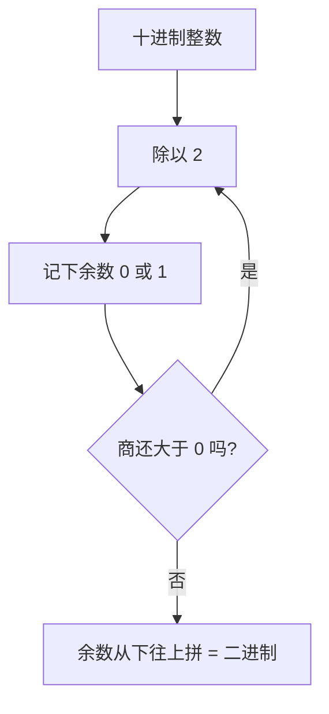

# 第 01 章 · 数——开关怎么表示量

> 本章从哪个问题出发：一台只会开和关的东西，凭什么装下一个数字？
> 推导到哪个结论：二进制不是天选，是工程将就；负数靠补码重编码成加法；而**"一个结论凭什么对"**——本章第一次把这个念头种进你的脑子：比特不会说话，全靠约定，而约定之下还有更硬的东西——证明。
>
> 核心认知：机器只会开和关。你看到的每一个数字，都是人跟机器约好的一套编码——比特本身没有任何意义，意义来自约定。**但约定不是"随便说说"：补码的每一条性质，都能被证明出来。** 这一章，你除了学会编码，还要开始习惯一件事——**"显然"两个字，在数学里不算数，算数的是证明。**

## 引子

我把那台老电子表拆了。外壳撬开，露出里面一小块黑乎乎的芯片和几条走线，就再没有别的了。没有齿轮，没有刻度，没有一圈圈数字。这表上明明能显示 8:32、12:17，能计时，能倒着数——可我翻来翻去，只在里面找到一片不会说话的硅。

"就这么点东西，"我举着那块芯片冲老谟晃，"它凭什么记住'8 点 32 分'？它身上连个数字的影子都没有。"

老谟正给一台更旧的收音机拧螺丝，头也不抬："你这话说得好像数字是种长在机器里的东西。你自己想想——你把'3'这个念头，是怎么'放进'脑子里的？"

"我脑子……"我一愣，"我脑子里也没有一个写着'3'的小牌子啊。"

"那你凭什么觉得自己能记住'3'？"

这问题问得我胸口一堵。是啊，我凭什么？"3"不是颜色、不是气味、不是一块肌肉，我脑子里到底存了它的什么？

老谟终于抬头，把那颗拧下来的螺丝抛起来又接住："想明白'你的脑子怎么存 3'，你就想明白'这台表怎么存 8 点 32 分'了。二者是一回事——先把'3 长什么样'扔掉，只剩'3 和别的东西不一样'这一点。本章，就干这一件事。"

## 对话引擎

### 第 1 轮：凭什么非得是二进制

**老谟**："你一张口就'二进制'。可人天生爱十进制——十个指头数过来最顺手。机器是你造的，你凭什么不干脆让机器也用十进制？十个电压档位，对应 0 到 9，不行吗？"

**造物主**："因为……二进制简单？计算机算二进制快？"

**老谟**："快？二进制在数学上可一点都不比十进制'快'。你用二进制写个一百，得写七位（1100100），用十进制两位就完了。论省事，十进制才是省事的那个。你那'简单'两个字，是从哪儿偷来的？"

**造物主**："那……难道是电路上，两种状态比十种状态容易做？"

**老谟**："这才沾到点边。你想想：一根导线上的电压，要区分'开'和'关'，得留多少安全区？要区分十档，又得留多少？"

**造物主**："两态只要一个门槛——高过它就是 1，低过它就是 0，中间一大段都是安全区。可要区分十个档，0 到 9 每个档之间得留极窄的缝……稍有噪声、温度漂移、导线损耗，档位就串了。"

**老谟**："今天读出来是 7，明天变成 8。二极管能稳稳'开'和'关'，却很难'开到七分'。所以呢？"

**造物主**："所以是物理上不可靠，才退而求其次用两态？"

**老谟**："把'退而求其次'四个字给我划掉，换句话——**二进制不是数学的必然，是工程的便宜。** 机器选二进制，是因为它容错、便宜、好做，不是因为它'天生正确'。这一点你要刻进骨头里：计算机里绝大多数'理所当然'，都是人跟物理讨价还价后的将就。"

**造物主**：（还是不服气，小声）"可我总觉得，二进制里藏着什么更'根本'的东西……"

**老谟**："你这话我听完就想给你鼓掌——可惜掌声是给'听懂了'的人的。藏着更根本的东西？你觉得它'根本'，恰恰是因为只有两种状态最稳、最不容易被物理噪声推翻——**稳定，就是那个'根本'。** 稳定不是偶然的浪漫，是工程里最硬的事实。你先别急着给它披上哲学的外衣。"

---

### 📐 知识锚点：为什么机器用二进制

【历史溯源】二进制不是新发明，是"老"约定。早在 **1679 年，德国数学家戈特弗里德·莱布尼茨（Gottfried Leibniz）** 就在《二进制算术》里完整描述了二进制系统，甚至把它和中国的八卦（阴爻/阳爻）联系起来。但莱布尼茨当时只是把它当纯数学玩具——他绝没想过这东西会在三百年后统治全世界的计算机。**数学先想明白，工程后用它，中间隔了近三百年。**

【工程实践】工程上选二进制，图的不是"正确"，是**容错与成本**。一根导线上表示"开/关"（两态），只需一个电压门槛，门槛上下都是大片安全区，噪声、温漂、损耗都撼不动它；可要表示十档（0-9），十个电压区间就得紧贴在一起，每个档之间只留一条细缝，任何扰动都会让档位串号。**状态越少，越容错；越容错，越便宜、越好造。** 这就是为什么芯片里清一色两态电路。

【概念深挖】**二进制（binary）** 是一种只用 **0 和 1** 两个数字表示数的进制。人日常用十进制（逢十进一，0-9），机器用二进制（逢二进一，只有 0 和 1）。例如十进制的 **5**，写成二进制是 **101**（表示 1×2² + 0×2¹ + 1×2⁰ = 4+0+1 = 5）。**一个二进制位叫一个比特（bit）**，是信息的最小单位——它只回答一个问题：开，还是关。

---

### 第 2 轮：5 在二进制里到底长什么样

**老谟**："先别想着算。你告诉我，二进制的世界只有 0 和 1。你从 0 开始，一个一个往下写，写到 5，中间每个数怎么跳？"

**造物主**："从 0 开始……0、1，然后是 2。可 2 没有第二个数字用了，只能进位——10。然后 3 是 11，4 是 100，5 是 101？"

**老谟**："你写出来了。停在这儿，别往下写。盯着这排数，告诉我：最低位（最右边那一位）有什么规律？"

```text
0 → 0
1 → 1
2 → 10
3 → 11
4 → 100
5 → 101
```

**造物主**："……最低位在 0、1、0、1 地跳。奇数结尾是 1，偶数结尾是 0！"

**老谟**："对。二进制的最低一位，就是'这个数是奇数还是偶数'。那我现在问你：5 是奇数，它的最低位一定是 1——你把它抹掉，剩下的是谁？"

**造物主**："抹掉最低位……101 去掉 1 剩 10，就是 2？可 5 抹掉一位怎么是 2？"

**老谟**："你反过来想：二进制每往左一位，值是翻倍的（1、2、4、8…）。所以'5 抹掉最低位'，等于'5 除以 2 丢掉了那点零头'。5 除 2 商 2 余 1，商 2 就是 10，余 1 就是最低位。你顺着这个'除 2、取余'往下走，会得到什么？"

**造物主**："……5 除 2 余 1，商 2；2 除 2 余 0，商 1；1 除 2 余 1，商 0。余数从下往上读：1、0、1，就是 101！我这是把'最低位=奇偶'这条路倒着走回去了。"

**老谟**："对。你不是背了个'除二取余'的口诀，你是从'最低位是奇偶'这一步一步一步把它踩出来的。这口诀是**你推导出来的**，不是天上掉的。"

**造物主**："……可我还有个不安：我说'最低位是奇偶'、'往左一位翻倍'，这俩是我数出来的规律。可它们**凭什么一直对**？我数到 5 对，数到 100 还对吗？"

**老谟**："你问出了一个比'怎么换算'深得多的问题——**你凭什么相信一条规律对所有的数都成立？** 这个问题，今天先记下，留到第 05 章我们专门给它一把'数学归纳法'的钥匙。现在你先把'怎么算'练熟——但记住你这个不安，它是学好数学的第一步。"

---

### 📐 知识锚点：整数十进制 → 二进制

【历史溯源】进制转换的方法不是凭空来的，它和**位值制计数法（place-value）** 一脉相承。十进制的"逢十进一"、二进制的"逢二进一"，本质都是**每一位代表一个固定的权值**：从右往左，十进制是 1、10、100…，二进制是 1、2、4、8…。这个"权值"思想源自古代位值计数系统（古巴比伦六十进制、古印度十进制），几千年后才被系统化成今天的进制换算规则。

【工程实践】工程师为什么从不用"除二取余"以外的方法？因为**除二取余**只靠重复的除法和取余就能完成——极其机械、可循环，特别适合交给计算机自动执行（一个 `while` 循环就能写完）。进制转换在工程里不是"心算游戏"，而是程序里一行代码的事。

【概念深挖】整数转二进制用**除二取余**：不断除以 2，记下余数（0 或 1），再从下往上拼。例：

```text
5 ÷ 2 = 2 余 1  → 最低位 1
2 ÷ 2 = 1 余 0  →        0
1 ÷ 2 = 0 余 1  → 最高位 1
从下往上读: 101
```

**最低位是奇偶，往左每一位翻倍**——抓住这两条，整数的二进制就是一张你随时能亲手画出来的表。


读图说明：这是一台"剥洋葱机"。每次从数的腰部剥下一层（最低位），剥下来的余数就是这一层的真相，剩下的商接着剥；一直剥到商变成 0，把剥下来的所有皮从里往外拼起来，就是二进制。机器只要会"除以 2、记余数、判断商是否为 0"三件事，就能无穷无尽地把整数转成二进制。

---

### 第 3 轮：负数，才是真正的坎

**老谟**："二进制装正数，你算是摸到门了。现在来硬的：开关只有 0 和 1，你怎么让它表示 '-5'？"

**造物主**："这还不简单？留一位当符号位，比如最左边是 1 就代表负号。10000101 表示 -5，00000101 表示 +5。"

**老谟**："听起来很讲道理。"他顿了顿，"那我问你，5 + (-5) 等于多少？"

**造物主**："等于 0 啊。"

**老谟**："用你的符号位法，让机器算一遍。它要把两个字节喂进加法电路：00000101 加 10000101。"

**造物主**："我算一下……00000101 加 10000101。个位 1+1=2，进 1……算完是 10001010，也就是 -10。等一下，5 加 -5 怎么会是 -10？"

**老谟**："你发现矛盾了。说说，你想怎么绕过去？你的符号位法，问题出在哪？"

**造物主**："我给它'贴了个标签'——最左边那位我单独当符号用。可贴了标签的数，和正数根本不是同一套逻辑。机器做加法时，得先看懂标签、判断谁正谁负、该加还是该减——一套电路被我拆成了两套。"

**老谟**："那怎么办？"

**造物主**："与其给负数贴标签，不如**把负数挪到正数圈里**，让加法电路一视同仁地加？"

**老谟**："挪？用一个固定长度，比如 8 位，能表示 0 到 255。你想怎么把 -5 挪进去？"

**造物主**："如果我把 -5 定义成 256 减 5，也就是 251？"

**老谟**："251 在 8 位里写成什么？"

**造物主**："11111011。"

**老谟**："那 5 + 251 等于多少？"

**造物主**："256。可 8 位装不下 256，最高位溢出了，剩下的……是 0。"

**老谟**："成了。你亲手把 -5 编码成 251（也就是 256-5），正数 5 就是 5，两者相加溢出后刚好归 0——**减法，被你变成加法了。** 这套把戏，叫补码（two's complement）。你刚才那一下'256 减它'，就是补码的灵魂。"

**造物主**："所以我不是发明了负数，我是发明了'怎么把负数藏进正数里'的编码。"

**老谟**："这就不赖了。可你还欠一件事——你说'取反加一'能造补码，你凭什么信？'溢出后归零'这个说法，能不能**证明**？我们下一轮，就给补码立个证明。"

---

### 📐 知识锚点：补码（two's complement）

【历史溯源】符号位法的坑，历史上整整一代机器都摔过。最早的商用存储程序计算机 **EDSAC（1949，剑桥，Maurice Wilkes 团队）** 用的就是"符号 + 幅度"（sign-magnitude）式的表示，结果 ±0 并存、加减要判符号，电路处处别扭。真正的转折是 **1964 年 IBM System/360**：这台机器正式把**补码（two's complement）**定为整数的标准表示，从此加减统一成一套逻辑，符号位不再特殊。有趣的是，补码的思想在 1945 年冯·诺依曼的《EDVAC 报告初稿》里就已现雏形。

【工程实践】补码替硬件工程师**省了一块芯片**。如果按符号位法，ALU（算术逻辑单元）得同时备着"加法器"和"减法器"两套电路，再加一个判符号的开关在两者间切换。而补码把 -b 编码成 (2ⁿ - b) 后，a - b 就变成了 a + (2ⁿ - b)——**减法器整个消失，机器里只剩一个加法器**。

【概念深挖】补码（two's complement）是什么：

在 n 位二进制里，模是 2ⁿ。一个数 x 的（n 位）补码，**正数就是自己**，**负数 -x 定义为 2ⁿ - x**。于是 a - b = a + (2ⁿ - b)，只要结果再取低 n 位（溢出自然丢弃），就等价于减法。符号位不再是"标签"，而是补码最高位天然带出来的：最高位为 1 的数，按无符号读本来就大于 2ⁿ⁻¹，正好对应负数区间。

```text
❌ 符号位法（原码）:  -5 → 10000101   （加 +5 → 10001010 = -10，错）
✅ 补码法:            -5 → 11111011   （加 +5=00000101 → 1 00000000，溢出剩 00000000 = 0，对）
```

踩坑注释：原码（符号位法）还有个更尴尬的毛病——它有两个 0（00000000 和 10000000 都表示零），白白浪费一个编码，还让"比较是否为零"要多判一次。补码只有一种 0，且负数区间比正数多表示一个（如 8 位补码能表示 -128 到 127），这都是编码约定带来的红利。

---

### 第 4 轮：亲手造一次——从"看懂"到"能造"

**老谟**："补码你懂了，可'懂'和'能造'隔着一条河。现在把河蹚了——给你一个整数，你给我写出它在 8 位补码下的样子。来，-7。"

**造物主**："-7 的 8 位补码……按公式，256 减 7 得 249，249 的二进制是 11111001。我算出来了。"

**老谟**："算得对，但你是在'背公式'。真造补码的人，从不用'256 减它'——那太慢，硬件也没法直接做减法。硬件用的是另一招，你试着找找。"

**造物主**："另一招？我只知道 -x = 256-x……哦，等一下。补码的核心是'溢出归零'，那能不能从 +7 出发，反着把它翻过去？"

**老谟**："说下去。"

**造物主**："+7 是 00000111。要让它和某个数相加得 0……如果我把每一位都翻转，00000111 变 11111000，再……加 1？11111000 加 1 等于 11111001！这正好是刚才那个 249！"

**老谟**："成了。你不是背出来的，你是造出来的。**取反加一**（NOT 一下，再加 1）——这就是硬件造补码的真实动作。它只需要几个取反门加一个加法器，连减法都不用做，就把 -7 从 +7 翻出来了。"

**造物主**："可我还是有点虚——'取反加一'和'256 减它'，真的永远是一回事吗？会不会哪天碰上一个数，两条路算出不一样的结果？"

**老谟**："你又问到一个'凭什么'了。这正该证明——下一轮，我们把这个'两条路永远一样'，用一个证明钉死。"

---

### 📐 知识锚点：补码的"取反加一"——数学 vs 工程

【概念深挖】数学上，-x 定义为 2ⁿ - x，方便你理解"溢出后归零"。但硬件要"省"，就换了个**等价动作：按位取反再加 1（NOT + 1）**。对正数 x 取反得 ~x，~x + 1 恰好等于 2ⁿ - x（在 n 位内），所以两者是同一个补码，只是工程上更好造。

【实现思考】把上面手动造补码翻译成代码，就是"看懂 → 能造"的落地：

```python
def to_twos_complement(x, n):
    mask = (1 << n) - 1
    if x >= 0:
        return x & mask           # 正数就是自己
    return (~abs(x) + 1) & mask   # 负数: 对 |x| 取反再加 1

print(bin(to_twos_complement(-7, 8)))    # 0b11111001
print((to_twos_complement(-7, 8) + 7) & 0xFF)  # 0
```

**踩坑**：Python 里 `~x` 对负数的语义是 `~(x) = -(x+1)`（不是"把每一位翻转"），所以对负数直接 `~x+1` 会出错——必须先取绝对值 `abs(x)`，对正数 `|x|` 做"取反加一"，才符合教材"对 +7 取反加一得到 −7"的教学逻辑。上面代码实测：`to_twos_complement(-7,8)` 输出 `0b11111001`，`(…+7) & 0xFF` 输出 `0`，与注释一致。（更简洁的写法是直接 `return x & mask`，Python 负数 `-7 & 0xFF` 自动给出补码 249；这里用 `~abs(x)+1` 是为了贴合"取反加一"的推导。）

**为什么这么造**：`~x + 1` 只需几个 NOT 门（取反）接一个加法器，不需要减法电路。**换条路会怎样**：若按字面"256-x"做，硬件得先造减法器，又绕回原码的老路。同一个数学对象，为方便工程改个等价动作，这就是"约定"在硬件层面的又一次落子。

---

### 第 5 轮：会造还得会还原——补码的自洽

**老谟**："造补码你会了。现在反过来——给你一串补码 `11111001`，你怎么知道它代表 -7，而不是 249？"

**造物主**："8 位里最高位是 1，所以它是负数。可它到底是 -7 还是别的？我……得把它'还原'回原数？"

**老谟**："怎么还原？你刚才的取反加一是'造'，那'还原'该是什么？"

**造物主**："……再造一遍？取反加一，再取反加一，不就回来了？11111001 取反得 00000110，加 1 得 00000111，是 +7！所以它代表 -7。"

**老谟**："对。**补码对自己再'取反加一'一次，就能还原回原数的相反数。** 这正好说明补码是'自洽'的——同一个操作，造是它，还原也是它。你现在既会造、又会还原了。可'自洽'这两个字，跟'证明'有什么关系？"

**造物主**："……关系？'自洽'是说它转一圈能回来，'证明'是说……它凭什么能回来？"

**老谟**："你这句话，就是本章埋的那颗种子：**'凭什么'三个字，就是证明的起点。** 你已经会背补码的公式了，可你还没'证明'过补码。下一节严格化走廊，我们就把'取反加一自洽'这个'凭什么'，写成一个像模像样的证明——那也是你这一生写的第一个证明的雏形。"

---

### 📐 知识锚点：补码的自洽性——造与还原是同一个动作

【概念深挖】补码最漂亮的性质是**自洽**：对任意补码再"取反加一"一次，就得到它的相反数。因为 (~x + 1) 再取反加一 = x（在 n 位内）。所以 `to_twos_complement(-7, 8)` 得 `11111001`，而 `to_twos_complement(11111001 按无符号读 = 249, 8)` 的结果在 8 位里就是 -7 的补码——同一个函数，造负数、还原负数，用的是同一个动作。这就是为什么硬件只需要"取反加一"这一个电路，既管编码又管解码。

【工程实践】若给你一个 16 位补码的电路图，要把"取反加一"的逻辑放进去，你会把它放在加法器的哪一侧？——答案：取反是"一堆 NOT 门"放在加数输入端，加 1 是给加法器最低位进一个"1"。你会发现，造和还原共用的就是这一小段：NOT 门 + 进位。这也解释了为什么补码能在硅上省下整整一个减法器。

---

### 第 6 轮：落点——比特不认识任何数，但证明认识

**老谟**："绕了一圈，回到你修表时的那个问题。你现在告诉我：那块表里，'8 点 32 分'到底被存成了什么？"

**造物主**："被存成一串比特。8 是 1000，32 是 100000……被存成若干个 0 和 1。"

**老谟**："那这串比特，自己知道它'是 8 点 32 分'吗？"

**造物主**："不知道。它连'几点'都不懂。同一串比特，按二进制读是个数，按别的方式读可能是别的……"

**老谟**："说到底——"

**造物主**："说到底，**机器只知道开和关。我写的每一个数字，全是我给比特串贴的标签。比特本身没有任何意义，意义来自约定。** 正数是一套约定，补码是把负数也藏进同一套约定里，让加法不必挑肥拣瘦。"

**老谟**："可你今天比样书里多学会了一样东西——你不再只是'知道'约定，你还开始问'凭什么'了。**你问'最低位是奇偶凭什么一直对'，问'取反加一和 256 减它凭什么一样'——这两个'凭什么'，就是证明的种子。** 你这一生要写的证明，全是从这种不安开始的。"

**造物主**："……所以比特不会说话，约定让它开口；而约定自己，还得靠证明来给它撑腰？"

**老谟**："这话记好了。**比特是哑的，约定让它说话；约定是松的，证明让它站住。** 下一章，我们让比特从'会报数'升级到'会判断'——而'判断'里，藏着你证明之路的第一块正式台阶。"

## 严格化走廊

> 位置说明：对话负责"直觉"——比特为什么这样编码。本走廊负责"严谨"——把"取反加一自洽"这个"凭什么"落成可复写的证明。这是全系列第一册的第一条严格化走廊，也是读者接触"证明"的第一次正式亮相：**每一步写清楚用了哪条定义/哪条代数规则，绝不说"显然"。**
>
> **证明类型标注**：本章的三条证明都属于**"直接计算/代数"型**——直接由定义展开、按代数规则变形（没用到反证、归纳、构造那些"招数"）。完整的证明方法分类（直接/反证/归纳/构造）会在第 05 章系统展开，这里先给你一个概念：**证明也是分"招式"的**，看懂"它用的是哪一招"，比看懂"它证了什么"更进一步。

### 定义：n 位补码（n-bit two's complement）

设 n ≥ 1。在 n 位二进制中，模 M = 2ⁿ。**整数 x 的 n 位补码**记作 `comp(x)`，定义为：
- 若 0 ≤ x ≤ 2ⁿ⁻¹ − 1（非负）：`comp(x)` = x 的 n 位二进制表示。
- 若 −2ⁿ⁻¹ ≤ x ≤ −1（负数）：`comp(x)` = x + M = x + 2ⁿ 的 n 位二进制表示（取低 n 位）。

**等价记法**：对负数 −a（a ≥ 1），`comp(−a) = 2ⁿ − a`。

**n 位截断**：任何整数 t 的 n 位表示，都取 t mod 2ⁿ（即丢弃高于 n−1 位的部分）。

> **定义域注记**：`comp(x)` 的定义只显式覆盖合法补码区间 [−2ⁿ⁻¹, 2ⁿ⁻¹−1]；但定理 1 里会出现 `comp((x+y) mod 2ⁿ)`，当 (x+y) mod 2ⁿ 落在溢出区 [2ⁿ⁻¹, 2ⁿ)（比如 127+1 的 10000000）时，comp 定义没直接写。**这条就按"边界"一节处理**：溢出的 mod 值，按补码语义解读（`10000000` 读作 −128）。换句话说——**comp 的"本义"是给合法区间的数编码；超出区间的结果，靠"模 2ⁿ 再按补码读"这条约定兜住。**

### 定理 1（补码加法闭合）：在 n 位内，补码加法等价于模 2ⁿ 加法

对任意 n 位补码表示的整数 x、y：`(comp(x) + comp(y)) mod 2ⁿ = comp((x + y) mod 2ⁿ)`。

> 直觉：补码把"减法"藏进"加法"，靠的就是"溢出即取模"。这个定理说：**在 n 位里做补码加法，跟"先正常相加、再取模"是一回事。** 5 + (−5) = 0 的验证，正是它的特例。

**证明**：
- 第 1 步：由补码定义，`comp(x)` 表示的数 ≡ x (mod 2ⁿ)，`comp(y)` 表示的数 ≡ y (mod 2ⁿ)。（因为非负数就是 x；负数是 x + 2ⁿ ≡ x mod 2ⁿ。）
- 第 2 步：因此 `comp(x) + comp(y) ≡ x + y (mod 2ⁿ)`。
- 第 3 步：取 n 位（即 mod 2ⁿ），得 `(comp(x) + comp(y)) mod 2ⁿ = (x + y) mod 2ⁿ`。
- 第 4 步：而 `comp((x+y) mod 2ⁿ)` 正是 (x+y) mod 2ⁿ 的 n 位表示（定义）。∎

> **读法**：整个证明只用了"补码 ≡ 原数 (mod 2ⁿ)"这一件事，加上模算术的同余相加。**先看懂'补码和原数同余'，再看懂'同余相加保持同余'，证明就通了。** 这就是证明的骨架：把"看起来玄"的东西，翻译成"已经懂的规则"。

### 定理 2（取反加一自洽性）：~x + 1 ≡ 2ⁿ − x (mod 2ⁿ)

设 x 是 0 ≤ x < 2ⁿ 的整数，~x 表示对 x 的 n 位每一位取反（NOT）。

**证明**：
- 第 1 步：x 的 n 位二进制中，每一位非 0 即 1，所以 x 的每一位与 ~x 的对应位相加恒为 1。故 **x + ~x = 111…1 = 2ⁿ − 1**（n 个 1）。
- 第 2 步：两边同时加 1：x + (~x + 1) = 2ⁿ − 1 + 1 = **2ⁿ**。
- 第 3 步：两边同减 x：~x + 1 = 2ⁿ − x。∎

> **读法**：这可能是你见过的第一个"真正的"证明。它只用了两步：① 取反的意义（每一位互补，所以加起来全是 1，即 2ⁿ−1）；② 代数移项。**没有一步说"显然"。** 这告诉我们：证明不是魔法，是把"你懂的东西"按规则连起来，直到结论自己冒出来。

### 定理 3（补码还原自洽）：取反加一再取反加一，回到原数

对 0 ≤ x < 2ⁿ，令 f(x) = (~x + 1) mod 2ⁿ（取反加一后取 n 位）。则 f(f(x)) = x。

**证明**：
- 第 1 步：由定理 2，f(x) ≡ 2ⁿ − x (mod 2ⁿ)，即 f(x) ≡ −x (mod 2ⁿ)。
- 第 2 步：再取一次：f(f(x)) ≡ −f(x) ≡ −(−x) = x (mod 2ⁿ)。
- 第 3 步：f(f(x)) 和 x 都是 [0, 2ⁿ) 内的数，且同余，故相等。∎

> **读法**：定理 3 就是对话第 5 轮"造也是它、还原也是它"的严格版。它把"转一圈回来"这个直觉，翻译成了"取两次相反数（模 2ⁿ）等于自己"。**注意第 3 步那一下"同余且在范围内所以相等"**——这是模算术里常用的收尾，先记住这个套路。

### 反例/边界：补码的四个边界

- **最高位是 1 一定是负数吗？** 在补码语义下是（因为 2ⁿ⁻¹ ≤ 值 < 2ⁿ 对应负数区间）；但同一串比特按无符号读就是正数。**"是正还是负"不是比特自带的，是你选的解读语义。** 例：`11111001` 按无符号读是 249，按补码读是 −7。
- **溢出会静默错**：n 位补码能表示的范围是 [−2ⁿ⁻¹, 2ⁿ⁻¹−1]。超出这个范围，加法结果会"绕回"——`127 + 1` 在 8 位里得 `10000000`，按补码读是 −128，不是 128。**溢出不报错，是补码的代价**（这也是为什么工程里要检查溢出）。
- **负数比正数多一个**：8 位补码能表示 −128 到 127，负数的绝对值比正数多 1（因为 −128 的补码 10000000 没有对应的正数）。**这不是 bug，是"模 2ⁿ 恰好有个半开半闭区间"的必然。**
- **补码的加法对"负数+负数"同样成立**：例 8 位里 (−5)+(−3)：`11111011 + 11111101 = 1 11111000`，溢出丢弃得 `11111000` = −8 ✓（定理 1 保证，不靠猜）。

## 知识点总结

### 知识点（本章推出的核心概念）

- **二进制不是数学的必然，是工程的便宜**：两态比十态容错、便宜、好做，机器选它是因为物理上两态更可靠。
- **整数除二取余**：不断除以 2、记余数、从下往上拼；最低位是奇偶，往左每一位翻倍。
- **补码（two's complement）**：把负数重编码进正数区间（-x = 2ⁿ - x），让减法变成加法，省掉减法器；工程上等价动作为"取反加一"。
- **编码**：比特本身无意义，正数、负数都是人和机器约好的标签。
- **"凭什么"= 证明的种子**：你问"最低位是奇偶凭什么一直对""取反加一凭什么等于 256 减它"——这些不安就是证明的起点。**证明不是魔法，是把"你懂的东西"按规则连起来。**

### 历史结论（本章涉及的史料）

- **二进制**：莱布尼茨 1679 年完整描述二进制系统，当时只是数学玩具，三百年后才统治计算机。
- **补码**：EDSAC（1949）用符号位法，±0 并存、加减判符号；IBM System/360（1964）定补码为整数标准，沿用至今。

### 工程实践结论（本章知识在真实工程里怎么用）

- **ALU 只需一个加法器**：因为补码把减法重写为加法，CPU 少一大块减法逻辑。
- **补码取反加一**：硬件只靠 NOT 门 + 加法器，就能既造负数又还原负数。
- **溢出要检查**：8 位补码 127+1 会绕回 −128，不报错——工程里必须显式检测溢出。

## 计算训练场

> 位置说明：对话负责"为什么"，这里负责"怎么算"。每题动笔 10 分钟以上，先自己写再对答案。

### 题 1（中）：批量进制换算 + 补码加减验证

**题干**：老谟给了造物主一串十进制数：13、42、100、255。请：
(a) 把它们全部转成二进制（写出除二取余过程）。
(b) 把 13 和 42 用 8 位补码相加，验证结果是否等于 55 的 8 位补码。
(c) 讨论：若用 8 位无符号数，100 + 200 会怎样？用 8 位补码，100 + 200 又会怎样？两个结果说明什么？

**完整分步解答：**

**(a) 进制换算**：
- 13：13÷2=6余1；6÷2=3余0；3÷2=1余1；1÷2=0余1。从下往上：**1101**。
- 42：42÷2=21余0；21÷2=10余1；10÷2=5余0；5÷2=2余1；2÷2=1余0；1÷2=0余1。**101010**。
- 100：100÷2=50余0；50÷2=25余0；25÷2=12余1；12÷2=6余0；6÷2=3余0；3÷2=1余1；1÷2=0余1。**1100100**。
- 255：255÷2=127余1；127÷2=63余1；63÷2=31余1；31÷2=15余1；15÷2=7余1；7÷2=3余1；3÷2=1余1；1÷2=0余1。**11111111**。

**(b) 补码加法**：
- 13 的 8 位补码 = 00001101；42 的 8 位补码 = 00101010。
- 相加：00001101 + 00101010（从位 0 起逐位，进位向右传递）：

```text
      位7654 3210
13  = 0000 1101
42  = 0010 1010
-----------------
位0: 1+0 = 1, 进 0      → 1
位1: 0+1 = 1, 进 0      → 1
位2: 1+0 = 1, 进 0      → 1
位3: 1+1 = 2, 写 0 进 1 → 0
位4: 0+0+1 = 1, 进 0    → 1
位5: 0+1 = 1, 进 0      → 1
位6: 0+0 = 0            → 0
位7: 0+0 = 0            → 0
结果(位7..位0): 0011 0111
```

- 得 **00110111** = 32+16+4+2+1 = 55 ✓
- 55 的 8 位补码 = 00110111 ✓ 一致。
- **关键在进位传递**：位 3 的 1+1 产生进位 1，必须带到位 4（0+0+1=1）；位 4 没有新进位，后面位 5 的 0+1 就是 1。**逐位加法最易错的就是漏掉这个跨位的进位。**

**(b 备选·直接用补码验证溢出归零)**：也可验证 13 + (−13) 在 8 位里归零：−13 的补码 = 2⁸−13 = 243 = 11110011；00001101 + 11110011 = 1 00000000，取低 8 位 = 00000000 = 0 ✓（补码加法的灵魂）。

**(c) 溢出**：
- 无符号 8 位：100+200=300，300 = 256+44，取低 8 位 = **44**（300 mod 256）。溢出丢失了 256。
- 补码 8 位：范围 [−128,127]。100+200=300 超出，300 mod 256 = 44，但 44 在正数范围内，按补码读还是 44——**注意：这里恰好没绕回负数，但结果已不是 300 了**。
- 结论：**8 位不管无符号还是补码，都装不下 300，结果都被"模 256"截断了。** 溢出不报错，这是定长编码的固有代价——工程里要检查结果是否超出范围。

**答**：(a) 13=1101、42=101010、100=1100100、255=11111111；(b) 00110111=55 ✓；(c) 都变成 44（mod 256 截断），说明定长编码溢出会静默错。

**常见错误**：① 除二取余把余数从上往下读（必须先算出来的是最低位）；② 补码加法忘了取低 8 位（把进位 1 也当结果）；③ 以为"补码负数相加会出负数、正数相加会出正数"——**溢出时不一定**，必须检查范围。

### 题 2（中→难）：取反加一的验证与"还原"循环

**题干**：给定 +7 的 8 位补码 00000111。
(a) 用"取反加一"求 −7 的补码。
(b) 对 (a) 的结果再"取反加一"，验证回到 00000111（还原自洽）。
(c) 用"256 减"的方法独立求 −7 的补码，与 (a) 对照。
(d) 证明：取反加一与"256 减"在 8 位内永远等价（用严格化走廊定理 2 的话说：~x+1 ≡ 2⁸−x mod 2⁸）。

**完整分步解答：**

**(a) 取反加一**：
- +7 = 00000111。取反：11111000。加 1：11111000 + 1 = **11111001**。
- 验证：11111001 + 00000111 = 1 00000000，取低 8 位 = 00000000 = 0 ✓（5 加 −5 同款）。

**(b) 还原**：
- 对 11111001 取反：00000110。加 1：00000110 + 1 = **00000111** ✓ 回到原数。

**(c) 256 减**：
- −7 的补码 = 2⁸ − 7 = 256 − 7 = 249。
- 249 的 8 位二进制：249 = 128+64+32+16+8+1 = **11111001** ✓ 与 (a) 一致。

**(d) 等价性**（写证明）：
- 由定理 2：x + ~x = 2⁸ − 1（每一位互补）。
- 两边加 1：x + (~x+1) = 2⁸。
- 移项：~x + 1 = 2⁸ − x。∎ 即"取反加一"恒等于"256 减 x"（模 2⁸ 意义下）。∎

**答**：(a) 11111001；(b) 回到 00000111；(c) 249 = 11111001 一致；(d) 证明见上。

**常见错误**：① 取反时把符号位也翻了——**取反是"每一位"都翻，没有例外位**（这正是补码和符号位法的本质区别）；② 加 1 时忘了最低位的进位会一路传（如 11111000+1 时，最低位 0+1=1 不进位，但如果最低位是 1 就会连续进位）；③ 混淆"249 的二进制"和"−7 的补码"——它们恰好是同一串比特，但**同一串比特读成无符号是 249，读成补码是 −7**。

### 题 3（难）：二进制加法器——把"进位"写成人话

**题干**：设计一个 4 位二进制加法器的手算流程。老谟给了造物主两个 4 位二进制数：A = 1011（11），B = 0110（6）。要求：
(a) 从最低位开始逐位相加，完整写出每一步的"本位和 + 进位"。
(b) 验证结果是否等于 11 + 6 = 17 的 4 位表示。
(c) 讨论：17 在 4 位里能表示吗？如果给的是补码语义，1011 + 0110 又等于多少？两个结果说明了什么？

**完整分步解答：**

**(a) 逐位加法**（从右往左，第 0 位起，进位逐位传递）：

```text
  1011    (11)
+ 0110    ( 6)
------
第0位: 1+0 = 1, 进位 0        → 本位 1
第1位: 1+1 = 2, 写 0 进 1     → 本位 0, 进位 1
第2位: 0+1+1 = 2, 写 0 进 1   → 本位 0, 进位 1
第3位: 1+0+1 = 2, 写 0 进 1   → 本位 0, 进位 1（最高位进位丢弃）
4 位结果: 0001
```

**(b) 验证**：11 + 6 = 17。17 的 4 位表示：17 = 16 + 1，而 16 = 2⁴ 超出 4 位，所以 17 mod 16 = 1 = **0001** ✓ 与逐位加法一致。

**(c) 讨论**：
- 17 在 4 位无符号里**不能表示**（最大 15），溢出丢掉了最高位。
- 若按补码语义：1011 = −5（最高位 1），0110 = 6，−5+6 = **1**，4 位结果 0001 = 1 ✓ 同样成立。
- 结论：**同一串比特，无符号读是"17 溢出成 1"，补码读是"−5+6=1"——解读不同，但硬件做的加法一模一样。** 这就是"编码是约定"的活例子。

**答**：(a) 逐位 1,0,0,0，结果 0001；(b) 17 mod 16 = 1 ✓；(c) 无符号读溢出、补码读合法，同一电路两种语义。

**常见错误**：① 忘记进位要在第 2 位之后逐位传递（0+1 也要加进位）；② 把丢弃的进位 1 当结果的一部分（4 位加法器只有 4 位输出）；③ 混用无符号/补码语义——同一比特串，读法不同答案不同，但加法电路是同一个。

## 向导便签

> 这一章咱们干了什么：从拆开的那台电子表，一路逼到补码。你亲手重走了"怎么用开关装下一个数字"的路程——二进制、进制转换、负数补码，一路由最底层构筑。但比样书多的是：你开始问"凭什么"了。
>
> 钉死一句话：**比特本身是个哑巴，编码才是它开口说话的语法；而约定是松的，证明让它站住。** 同一个 101，按无符号读是 5，按补码读是 -3，按符号位法（原码）读是 -1——谁对？都"对"，因为"对"的意思是"照同一张表在读"。
>
> 记住：二进制不是天选，是工程将就；补码不是魔法，是把减法藏进加法的编码巧思。**而"取反加一和 256 减它凭什么一样"——这个"凭什么"，是你证明之路的第一块台阶。**

## 造物主手记

**我曾踩的坑**：

我以为"计算机用二进制"是因为二进制在数学上更优雅、更"底层正确"。被老谟一句话戳穿——是物理上两态比十态容错、便宜，才退而求其次。我还会把"整数除二取余"当成一个要背的口诀，忘了它其实是从"最低位是奇偶"一步步踩出来的。最丢人的是符号位法：我给 -5 贴了个负号标签，就以为搞定负数了，结果 5+(-5) 在机器里算出 -10。**但我这章最大的收获不是学会补码，是学会了不安**——我两次问出"凭什么"，老谟说这就是证明的种子。

**顿悟时刻**：

真正开窍是老谟逼我想"把 -5 藏进正数区间"那一刻。256-5=251，251 加 5 溢出成 0——减法凭空消失了。我突然懂了：负数从来不是"带负号的数"，而是"被重新编码、好让加法不挑肥拣瘦的数"。而更震撼的是严格化走廊里那个证明：**~x + 1 = 2ⁿ − x，只用了"每一位互补所以加起来全是 1"这一件事。** 原来证明不是天书，是把已经懂的东西按规则连起来——我这个"第一次写证明"的人，居然看懂了。

## 自测题

> 计算题须动笔完成，附完整解答自核；概念题用于检查理解。

**题 A（计算，易→中）：批量换算 + 补码求值**

(a) 把 29、64、131 转成二进制（写出过程）。
(b) 写出 29、-29、-1、-128 的 8 位补码。
(c) 用 8 位补码计算 (-29) + (-1)，验证结果。

**完整解答**：
(a) 29=11101；64=1000000；131=10000011。
(b) 29 的补码 = 00011101；-29 = 2⁸-29 = 227 = 11100011；-1 = 2⁸-1 = 255 = 11111111；-128 = 2⁸-128 = 128 = 10000000。
(c) 11100011 + 11111111 = 1 11100010，取低 8 位 = 11100010。-30 的补码：2⁸-30 = 226 = 11100010 ✓ 一致。

**题 B（计算，中→难）：补码还原循环**

给定 8 位补码 11101011（它是某个负数 x 的补码）。
(a) 用"取反加一"还原出 |x|。
(b) 说出 x 是多少。
(c) 用"256 减"独立验证。

**完整解答**：
(a) 取反：00010100；加 1：00010101 = 21。
(b) 所以 x = -21。
(c) 2⁸ - 21 = 235 = 11101011 ✓（与给定一致，确认 -21）。

**题 C（概念，检查理解）：为什么补码必须证明**

老谟说"取反加一和 256 减它在 8 位里永远一样"，造物主问"凭什么"。请用本章严格化走廊定理 2 的证明思路，写一个简短的证明（x + ~x = 2ⁿ−1 起手），说明"取反加一 ≡ 2ⁿ − x"。

**完整解答**：
设 0 ≤ x < 2ⁿ。x 的每一位非 0 即 1，~x 是每一位取反，故 x + ~x 每一位都是 1，即 x + ~x = 111…1 = 2ⁿ − 1（n 个 1）。两边加 1：x + (~x + 1) = 2ⁿ。移项：~x + 1 = 2ⁿ − x。∎

## 预告

比特哑着，编码让它说话。这一章它开口报了数——0 和 1 能表示任何量，而你也第一次尝到了"凭什么"的味道。

可光会"报数"还不够：机器总得对这几个数做出判断，比如"这个数字是不是负数""这两个条件成不成立"。而"判断"这件事，老谟说藏着证明之路的第一块正式台阶——**一个判断，要么成立要么不成立，可"凭什么成立"？**

下一章，我们让比特从"会报数"升级到"会判断"——而判断的规则（布尔代数）和判断的依据（逻辑证明），是同一枚硬币的两面。
