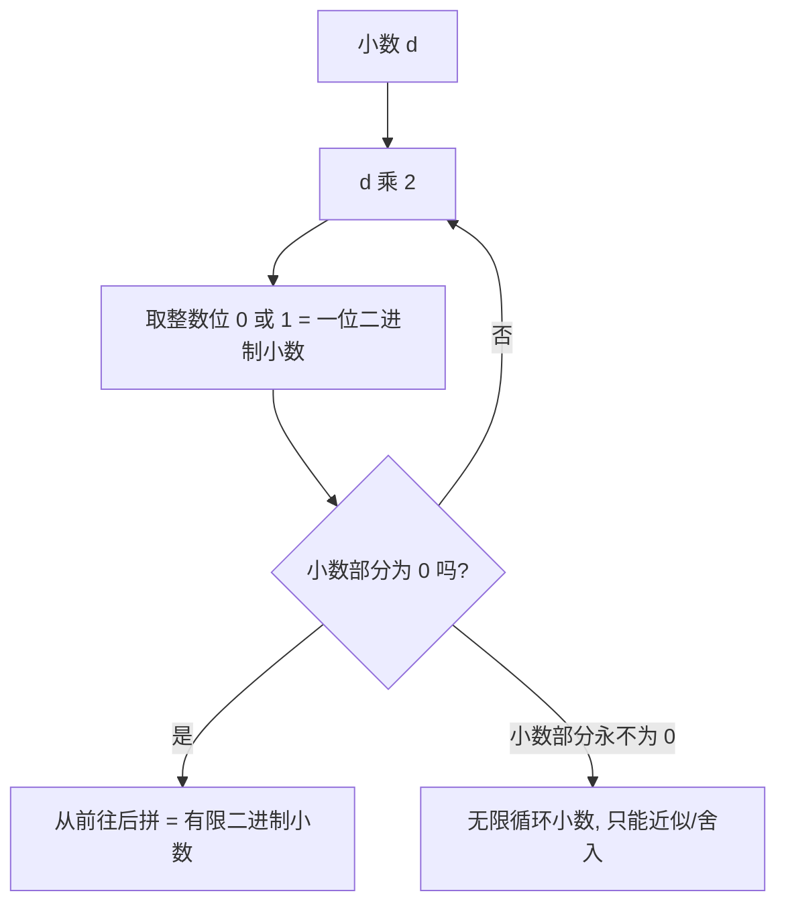

# 第 02 章 · 浮点——小数怎么塞进比特

> 本章从哪个问题出发：你在第 01 章补好了数轴上的洞——实数完备性让"极限"有了家。可你马上撞上一个更扎手的"洞"：**小数怎么塞进比特？** 明明 `0.1 + 0.2` 该等于 `0.3`，为什么机器算出来是 `0.30000000000000004`？
>
> 推导到哪个结论：浮点是拿有限的位（指数位 + 尾数位），去硬装"无限连续"的实数。**它的"洞"不是抽象的，是位数有限直接造出来的**——第 01 章说的"float 像一根有齿的梳子"，这一章你要看清每个"齿缝"到底有多宽、从哪儿来。而机器精度的精确度量，叫 **machine epsilon**。你还会拿到一个最硬的事实：**0.1 的二进制展开是无限循环的**——这不是"约等于"的敷衍，是一个能被除法演算完整证明的定理。
>
> 核心认知：**浮点不是"数的真身"，是"替身"；它的误差不是 bug，是"有限位装无限连续"的必然取舍。** 而"替身够不够接近真身"，有一个精确的尺子——machine epsilon。这一章的直觉（机器在"逼近"一个精确值但总差一点点），正是下一章你把"趋于"写成 ε-N 证明的入口。

## 引子

我把一台老式计算器拆开，又看了一遍里面那块芯片。"我上一章刚把数轴上的洞补上，"我举着芯片对老谟说，"可现在这台机器告诉我，`0.1 + 0.2 = 0.30000000000000004`。0.1 加 0.2，这不是最朴素的算术吗？它凭什么算不对？"

老谟正用一根圆珠笔在纸上画一条直线，又在直线上刻了一排细细的齿。"你先把'0.1 加 0.2'这句'理所当然'划掉。"他把纸转过来对着我，"然后回答我：**0.1 这个数，你在机器里是用几个比特存的？那几个比特，够不够把 0.1 的'全部'存进去？**"

"够不够……"我盯着那排齿，"整数我用有限的比特，能存得准准的。可 0.1 这种小数，它'全部'有多少？它该不会跟整数不一样吧？"

"你这句话，就是这一章的地雷。"老谟把圆珠笔搁下，"整数能存准，是因为整数的'全部'是有限的；可 0.1 的'全部'，可能是无限长的。**有限的比特，怎么装得下无限长的东西？** 你先别急着答——这一章，我们就干这一件事。"

## 对话引擎

### 第 1 轮：接住上一章的"梳子"——float 的洞，是怎么来的

**老谟**："你上一章补数轴上的洞，得了句'float 是有限离散点集，像一根有齿的梳子'。现在我要你把这句话拆开：**这台机器能表示的所有浮点数，到底有多少个？是无穷多个，还是有限多个？**"

**造物主**："……机器用固定多少位存一个数。位数是死的，那能拼出来的数的组合……也是有限的？"

**老谟**："对。**任何定长编码，能表示的数都是有限多个。** 你上一章那个'实数数轴'上有无穷多个点（完备、没洞），可机器里这一串有限的比特，只能踩出有限多个点。那问题来了——**这有限多个点，凭什么能'装满'无穷的实数轴？**"

**造物主**："……装不满。有限个点，怎么铺满无穷个位置？中间肯定有缝。"

**老谟**："就是这条缝。**实数数轴是'满'的（完备），浮点数是'稀疏'的（有限离散）——这就是它天生带着'洞'的原因。** 那你说，同样是有限位数，为什么上一册的整数能存准、小数却会出错？"

**造物主**："整数……能存准？"

**老谟**："先别急着答，我们下一轮把'整数为什么能、小数为什么不能'这个区别，逼出来。"

---

### 📐 知识锚点：浮点是有限离散点集——"梳子"的正式说法

【概念深挖】**浮点数集是有限的**：任何定长浮点格式（如 float32 用 32 位、float64 用 64 位）能表示的普通数都只有有限多个。**与之对比，实数轴（第 01 章）是完备的——没有洞；而浮点数集天生有洞（齿缝），因为有限个点装不满无限个位置。**

**"梳子"比喻的精确化**：一根有齿的梳子，齿与齿之间有缝。**浮点数的"齿"就是它能表示的有限个数；"齿缝"就是那些"该有却没被表示"的实数**——比如精确的 0.1，就没有任何一个 float 占它。**第 01 章说 float"连稠密都不满足"，正是这个意思**：实数轴上每个区间里有无数个实数，可浮点在这个区间里只有有限个齿。

【历史溯源】"机器里的数不连续"这件事，从冯·诺依曼设计 EDVAC（1945）时就知道——任何定长表示都只能覆盖实数轴的一个离散子集。**但"这个离散子集该怎么设计（位数怎么分、范围多大）"，直到 1985 年 IEEE 754 标准才彻底定下来。** 第 01 章的完备性（实数没洞）是数学的"理想国"；IEEE 754 的浮点（有限离散）是工程的"现实国"——两个世界的差距，就是本章要讲的全部。

【工程实践】"浮点数是离散的"在工程里最直白的后果：**你要判断"两个浮点够不够接近"，本质上是在问"它们是不是落在同一个'齿'上，或者隔得够不够近"**。正因为浮点是一把疏密不均匀的梳子（靠近 0 齿密、靠近大数齿疏），"够不够近"的标准才不能写死——这会在本章末尾展开。

---

### 第 2 轮：整数为什么能存准，小数为什么不能

**老谟**："回到那个'整数能存准'。你说说，一个整数，比如 7，用 8 位存，是几个比特？它'长什么样'？"

**造物主**："7 是 00000111，一位一位写死的，一共 8 位就写完了。"

**老谟**："对。**整数往左，每一位代表翻倍的权（1、2、4、8…），只要位数够，写多少位就存多少位，总是'恰好'的。** 那反过来——小数，往哪边代表什么？"

**造物主**："……往右？小数点右边第一位是 1/2、第二位是 1/4、第三位 1/8……**整数是往左翻倍，小数是往右对半折。**"

**老谟**："往右对半折。现在我要你想想：**同样是位数有限，为什么整数'写几位就够'，小数却常常'写再多也不够'？**"

**造物主**："……整数往左，权的间隔是'一个整数'，写到最高位就是 2⁷，能表示到 127，够大就行；**可小数往右，是对半折，折出来的数……有些永远对不齐？** 比如 0.1，对半折 1/2、1/4、1/8 一路折下去，好像总差一丁点。"

**老谟**："你摸到了。**小数的麻烦在于：往右对半折，折到的地方永远是 1/2、1/4、1/8 这种'二的幂'的拼合。可 0.1 不是一堆'二的幂'能拼出来的——它分母带了个 5。** 整数那侧，任何整数都是'二的幂 × 系数'能拼的（这是进制的基本功）；小数这侧，只有分母恰好是 2 的幂的数，才拼得尽。"

**造物主**："……所以 0.5、0.25 这种能拼尽，0.1、0.3 这种拼不尽？"

**老谟**："方向对了。**至于'0.1 到底拼不尽到什么程度、循环不循环'——那是要动笔算的，具体演算在后面的严格化走廊里，你翻过去对着空白纸补全。** 我们先把直觉钉住：**整数往左，位数够就精确；小数往右，多数数天生写不尽。**"

---

### 📐 知识锚点：二进制小数——往右是对半折，分母是 2 的幂才写得尽

【概念深挖】**二进制小数的位权**：小数点后第 i 位代表 2⁻ⁱ = 1/2、1/4、1/8、…。**与整数相反**：整数最低位是 1、往左翻倍；小数最高位（小数点后第一位）是 1/2、往右减半。

一个二进制小数，本质是"一堆 2 的负幂的拼合"。例：`0.101` = 1×1/2 + 0×1/4 + 1×1/8 = 0.5 + 0.125 = **0.625**。

**"写得尽 / 写不尽"的判据**：一个最简分数 a/b 的二进制展开是**有限小数**，当且仅当 **b 只含 2 这个素因子**（即 b = 2ᵏ 的形式）。因为有限位小数 = 有限多个"2 的负幂"相加 = 分子/2ᵏ 的形式，通分后分母是 2 的幂。
- 分母只含 2：1/2=0.1、1/4=0.01、3/4=0.11、5/8=0.101 —— 都写得尽。
- 分母含 2 以外的因子：1/3、1/5、1/10(=0.1)、3/10(=0.3)、7/10(=0.7) —— 都写不尽，是无限循环小数。

> **对照十进制**：十进制基数 10=2×5，所以十进制里分母只含 2 和 5 的数（如 1/2、1/5、1/20）写得尽。**"写不尽"不是某个进制的毛病，是"分母里有这个进制消不掉的素因子"的必然**——十进制消不掉 3（所以 1/3=0.333…），二进制消不掉 5（所以 0.1 循环）。

**乘二取整算法**（把小数转二进制，也是 0.1 为什么循环的引擎）：


读图说明：这是一台"倒水机"。每次把小数翻倍，溢出来的整数位（0 或 1）就是一位二进制小数，从前往后一滴一滴接。绝大多数数（如 0.1）会卡在右下角那条岔路——小数部分永远清不干净，于是永远接不完，只能收到某个位置就停（舍入成替身）。**判断"会停还是卡死"，看的是分母是不是 2 的幂。**

【工程实践】为什么二进制偏偏要"对半折"？因为跟硬件一拍即合——对半折只要"移位 + 判断"就能实现，最便宜。**没有哪个进制天生适合小数，只是二进制的'对半折'恰好最省钱。** 这也是为什么工程师不抱怨"二进制不合理"，而是接受"0.1 存不准"——**这是跟机器签下的近似协议，不是机器的错。**

---

### 第 3 轮：写不尽，机器只能"给个替身"

**老谟**："0.1 写不尽，可机器不能存'永远'。那你告诉我，工程师拿这个 0.1 怎么办？"

**造物主**："……截断？存前面的几位，后面的不要了？"

**老谟**："舍掉后面，那机器里这个'0.1'，还是精确的 0.1 吗？"

**造物主**："不是了。存得越少，差得越多。可存得再多，也到不了真正的 0.1——**因为它根本没有尽头，机器再大方，也只能给 0.1 一个'足够接近'的替身。**"

**老谟**："你抓住了整章的要害：**机器存不下'精确的 0.1'，只能存一个'足够接近 0.1'的数。** 那这个'足够接近'，总不能每台机器各定各的吧？"

**造物主**："总得有个统一标准？不然我存 10 位、你存 20 位，两台机器读同一个数，结果都不一样。"

**老谟**："标准，迟早要来。而且——你还记得第 01 章那句话吗：**'约定是地基，证明是盖楼。'** 浮点的三段式（指数、尾数、符号）、舍入规则、规格化——**全是人定的约定，不是天上掉下来的。** 可正因为有了这些约定，'0.1 的二进制必然循环'才成为一件**可证明的必然**（走廊定理 1）。**先有约定，后有必然——这就是整个浮点世界的剧本。** 而且'足够接近'这四个字，你现在只是凭感觉说的。**数学上，'够不够接近'能不能有一个精确的尺子？** 你先把这个念头记下，我们把它留到后面，用 machine epsilon 这把尺子来量。"

---

### 📐 知识锚点：舍入——把写不尽的数，截到固定位数

【概念深挖】**舍入（rounding）**：把无限（或超长）的数，截到固定位数，按某种规则取"最近的可表示数"。IEEE 754 默认用**最近舍入（round to nearest）**：截到最接近的那个浮点；一样近时取偶数尾数（ties to even），避免系统偏向。

**替身（representative）**：机器里存的"0.1"，其实是"最接近精确 0.1 的那个浮点数"。这个替身跟真身差一点点，但差多少有个上限——**这个上限，就是机器精度的核心度量（machine epsilon）**。

【历史溯源】早期各机器厂各自定义浮点格式，"同一段程序换台机器结果就对不上"——这就是著名的**浮点混乱年代**。1985 年 IEEE 754 用统一的格式（符号/阶码/尾数各占几位、舍入规则、特殊值）终结了乱象，让"同样的代码、任何机器、结果一致"。它还规定了一整套**特殊值**：正负零、正负无穷、NaN（Not a Number），把"出错"也变成一种可编码、可传播的状态。

【工程实践】舍入的代价是"误差"；但**有舍入规则，才有可预测性**。今天你写 `0.1 + 0.2`，在任何语言、任何机器上几乎都得到同一个 `0.30000000000000004`，靠的就是 IEEE 754 把舍入规则钉死。**误差是必然，但"误差是谁、误差多大"是标准说了算。**

---

### 第 4 轮：浮点的三段式——范围大了，精度救不了

**老谟**："截断会丢精度。那有没有办法，让'有限的位'装下'很大的范围'？比如 10 的负 300 次方、10 的正 300 次方这种极端的数，一位一位存得存多少位？"

**造物主**："那得存几百位吧？一长串 0 就写半天。"

**老谟**："那你记一个数，是记'0.000…0001'（一长串）省事，还是记'10⁻³⁰⁰'省事？"

**造物主**："10⁻³⁰⁰！跟科学计数法一样，几个字就完了！"

**老谟**："对。**数的'规模'用'几次方'记，比一个个位数省多了。** 那你说，一个数 = 符号 + 一个'有效数字' + 一个'2 的几次方'，拆成三段，机器是不是就能用有限的位，装下极大的范围？"

**造物主**："……你这不还是科学计数法吗？把'有效数字'、'几次方'、'正负号'分开存，范围一下就大了。"

**老谟**："你摸到了。这套'符号 + 尾数 + 指数'的存法，就是浮点数的骨架。**先别急着给它起名字——你先告诉我：这里头哪个地方，还是会丢精度？**"

**造物主**："……尾数！尾数只能存固定的几位，0.1 那串无限循环，存进尾数还是得截断。**指数再聪明，救不了尾数那一截。**"

**老谟**："一句话说穿了：**浮点能扩大'范围'，却救不了'精度'。** 范围再大，0.1 照样存不准。"

---

### 📐 知识锚点：IEEE 754 浮点结构——符号 + 阶码 + 尾数

【概念深挖】**浮点数（floating-point number）** 的三段式（"浮点"指小数点位置随指数浮动，不像定点数固定）：
- **符号位（sign）**：1 位，表示正负。
- **阶码（exponent）**：记录"2 的几次方"，决定**范围**（能到多大/多小）。
- **尾数（mantissa / significand）**：记录"那个有效数字"，决定**精度**（能多精确）。

IEEE 754 的两种常用定长格式：

| 格式 | 总位数 | 符号 | 阶码 | 尾数（显式） | 有效位（含隐含 1） | 十进制有效位约 |
|------|--------|------|------|--------------|--------------------|----------------|
| **float32（单精度）** | 32 | 1 | 8 | 23 | 24 | 约 7 位 |
| **float64（双精度）** | 64 | 1 | 11 | 52 | 53 | 约 16 位 |

> **隐含前导 1**：规范化的尾数总是 1.xxx…（小数点前是 1），这个 1 不必显式存，所以尾数显式 p−1 位、实际有效 p 位（float32: 23+1=24，float64: 52+1=53）。

**关键：范围由阶码撑大，精度由尾数决定，二者不可兼得。** 尾数位固定，有效位数就固定——这就是 0.1 无论存成 float32 还是 float64 都只能是近似的根本原因。

【工程实践】选 float32 还是 float64，是"精度 vs 内存/速度"的取舍：图像、游戏、神经网络动辄几亿个数，常用 float32 省内存换速度；科学计算、金融、需要多步累积不失控的场景，宁可多花一倍内存用 float64。**没有"哪个更对"，只有"这个场景够不够"。** 选错位数的代价，往往到运算累积出肉眼可见的误差时才后悔。

---

### 第 5 轮：梳子的"齿缝"到底多宽——machine epsilon

**老谟**："你上一章说 float 是'有齿的梳子'。现在你要看清每一个齿缝有多宽。**我告诉你：float64 的尾数有 52 位（加隐含位 53 位）。那么，1.0 和'下一个比 1.0 大的浮点数'之间，隔了多远？**"

**造物主**："1.0 往右挪一位……尾数最低位加 1，那就是 1 加上 2⁻⁵³？隔了 2⁻⁵³？"

**老谟**："你算对了一半。**1.0 的下一个浮点，是 1 + 2⁻⁵²（因为尾数有效 53 位，最低位单位是 2⁻⁵²）。** 这个 2⁻⁵² 有多小？"

**造物主**："2⁻⁵²……1 除以 4 万亿多，大约 2.2×10⁻¹⁶，小数点后 16 个 0 之后才见数。"

**老谟**："对。**1.0 和它下一个邻居的距离 2⁻⁵²，就是 float64 的 machine epsilon——它是'1 附近能分辨的最小间隔'，也是'相对精度'的精确度量。** 你想想，这个数跟'0.1 的替身和真身差多少'，是不是同一个量级的东西？"

**造物主**："……都是小数点后十几位那么小。所以 machine epsilon 就是在说：**一个数存进机器，相对误差最多也就到 2⁻⁵² 这个量级？**"

**老谟**："方向对了。**machine epsilon 给你一把精确的尺子：'替身离真身，到底差多远'。** 这把尺子有多精确、怎么用它算误差累积，我们留在计算训练场和走廊里。"

---

### 📐 知识锚点：machine epsilon——精度的精确尺子

【概念深挖】**machine epsilon（机器精度，记 ε）** 的精确定义：**浮点格式中，1.0 与下一个可表示的更大浮点数之间的距离。**
- **float64（双精度）**：尾数有效 p=53 位，**ε = 2⁻⁵² ≈ 2.2204×10⁻¹⁶**。
- **float32（单精度）**：尾数有效 p=24 位，**ε = 2⁻²³ ≈ 1.1921×10⁻⁷**。

**它为什么是"相对"的尺子**：一个数 x 存进浮点后，舍入的相对误差不超过 ε/2（即"半个单位"量级）：`|round(x) − x| ≤ (ε/2)·|x|`（粗略量级）。**machine epsilon 不度量"绝对误差"（那要看数多大），它度量"相对精度"——无论数多大，相对误差都被 ε 挡住。**

> **区分**：有些教材把"单位舍入 u = ε/2 = 2⁻⁵³"另作定义（用于更紧的误差界）。本册采用最直观的定义：**ε = 1 与下一个可表示数之间的距离 = 2⁻⁵²**。

【工程实践】machine epsilon 的工程含义：**它是"你该信几个有效位"的裁判。** float64 的 ε≈2.2×10⁻¹⁶，意味着最多约 16 位十进制有效位是可信的，之后的都是噪声。**当你累加几千、几万次运算，误差会按 ε 的量级累积起来——这正是下一章"逼近"直觉的工程来源。**

---

### 第 6 轮：0.1 + 0.2 ≠ 0.3——两个替身相加，还是替身

**老谟**："说了这么多，回到开头。你知道 0.1 和 0.2 在机器里都是替身了。**那 0.1 + 0.2，机器算出来等于多少？**"

**造物主**："两个近似数加起来……还是近似？大概不是精确的 0.3？"

**老谟**："别猜。你想想，两个都差一点的数相加，误差会怎么样？"

**造物主**："……误差会叠加？0.1 差一点，0.2 差一点，加起来差得更多一点，所以结果不是 0.3，而是 0.3 附近的一个数，比如 0.30000000000000004。"

**老谟**："你自己说出 0.30000000000000004 了。那这是机器算错了吗？"

**造物主**："……不是算错。是 0.1 和 0.2 从一开始就不是精确的，是我要它存的。**机器把两个替身加起来，得的当然是替身，不是真身。**"

**老谟**："你能分清'真身'和'替身'，这一章就没白学。这句 0.30000000000000004，不是你算错，是**你亲手签下的近似协议的账单**。那再追一层——**0.1 的替身和真身差多少，0.2 的替身和真身差多少，加起来的误差，跟 machine epsilon 是什么关系？** 这个我们到计算训练场里，一笔一笔算清楚。"

---

### 📐 知识锚点：0.1 + 0.2 的误差不是 bug，是取舍

【工程实践】**为什么 0.1+0.2 在几乎所有语言里都等于 0.30000000000000004**：0.1 和 0.2 在二进制里都写不尽，各自被舍入成替身；两个替身相加，再舍入一次，就得到 0.30000000000000004（精确值 0.3000000000000000444…）。**这不是 bug，是"二进制表示不了 0.1"的必然结果。**

**工程应对**：
- **金额计算**：绝不用浮点。用专门表示十进制小数的类型（Python `decimal`、数据库 `DECIMAL`），内部按十进制精确存储，避开 0.1+0.2 的误差。
- **比较浮点**：不要直接判 `a == b`，而是判 `|a − b|` 小于一个与量级匹配的容差。
- **科学计算**：追求"足够接近"，浮点本就够用；但要清楚每次运算都可能累积误差——数值分析就是研究怎么控制这种累积的学问。

【实现思考】把"看懂"推到"能造"——用 Python 亲眼验证（完整代码在计算训练场）：

```python
print(0.1 + 0.2)          # 0.30000000000000004（替身相加还是替身）
from decimal import Decimal
print(Decimal("0.1") + Decimal("0.2"))   # 0.3（十进制精确，无误差）
a, b = 0.1 + 0.2, 0.3
print(a == b)             # False（比相等翻车）
print(abs(a - b) < 1e-9)  # True（比"足够接近"才对）
import sys
print(sys.float_info.epsilon)  # 2.220446049250313e-16（float64 的 machine epsilon）
```

**为什么这么造**：第一条直陈误差；第二条说明"要精确用十进制类型"；第三条说明"比较要用接近而非相等"；最后直接打印出 machine epsilon。**换条路会怎样**：如果坚持用 `a == b` 判断浮点相等，生产环境里会踩出无数"莫名不相等"的隐蔽 bug。你知道取舍，就能避开坑。

---

### 第 7 轮：光知道"会错"还不够——真正的坑是拿它"比相等"

**老谟**："你知道 0.1+0.2≠0.3 了，觉得自己挺清醒。那我给你个真实场景：**程序算了半天，想判断'结果是不是 0.3'，写了 `if result == 0.3:`。你说，这个 if 会不会永远不触发？**"

**造物主**："……会！result 是 0.30000000000000004，不是 0.3，`==` 一比就是 False。**所以光知道'浮点会错'还不够，我还得小心'拿它比相等'。**"

**老谟**："你自己把第二个坑挖出来了：**浮点误差的麻烦，不只在它'不准'，更在它让你'比相等'时意外翻车。** 那想判断'这俩浮点差不多'，该怎么写？"

**造物主**："……不判相等，判'离得够不够近'？比 `abs(a-b)` 是不是小于一个很小的数，比如 1e-9？"

**老谟**："思路对了一半。那我考你一个更刁的——**如果 a、b 都是很大的数，比如 100 万和 100 万.1，差是 0.1，比 1e-9 大，你当它们不相等；可这 0.1 相对那 100 万，才是一百万分之一，根本可以忽略。反过来，0.0000001 和 0.0000002，差 0.0000001，也比 1e-9 大，你也当不相等——可这俩数本身就在极小的量级上转。** 一个固定的阈值，够用吗？"

**造物主**："……不够！同样的差 0.1，在'100 万附近'可以忽略，在'0.1 附近'却很大。**我不能只用一个固定的数当标准，得看它跟被比较的数比，占多大比例。**"

**老谟**："你自己把'比例'想出来了——这正是关键。具体怎么把'看差值'和'看比例'两把尺子钉成判据，看计算训练场。这一章，你要带走的不只是'0.1+0.2≠0.3'这个段子，还有'怎么正确比较浮点'这一整套工程素养。"

---

### 📐 知识锚点：浮点比较的工程判据——别用"等于"，要用"容差"

【工程实践】造物主亲手踩中两个坑：浮点不能直接用 `==` 比相等；"固定小阈值"对大小悬殊的数会失灵。标准工程判据：

**① 为什么不能直接 `==`**：`a == b` 要求两个数"一位不差地相等"，可浮点存的是近似——`0.1+0.2` 得到的 0.30000000000000004 跟 0.3 差在最后几位。**拿"精确相等"去审"本就有误差"的数，等于要求替身和真身逐位一样，必然翻车。**

**② 用"容差"而非"相等"**：判断"够不够近"，标准写法是 `abs(a − b) < eps`，其中 eps 是容差（你愿意接受多大误差的阈值）。

**③ 但"固定容差"有致命盲区——绝对误差 vs 相对误差**：
- **绝对误差（absolute error）**：`|a − b|`，看差的绝对值多大。适合"数量级本来就差不多"的数。
- **相对误差（relative error）**：`|a − b| / max(|a|, |b|)`，看差占多大比例。适合"大小悬殊"的数——同样差 0.1，在 100 万附近（占亿分之一）可忽略，在 0.1 附近（占 100%）却天差地别。
- **取舍**：绝对误差简单、但对大数过严、对小数过松；相对误差能自适应大小，但被比较的数接近 0 时，除以近 0 的数会爆掉。**所以工程上常两者结合。**

**④ `np.isclose`：把"绝对 + 相对"做成标准工具**。NumPy 的判断式是 `|a − b| ≤ atol + rtol·|b|`：
- `atol`（absolute tolerance）管小数附近（数接近 0 时兜底，避免除以近 0 的数）；
- `rtol`（relative tolerance）管大数附近（相对误差主导）。
- 代价：atol/rtol 取多大要按业务量级定——科学计算、图像、物理的"够近"标准天差地别，不能照抄一个值。

**"别比相等、要比接近；接近的标准还得看量级定绝对/相对容差"——这三句话能帮你躲掉一大片隐蔽的浮点 bug。**

---

### 第 8 轮：落点——有限位装不下无限连续，替身够近就够用

**老谟**："回到那把梳子。浮点数的'洞'，到底是打哪儿来的？"

**造物主**："……因为它位数有限：指数位定范围、尾数位定精度，加起来就那么多位，能踩出的点有限，**实数轴上那么多位置，自然就空出了一堆'洞'（齿缝）。** 0.1 这种分母带 5 的数，恰好掉进一个缝里，机器只能给个替身。"

**老谟**："而你拿替身凑合着用，凭什么敢用？"

**造物主**："……因为替身够接近。machine epsilon 这把尺子告诉我：**只要误差小到在我这个场景里无所谓，替身就当真身用。** 关键是'接近'，不是'相等'。"

**老谟**："你把这层皮剥干净了。**浮点是拿有限的离散去硬装无限的连续——装不下是常态，误差是取舍，'够近'有精确的尺子（machine epsilon）。** 那你说，'机器在逼近 0.1、但总差一点点'这个感觉，像不像你下一章要面对的事？"

**造物主**："……像。'总差一点点但可以越来越近'，好像正是某种'逼近'的味道。"

**老谟**："记住这个味道。**下一章，你要把'越来越近、差一点点'这件事，用 ε-N 语言写成证明——浮点误差，就是你理解'逼近'的第一个、也最具体的入口。**"

---

## 严格化走廊

> 位置说明：对话负责"直觉"——小数为什么出错、替身为什么够用。本走廊负责"严谨"——把"0.1 写不尽"落成一个**可复写的除法演算证明**，把 machine epsilon 落成**精确定义**。这是全系列"工程数值"严格化的样板：**不许用'约等于'糊弄，'写不尽'要么证明，要么别开口。**

### 定义：IEEE 754 浮点表示、machine epsilon、浮点数集

**IEEE 754 规范化浮点数**（float32、float64）表示一个普通非零数 x 为：
$$x = (-1)^s \times 1.f \times 2^{e - \text{bias}}$$
其中：
- **s** ∈ {0,1}：符号位（1 位）；
- **f** ∈ {0,1}^{p−1}：尾数的显式 p−1 位（规范化时隐含前导 1，故有效位为 p 位）；
- **e − bias**：真实指数（阶码存的是偏移后的值，float32 用 8 位阶码、bias=127；float64 用 11 位阶码、bias=1023）；
- **p**：尾数有效位。float32 的 p=24，float64 的 p=53。

**machine epsilon（机器精度）**：
$$\varepsilon \;=\; 2^{-(p-1)}$$
- float32：ε = 2⁻²³ ≈ 1.1921×10⁻⁷；
- float64：ε = 2⁻⁵² ≈ 2.2204×10⁻¹⁶。
- **直观含义**：1.0 与下一个可表示浮点数的距离。即若 `next(1.0)` 表示 1.0 的紧邻右邻，则 `next(1.0) − 1.0 = ε`。

**浮点数集的离散性与非均匀间距**：设尾数有效位 p、指数范围为 [E_min, E_max]。对每个指数 k ∈ [E_min, E_max]，落在区间 [2ᵏ, 2ᵏ⁺¹) 内的浮点数恰有 **2ᵖ⁻¹** 个，且相邻两个的间距为 **2ᵏ⁻⁽ᵖ⁻¹⁾**。故：
- 浮点数集在每个有限区间内只有**有限多个点**（不是稠密的，更不是完备的）；
- **间距随指数增长而变宽**（越靠近大数越疏，越靠近 0 越密）——这是"有齿梳子"的精确版：齿距不是均匀的。

### 定理 1（0.1 的二进制展开是无限循环）——证明类型：直接计算 / 除法演算

**前提**：0.1 是有理数 1/10；二进制小数用"乘二取整"算法展开。

**结论**：0.1 的二进制展开是无限循环小数：**0.1 = 0.000\overline{1100}**（即 0.000110011001100…，循环节 1100）。

**证明（直接计算 / 除法演算）**：
用"乘二取整"算法：设 r₀ = 0.1，反复计算 dᵢ = ⌊2rᵢ₋₁⌋、rᵢ = 2rᵢ₋₁ − dᵢ（dᵢ 是第 i 位小数，rᵢ 是第 i 步后的余数）。逐步演算：

| 步 i | 2·rᵢ₋₁ | 取整 dᵢ | 余数 rᵢ = 2rᵢ₋₁ − dᵢ |
|------|--------|---------|------------------------|
| 1 | 2×0.1 = 0.2 | 0 | 0.2 = 2/10 |
| 2 | 2×0.2 = 0.4 | 0 | 0.4 = 4/10 |
| 3 | 2×0.4 = 0.8 | 0 | 0.8 = 8/10 |
| 4 | 2×0.8 = 1.6 | 1 | 0.6 = 6/10 |
| 5 | 2×0.6 = 1.2 | 1 | **0.2 = 2/10 = r₁**（回到第 1 步的余数）|
| 6 | 2×0.2 = 0.4 | 0 | 0.4 = r₂ |
| 7 | 2×0.4 = 0.8 | 0 | 0.8 = r₃ |
| 8 | 2×0.8 = 1.6 | 1 | 0.6 = r₄ |

- 第 5 步的余数 r₅ = 0.2 与第 1 步的余数 r₁ = 0.2 相等。**一旦余数重复，其后的各位小数只由余数决定，故从第 2 位起进入周期 4 的循环。**
- 得到的小数位 d₁d₂d₃d₄… = 0, 0, 0, 1, 1, 0, 0, 1, 1, 0, 0, 1, 1, …，即 **0.000110011001100…**。
- 循环节为 **1100**（从第 4 位起每 4 位重复：1100 1100 1100…），故 **0.1 = 0.000\overline{1100}**。∎

**为什么必然循环（本质论证）**：余数 rᵢ 始终是分母为 10 的分数（从 r₀=1/10 出发，每步乘 2 再取小数部分，通分后分母仍整除 10；即 rᵢ = kᵢ/10，其中 kᵢ ∈ {1,…,9}）。**可能出现的不同余数只有 9 种**（k/10，k=1…9）。另一方面，余数永远不会变成 0——因为若某步余数为 0，则 0.1 = m/2ⁿ 对某整数 m、n 成立，即 1/10 = m/2ⁿ，得 2ⁿ = 10m，左边是 2 的幂、右边含因子 5，矛盾。**于是过程永不停顿，而可能的余数只有有限 9 种，由鸽巢原理，某个余数必然重复，重复即进入循环。** 这从根上证明了"0.1 的二进制展开是无限循环"，且循环节长度 ≤ 9。

> **读法**：这个证明是"直接计算 / 除法演算"型的典范——它不靠反证、不靠归纳，就是**老老实实把除法一步步演算下去，直到看出循环**；再用"余数有限、永不为 0，必重复"给出"必然循环"的保证。**注意：我们没有说"0.1 约等于 0.00011"，我们说"0.1 精确等于 0.0001100110011…"**——无限循环小数本身就是 0.1 的精确二进制写法。

### 定理 2（写尽的判据）——证明类型：直接证明

**前提**：a/b 是最简分数（gcd(a,b)=1），b ≥ 1。

**结论**：a/b 的二进制展开是有限小数，当且仅当 **b 是 2 的幂**（b = 2ᵏ，k ≥ 0）。

**证明**：
- **(⇐) 若 b = 2ᵏ**：则 a/b = a·2⁻ᵏ。把 a 写成二进制（有限位整数），小数点向左移动 k 位，得到有限位二进制小数。故有限。
- **(⇒) 若 a/b 的二进制展开有限**：则 a/b = m/2ⁿ 对某整数 m、n（m 是该有限小数的分子，2ⁿ 是最后一位的位权）。交叉相乘得 a·2ⁿ = b·m。因 gcd(a,b)=1，b 必须整除 2ⁿ。**而 2ⁿ 只含素因子 2，故 b 也只含素因子 2，即 b = 2ᵏ。** ∎

> **读法**：这个判据是定理 1 的"一般化"——0.1 = 1/10，分母 10 = 2×5 不是 2 的幂，故必然循环（定理 1 已经算了循环节）。**所有分母带 2 以外素因子的最简分数（1/3、1/5、0.3、0.7 等）都写不尽**，这是"哪个进制消不掉哪个素因子"的必然。

### 反例/边界：浮点的洞、间距与精度的边界

- **写得尽的数**：0.5 = 0.1、0.25 = 0.01、0.75 = 0.11、0.625 = 0.101——分母是 2 的幂，浮点能精确表示。**"0.1 存不准"不意味着"所有小数都存不准"，只有分母带 2 以外素因子的数存不准。**
- **间距不均匀（梳子齿距不匀）**：float64 里，[0.5,1) 区间内浮点间距是 2⁻⁵³≈1.1×10⁻¹⁶，而 [2⁵²,2⁵³) 区间内间距是 2⁰=1——**同一个尾数位数，靠近 0 的齿缝窄、靠近大数的齿缝宽。** 所以在 10¹⁶ 附近，两个相邻 float64 甚至相差好几个整数。**"相对精度恒为 ε，绝对精度随数的大小变化"——这就是 machine epsilon 是'相对'尺子的原因。**
- **machine epsilon ≠ 最小正数**：float64 能表示的最小正数（subnormal 的下界）约 5×10⁻³²⁴，远小于 ε≈2.2×10⁻¹⁶。**ε 度量的是"1 附近的相对间隔"，不是"能表示多小的数"**——范围（多小/多大）由指数管，精度（相对间隔）由尾数管，别混。
- **边界：NaN 与无穷**：0/0、∞−∞ 在 IEEE 754 里不是"错误崩溃"，而是产生 NaN（Not a Number）并可继续传播；1/0 产生 ±∞。**它们是有"名字"的特殊值，不是崩溃**——但一旦某个量变成 NaN，后续所有用它算的结果都是 NaN，需要显式检测。

---

## 知识点总结

### 知识点（本章推出的核心概念）

- **浮点数是有限离散点集**：任何定长格式只能表示有限多个数，实数轴（完备、没洞）装不满，天生有"齿缝"——这是"有齿梳子"的精确含义。
- **二进制小数的位权**：往右是对半折（1/2、1/4、1/8…），与整数往左翻倍相反；**乘二取整**把小数转二进制。
- **写不尽 / 写尽判据**：最简分数 a/b 的二进制展开有限 ⟺ b 是 2 的幂；否则是无限循环小数。**0.1 = 1/10，分母含 5，注定循环（0.000\overline{1100}）。**
- **浮点三段式**：符号 + 阶码 + 尾数。**范围由阶码撑大、精度由尾数决定，二者不可兼得。**
- **machine epsilon**：ε = 2⁻⁽ᵖ⁻¹⁾（float32≈1.19×10⁻⁷，float64≈2.22×10⁻¹⁶）——**1.0 与下一个可表示数的距离，是"相对精度"的精确尺子。**
- **浮点误差不是 bug 是取舍**：0.1+0.2=0.30000000000000004，是两个替身相加再舍入的必然结果。
- **浮点比较判据**：别用 `==`（拿精确相等审本就有误差的数必翻车）；要比"接近"（`|a−b|<eps`）；接近的标准要看量级定绝对/相对容差（`np.isclose` 的 atol+rtol·|b|）。

### 历史结论（本章涉及的史料）

- **IEEE 754（1985）**：统一浮点格式（符号/阶码/尾数、各占几位、舍入规则、NaN 等特殊值），终结"浮点混乱"年代。
- **冯·诺依曼（1945）**：设计 EDVAC 时已知任何定长表示只能覆盖实数轴的一个离散子集。

### 工程实践结论（本章知识在真实工程里怎么用）

- **金额计算**用 decimal/DECIMAL，不用浮点；**比较浮点**用"足够接近"（容差 / `np.isclose`），不用 `==`。
- **float32 约 7 位十进制有效位、float64 约 16 位**——精度由尾数位决定；ε 是"该信几个有效位"的裁判。
- **误差累积**：多步运算按 ε 量级累积，累加越多次误差越大——这就是数值分析要控制的东西（也是第 03 章"逼近"的工程来源）。
- **常见雷区**：累积运算后的收敛判断、游戏/物理碰撞检测、优化里判断"梯度≈0"是否收敛，都不能用 `==`，要用容差。

---

## 计算训练场

> 位置说明：对话负责"为什么"，这里负责"怎么算"。每题动笔 10 分钟以上，先自己写再对答案。

### 题 1（易→中）：手算 0.1、0.3、0.7 的二进制展开

**题干**：老谟给了造物主三个十进制小数 0.1、0.3、0.7，让用手算（乘二取整）写出它们前 8 位二进制小数，并判断循环节。

**完整分步解答：**

**(a) 0.1**：
- 0.1×2=0.2→取 0，余 0.2
- 0.2×2=0.4→取 0，余 0.4
- 0.4×2=0.8→取 0，余 0.8
- 0.8×2=1.6→取 1，余 0.6
- 0.6×2=1.2→取 1，余 **0.2**（回到余 0.2，循环）
- 前 8 位：**0.00011001**；完整循环节 **1100**（0.000110011001100… = 0.000\overline{1100}）。

**(b) 0.3**：
- 0.3×2=0.6→取 0，余 0.6
- 0.6×2=1.2→取 1，余 0.2
- 0.2×2=0.4→取 0，余 0.4
- 0.4×2=0.8→取 0，余 0.8
- 0.8×2=1.6→取 1，余 **0.6**（回到余 0.6，循环）
- 前 8 位：**0.01001100**；循环节 **1001**（0.0100110011001100… = 0.0\overline{1001}）。

**(c) 0.7**：
- 0.7×2=1.4→取 1，余 0.4
- 0.4×2=0.8→取 0，余 0.8
- 0.8×2=1.6→取 1，余 0.6
- 0.6×2=1.2→取 1，余 0.2
- 0.2×2=0.4→取 0，余 **0.4**（回到余 0.4，循环）
- 前 8 位：**0.10110011**；循环节 **0011**（0.10110011001100… = 0.1011\overline{0011}）。

**判定**：0.1、0.3、0.7 的分母 10 含素因子 5（非 2 的幂），故全部写不尽、都是无限循环小数；0.5、0.25、0.75 等分母是 2 的幂，写得尽。

**答**：0.1=0.000110011…（循环节 1100）；0.3=0.010011001…（循环节 1001）；0.7=0.101100110…（循环节 0011）。

**常见错误**：① 乘二取整时把"取整位"和"余数"搞混——取整位是 dᵢ（0 或 1），余数是剩下的纯小数；② 只算到"发现循环"却写错循环节起点（0.3 的循环从第二位开始、0.1 从第四位开始，别写错）；③ 以为"位数越多越接近"就等于"能精确"——无限循环给再多位也是近似。

### 题 2（中→难）：0.1 + 0.2 的精确误差与 machine epsilon

**题干**：float64（尾数有效 53 位，ε = 2⁻⁵² ≈ 2.2204×10⁻¹⁶）。
(a) 写出 0.1 与 0.2 的 float64 替身相对真身各自的误差量级。
(b) 估算 0.1 + 0.2 的结果相对 0.3 的绝对误差，并说明为什么比"两个输入误差之和"还大。
(c) 用相对误差检验：结果与 0.3 的相对误差大约是多少倍 ε？

**完整分步解答：**

**(a) 输入误差**：
- 0.1 最近的 float64 是 **0.1000000000000000055511…**（略大于 0.1），误差 ≈ **+5.55×10⁻¹⁸**。
- 0.2 最近的 float64 是 **0.2000000000000000111022…**（略大于 0.2），误差 ≈ **+1.1×10⁻¹⁷**。
- 两者都落在 ε 的一半量级内（ε/2 = 1.1×10⁻¹⁶），符合"舍入误差 ≤ (ε/2)·|x|"的量级。

**(b) 加法误差**：
- 两个替身精确相加 = 0.1000000000000000055511 + 0.2000000000000000111022 = **0.3000000000000000166533…**。
- 这个和本身又不是 float64，还要再舍入一次到最近的 float64，得 **0.3000000000000000444089…**（打印成 0.30000000000000004）。
- 相对 0.3 的绝对误差 = 0.3000000000000000444089 − 0.3 ≈ **+4.44×10⁻¹⁷**。
- **为什么比输入误差之和（5.55e-18 + 1.1e-17 ≈ 1.67e-17）还大**：因为加法结果本身还要做一次舍入（third rounding）。**两次输入舍入 + 一次加法舍入，三次误差叠加。**（顺带注意：0.1、0.2 的最近 float64 恰好都**向上偏大**，两个输入误差同号，叠加时不会互相抵消——这也是结果比单个输入误差明显更大的原因之一。）
- **核对提醒**：如果你用 Python 直接跑 `(0.1+0.2)-0.3`，会得到 ≈5.5×10⁻¹⁷，而不是这里的 4.44×10⁻¹⁷——**因为 `0.3` 这个字面量本身也是舍入后的 float64**（略小于真值 0.3，误差约 −1.1×10⁻¹⁷）。这里的 4.44×10⁻¹⁷ 是相对**精确真值 0.3** 的误差；两个值都在 1 个 ε 内，参照对象不同而已，都对。

**(c) 相对误差**：
- 相对误差 = 4.44×10⁻¹⁷ / 0.3 ≈ **1.48×10⁻¹⁶**。
- ε = 2.22×10⁻¹⁶，故相对误差 ≈ 0.67 ε——**在 1 个 machine epsilon 之内**，符合"浮点运算结果相对误差被 ε 量级控制"的预期。

**答**：(a) 输入误差各约 +5.55e-18 和 +1.1e-17；(b) 结果 0.30000000000000004，绝对误差约 +4.44e-17，含三次舍入；(c) 相对误差约 0.67 ε。

**常见错误**：① 以为"0.1+0.2 的误差 = 0.1 误差 + 0.2 误差"——漏了加法本身的一次舍入；② 把 machine epsilon 当"绝对精度"——它是相对尺度，绝对误差随数的大小变化；③ 用 Python `print(0.1+0.2)` 只看到 0.30000000000000004，没意识到那已经是舍入后的浮点，不是精确结果。

### 题 3（中→难）：误差累积——累加 10⁶ 个数会丢多少精度

**题干**：科学计算里，造物主要把 10⁶ 个约等于 1.0 的数用 float64 累加求和。
(a) 写出 float64 的 machine epsilon ε 与单位舍入 u=ε/2。
(b) 估算"每次加法相对误差 ≤ u 量级"时，朴素顺序累加 10⁶ 次的总相对误差量级。
(c) 说明为什么大数累加会越加越不准，以及 Kahan 求和为什么能显著降低误差。

**完整分步解答：**

**(a)**：ε = 2⁻⁵² ≈ 2.22×10⁻¹⁶；u = ε/2 = 2⁻⁵³ ≈ 1.11×10⁻¹⁶。

**(b) 误差累积估算**：
- 每次加法，结果的相对误差 ≤ u ≈ 1.11×10⁻¹⁶ 量级。
- 朴素顺序累加（依次 s = s + xᵢ），若每个部分和都约在 O(1) 到 O(10⁶) 之间，累计 n=10⁶ 次，**总误差的粗略量级 ≈ n·u·(部分和的平均量级)**。
- 取乐观情形（部分和保持 O(1)，误差不系统叠加）：总绝对误差 ≈ 10⁶ × 1.11×10⁻¹⁶ ≈ **1.1×10⁻¹⁰** 量级。
- 若部分和一路累到 O(10⁶)，最坏情形误差可达 O(n²·u) ≈ 10¹²×1.11×10⁻¹⁶ ≈ **1.1×10⁻⁴** 量级——**这就是"越加越不准"：累加次数越多、累积的和越大，误差越失控。**

**(c) 解释**：
- **为什么大数累加不准**：每加一次就舍入一次，误差按 ε 量级累积；且和越大，machine epsilon 的"绝对步长"（间距 2ᵏ⁻⁵²）越大，舍入损失越明显。
- **Kahan 求和（补偿求和）**：维护一个"补偿项 c"，把每次舍入丢掉的误差记下来、下步加回去。它把累积误差从 O(n·u) 降到 O(u)（约 1 个 machine epsilon 量级），无论累加多少个数误差都不随 n 增长。**代价**：每个数要多几次加减运算（慢一点），但精度提升巨大。

**答**：(a) ε≈2.22e-16、u≈1.11e-16；(b) 朴素累加 10⁶ 个数，误差约 1.1e-10（乐观）到 1.1e-4（最坏）量级；(c) 误差随累加次数与和的大小累积，Kahan 求和把误差降到 O(u)。

**常见错误**：① 把 machine epsilon 当"绝对精度"，直接说"误差永远是 1e-16"——它是相对尺度，累加后误差会随次数和数量级放大；② 漏掉"部分和越大、绝对步长越大"这个因素；③ 以为"浮点运算精确"——每步都舍入，多步必然累积。

---

## 向导便签

> 这一章咱们干了什么：从 `0.1 + 0.2 ≠ 0.3` 出发，接住上一章"float 是有限离散点集"的梳子比喻，讲清了"float 的洞"怎么来（指数位 + 尾数位有限）；用"乘二取整"亲手算清了 0.1/0.3/0.7 的二进制展开（都是无限循环）；用除法演算完整证明了 0.1 = 0.000\overline{1100}；精确定义了 machine epsilon（float64 的 2⁻⁵²）；亲眼验证了 0.1+0.2=0.30000000000000004；最后补上"浮点比较判据"——别用 `==` 比相等、要用容差、还得按量级定绝对/相对容差。
>
> 钉死一句话：**浮点是拿有限的离散（指数位+尾数位）去硬装无限的连续——装不下是常态，误差是取舍，'替身够不够接近真身'有精确的尺子叫 machine epsilon。**
>
> 记住：**整数能精确是因为它写得到底；小数多数写不到底（0.1 的循环是有证明的，不是约等于）**；**机器不欠你精确，它只按约定给替身**；而判断两个浮点"一样"，不能比相等、要比接近。

## 造物主手记

**我曾踩的坑**：

我以为"0.1 是个干净的数，机器肯定存得准"——直到手算乘二取整，看到 0.1×2=0.2→0、0.2×2=0.4→0……绕了一圈余数回到 0.2，才知道 0.1 在二进制里是写不尽的无限循环。我还差点以为"存多点就能精确"，被老谟一句"存得多只是更接近、永远到不了"拽回现实。最坑的是我下意识用 `a == b` 去比浮点；更没想到的是，换成 `abs(a-b)<阈值` 后，遇到 100 万和 100 万.1 这种"绝对差不小、比例却极小"的大数，固定阈值也会误判——才知道得看相对误差，或者用 `np.isclose` 的 atol+rtol 组合。还有一次我算 0.1+0.2 的误差，只加了两个输入的误差，忘了加法本身还要再舍入一次。

**顿悟时刻**：

真正开窍是"尾数管精度、阶码管范围，二者不可兼得"那一刻。我原以为换个聪明的存法就能又大又准，结果范围再大也救不了尾数那一截。而最震撼的是走廊里那个除法演算证明：**0.1 = 0.000\overline{1100} 不是一个"约等于"的偷懒，是一个把余数一步步演算、再用"余数只有 9 种、永不为 0、必重复"钉死的定理。** 原来"写不尽"这件事，也可以说得这么硬。再加上 machine epsilon 这把尺子，我突然觉得：**浮点不是"错的"，它只是"有限"，而"有限够不够接近无限"，是有精确答案的。**

## 自测题

1. **辨析**：有人说"0.1 这么简单的数，计算机肯定能精确存储"。错在哪？
   *简答要点*：0.1=1/10，分母含素因子 5，二进制写不尽（0.000\overline{1100}），只能存近似替身。

2. **换算**：用手算乘二取整，写出 0.75 的二进制，并解释为什么 0.75 写得尽而 0.3 写不尽。
   *简答要点*：0.75=0.11（分母 4=2²，2 的幂，写得尽）；0.3=0.010011…（分母 10 含因子 5，写不尽）。

3. **辨析**：浮点能表示极大极小的数，那是不是就"又大又准"了？为什么不能？
   *简答要点*：范围由阶码撑大、精度由尾数决定，尾数位固定则有效位数固定，不可兼得。

4. **计算**：float64 的 machine epsilon 是多少？它度量的是"绝对精度"还是"相对精度"？
   *简答要点*：ε=2⁻⁵²≈2.22×10⁻¹⁶；它是"1.0 与下一个可表示数的距离"，是**相对精度**的尺子，绝对误差随数的大小变化。

5. **改错**：下面代码想判断两个浮点是否相等，问题在哪？该怎么改？
   ```python
   if 0.1 + 0.2 == 0.3:
       print("相等")
   ```
   *简答要点*：浮点比较不能用 `==`；应判 `abs(a-b) < 1e-9`，或金额用 decimal。

6. **辨析**：为什么"比较浮点只要 `abs(a-b)<1e-9` 一个阈值走天下"不够？
   *简答要点*：固定容差对大小悬殊的数会误判：100 万和 100 万.1 绝对差 0.1>1e-9 被判"不相等"，可相对差才亿分之一、可忽略；反之小数量级的差会被放大。要看量级，用相对误差或 `np.isclose` 的 rtol/atol 组合。

7. **计算**：手算 0.7 的二进制前 8 位，并写出循环节。
   *简答要点*：0.7=0.10110011…，循环节 0011（0.1011\overline{0011}）。

8. **改错**：循环累加了很多步后想判断"结果是否收敛到 0"，下面写法错在哪？该怎么改？
   ```python
   if total == 0:
       print("收敛了")
   ```
   *简答要点*：浮点累积后几乎不可能精确等于 0，`==` 永远不触发。应判 `abs(total) < eps`（按业务量级定 eps），或用 `np.isclose(total, 0)`。

## 预告

整数、小数、判断——比特都装下了。可这一章你学会了一件更本质的事：**"替身够不够接近真身"这件事，是可以精确度量的（machine epsilon），而且误差会随运算累积。** 你隐隐摸到了"一个东西越来越靠近另一个、但总差一点点"的味道。

可"0.1 的替身靠近 0.1"这种"逼近"，还只是**具体的、一个数的**逼近。真正的问题是：**"一个数列越来越靠近某个数"——比如 1, 1/2, 1/3, 1/4…"趋于 0"——这个"趋于"，到底能不能用数学钉死？** 你说"差一点点"，可到底差多少算"够近"？差到什么时候算"到"？

下一章，数列极限——**你要用 ε-N 语言，把"趋于"两个字，亲手写成证明。** 而这一章你建立的"机器在逼近一个精确值、但永远差一点点"的直觉，正是你理解 ε-N 的第一块踏板。
