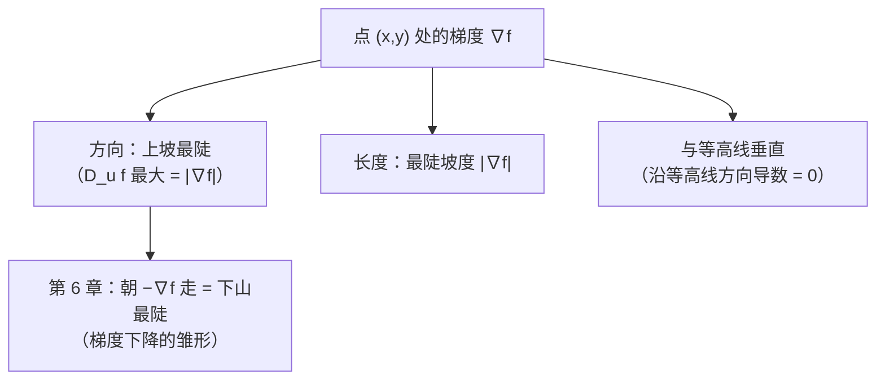

# 第 01 章 · 多元函数与偏导——山有千万面，先看哪边

> 本章从哪个问题出发：一元函数 y=f(x)，你要么往左、要么往右，只有两个方向。可当你真的站在一座山的山坡上——面前是 360° 无数个方向，你要往哪边迈脚才能最快上山？"这一面"有多陡，还能用"一个数"说清楚吗？
> 推导到哪个结论：只固定一个方向看（偏导）不够——它只告诉你"东西向"和"南北向"各自多陡。把所有方向的陡峭程度合成一个**向量**（梯度），你会惊异地发现：**任意方向的坡度，不过是"梯度"在这个方向上的投影；而上山最快的方向，正是梯度自己指向的方向。**
>
> 核心认知：**多元函数的"陡峭程度"不是一个数，而是一个向量（梯度）。** 梯度同时回答两个问题：朝哪个方向变化最快（方向），最快的变化率有多大（长度）。这一章是你走进"高维求最优"的第一级台阶——后面所有章节（梯度下降、鞍点、KKT）都踩在这块"梯度"上。

## 引子

老谟的客厅里摊着一张等高线地形图，图上弯弯曲曲的红线一圈套一圈，中间用铅笔重重标了个圈。

"我明天要陪人去爬山，"我盯着那张图，"可是老谟，我看了半天这图，有一个问题憋住了——图里只标了'等高线'，也就是高度相同的地方连起来的线。可我站在坡上的时候，想知道的是**我该往哪边走才最陡**。你给我讲讲，这跟一元函数可不一样：一元函数 y=f(x)，我想往哪边看就看哪边，左边右边两条路。可这是座山，我面前有 360° 的方向，我这脚，往哪迈？"

老谟把铅笔往图上一戳："你说得对，这确实不一样。那我们先从一个更笨的问题开始——**你说'山的陡峭'，它到底该用几个数来描述？**"

我愣了一下："几个数？……一个数不就够了？坡度嘛，45°、60°，一个角度。"

"一元函数用**一个**导数就能描述陡峭，是因为你只能往**一个**方向走。现在你面前有**无穷多个**方向——你拿一个数，怎么装得下无穷多个方向各自的陡峭程度？"

"……装不下。可我总不能数出 360 个坡度来吧？"

"那你就想吧。"老谟把笔往桌上一放，"这一章，就是让你亲手把'一个数'长成'一个向量'。别急，先从最省事的那一步走起。"

## 对话引擎

### 第 1 轮：一座山有无数个方向——"陡峭"需要一个"数"还是"一个向量"

**老谟**："你站在这张图的 A 点上。我现在让你回答：'A 点有多陡？' 你张口就来，报一个数给我。你打算怎么报？"

**造物主**："……我先朝东走一步试试？感觉一下东边是上坡还是下坡，陡不陡。"

**老谟**："好，你朝东试了，报了个数。那我再问你：'A 点有多陡？' 你这回朝**北**走一步再试试——报出来的，还是刚才那个数吗？"

**造物主**："……不一定。山是歪的，朝东可能平缓、朝北可能陡峭。朝东报一个数，朝北又是另一个数。"

**老谟**："那你刚才那句'一个数就够了'，还作数吗？"

**造物主**："不作数了。A 点'有多陡'，不是一个数能装完的——每个方向都有自己的坡度。"

**老谟**："所以你被逼到一个选择面前：要么老老实实把无穷多个方向全都试一遍——你试得完吗？要么，**找个更聪明的法子，用有限的几个数，把'所有方向有多陡'这件事全都包进去。** 数学家当年也是被同一个问题卡住的。我们先看他们最省事的那个办法——先不贪心，只挑两个方向看。"

---

### 📐 知识锚点：多元函数——"输入"不止一个数

【概念深挖】这一章我们要处理的函数长这样：**f(x, y)**——输入是两个数，输出是一个数。比如你站的山：输入是"平面坐标 (x, y)"，输出是"该点的高度 f(x, y)"。更一般地，f(x₁, x₂, …, xₙ) 输入 n 个数，输出 1 个数，叫 **n 元函数（function of several variables）**。

注意它和一元函数的关键差别：一元函数的图像是**一条曲线**，你站在上面只有左右两个方向；二元函数 f(x,y) 的图像是**一张曲面**（在三维空间里），你站在曲面上，面前是**一整圈的切线方向**。**"输入多了一个维度"这件事，直接导致"陡峭"从一个数膨胀成一个向量。** 这就是本章全部故事的起点。

【历史溯源】多变量微积分的真正奠基要等到 18 世纪。**克莱罗（Clairaut，1713–1765）**在研究曲面几何时较早系统处理"同时对两个变量求导"的问题，他在 1740 年左右给出了后来以他命名的定理——**混合偏导数相等的条件（克莱罗定理）**。之后**欧拉、拉格朗日**把多变量求导的算法补全。至于那个扭来扭去的偏导符号 **∂**，则是**雅可比（Jacobi，1804–1851）在 1841 年前后推广使用的**——他用 ∂ 强调"这是偏导数，不是对唯一变量的全导数"，这个约定沿用至今。**数学家花了一个多世纪才搞定"一个数装不下多方向陡峭"这件事，所以你一时绕不出来，不丢人。**

---

### 第 2 轮：先只挑两个方向看——"把 y 冻住，只让 x 动"

**老谟**："现在你站 A 点。你答应我不贪心，只挑两个方向看。你说，挑哪两个？"

**造物主**："……朝东（x 方向）和朝北（y 方向）吧？这俩横平竖直，好认。"

**老谟**："行。那我问你：朝东这个方向，你怎么测量它的坡度？"

**造物主**："朝东走一小步 Δx，看高度变了多少 Δf，比值就是平均坡度……这跟一元函数求导不是一样吗？"

**老谟**："一样，也不一样。一元函数里，x 一动，f 跟着动，就完了。可你现在是二元函数 f(x,y)——**你朝东走，x 在变，y 呢？**"

**造物主**："……y 不变。我是正东走的，y 一直没动。"

**老谟**："这就对了。朝东走 = **把 y 冻住当常数，只把 f 看成 x 的一元函数来求导**。这个操作，数学家给它起了个名字叫**偏导**——'偏'就偏在：我只动一个变量，其他全都按住不动。你先按这个思路，说说朝北该怎么做？"

**造物主**："朝北走 = 把 x 冻住当常数，只把 f 看成 y 的一元函数来求导。……这样每个方向我都只剩一个变量在动，跟一元函数一模一样了！"

**老谟**："你摸到偏导的精髓了：**多元函数求导的'笨办法'，就是把其他变量全冻住，退回一元函数**。可你自己也承认过——朝东的坡度和朝北的坡度是两回事，是两个数。那我只给你这两个数，你站 A 点朝**东北**（45°）走，坡度是多少？用这两个数，能算出来吗？"

---

### 📐 知识锚点：偏导数——"按住其他变量，只动一个"

【概念深挖】**偏导数（partial derivative）** 的定义：设 f(x, y)，把 y 当作常数，对 x 求导，得到

```text
f_x(x, y) = ∂f/∂x = lim_{h→0} [f(x+h, y) − f(x, y)] / h
```

把 x 当作常数，对 y 求导，得到 f_y(x, y) = ∂f/∂y。记号里那个 **∂** 就是偏导号，读作"偏"——它提醒你：**这个导数是在"按住其他变量"的前提下算的，不是全导数。** 计算上，它和一元求导完全一样，只是每动一个变量前，要把其余变量当"带字母的常数"处理。

例：f(x, y) = x²y + sin y。
- 对 x 求偏导：把 y 当常数，x² 的导数是 2x，x²y 对 x 的偏导是 2xy；sin y 与 x 无关，当常数，导数为 0。得 **f_x = 2xy**。
- 对 y 求偏导：把 x 当常数，x²y 对 y 的偏导是 x²；sin y 对 y 的导数是 cos y。得 **f_y = x² + cos y**。

【工程实践】为什么工程师必须先练"偏导"这一手？因为**几乎所有"调参"场景都是多元的**。你在训练一个模型，参数是 w₁, w₂, …, wₙ——你手里只有一个损失函数 L(w₁, …, wₙ) 要往下压。**你不可能同时乱动所有参数，只能"按住其他参数，单独试这一个怎么变"——这恰恰就是偏导。** 后面第 6 章你会看到，整个梯度下降就是在反复做这件事：算所有偏导、打包成向量、朝那个方向迈一步。**偏导是"多元微积分"和"机器学习"之间的第一块接头。**

---

### 第 3 轮：两个方向不够——方向导数登场

**老谟**："回到刚才的问题。你手里有两个数：朝东的坡度、朝北的坡度。现在我问你朝**东北**（45°）的坡度——你答得上来吗？"

**造物主**："……答不上来。东北既不是正东也不是正北，感觉是'两个都有点'。可'有点'是多少？总不能拿朝东的坡度和朝北的坡度加起来除以二吧？"

**老谟**："那我们先不急着算。先把这个新问题**立起来**：你现在需要的是一个新概念——**朝任意给定方向的坡度**。它得比偏导更'全能'：偏导只会东西向和南北向，而你要的是 360° 任何一个方向都能回答。数学家管这个叫**方向导数**。它长什么样？你自己说：朝单位方向 u 走，坡度怎么定义？"

**造物主**："……跟偏导一个思路？朝 u 方向走一小步，高度变化量除以步长。只不过步长不是一个单纯的 Δx 了，得同时动 x 和 y。"

**老谟**："你定义得对。方向 u = (u₁, u₂) 是**单位长度**的方向，朝它走 t 步，坐标变成 (x + tu₁, y + tu₂)，高度从 f(x,y) 变到 f(x+tu₁, y+tu₂)，那么

```text
D_u f(x,y) = lim_{t→0} [f(x+tu₁, y+tu₂) − f(x,y)] / t
```

就是朝 u 方向的方向导数。**注意偏导就是它的特例**：u = (1,0) 时就是 f_x，u = (0,1) 时就是 f_y。定义立起来了——可你自己马上会发现一个麻烦：这定义要对**每一个方向**单独算一次极限，360° 就要算 360 个极限。**这条路走得通，但你愿意这么干吗？**"

---

### 📐 知识锚点：方向导数——朝任意方向的"坡度"

【概念深挖】**方向导数（directional derivative）**：设 u = (u₁, u₂) 为单位向量（u₁² + u₂² = 1），f 在点 (x,y) 朝 u 方向的方向导数为

```text
D_u f(x,y) = lim_{t→0} [ f(x + t·u₁, y + t·u₂) − f(x,y) ] / t
```

直觉：从点 (x,y) 出发，沿着 u 方向迈一小步 t，测高度变化率。**它回答的问题比偏导更完整："这座山上，我朝这个方向走，坡有多陡？"** 偏导只是它取 u=(1,0) 和 u=(0,1) 的两个特例。

【概念深挖】方向导数有两个必须钉死的细节：
1. **u 必须是单位向量**（长度 1）。如果 u 长度不是 1，你迈的那"一小步 t"就不是"一步"而是"0.7 步"——测出来的就不是"每步变化率"，数值会失真。**先把方向归一化（除以自己的长度），再算方向导数。**
2. **极限的存在性**：方向导数是一个极限，极限可能不存在（比如曲面在该方向上有棱）。后面反例里你会亲眼看到一个"朝所有轴方向都有偏导、却几乎任何别的方向都没有方向导数"的病态函数。

【工程实践】方向导数的工程直觉：**"沿着这个策略方向改，指标会涨还是会跌？涨多少？"** 比如你调参时想同时微调多个超参数——"把学习率 ×1.1、批大小 ×0.9"这个组合方向，损失函数朝这个方向走是升是降，就是方向导数。**它把"一个方向"翻译成"一个变化率"，是所有"往哪儿走"类问题的统一度量。**

---

### 第 4 轮：无穷多个方向，难道要算无穷多个极限？

**老谟**："方向导数定义好了。可你自己数数——一个点有 360° 无限多个方向，每个方向都要单独算一个极限。这要是真这么干，工程师早累死了。你回头看看你手里那点家当：朝东的偏导 f_x、朝北的偏导 f_y。就这两个数，你觉得够不够**拼出**任意方向的方向导数？"

**造物主**："……拼出来？可是东北方向的坡度和 f_x、f_y 什么关系？我不是说不能简单平均嘛……"

**老谟**："别猜平均值。我们一步一步来：你朝东北走，等于**同时**往东走一点、往北走一点。假设曲面在这一点是**平滑**的（没有棱、没有台阶），那你迈这一小步，高度变化能不能看成'往东那部分贡献的 + 往北那部分贡献的'？"

**造物主**："能……吧？往东走贡献 f_x × 东向位移，往北走贡献 f_y × 北向位移，加起来就是总高度变化。东向位移是 t·u₁，北向位移是 t·u₂，所以总变化 ≈ f_x·(t·u₁) + f_y·(t·u₂)。"

**老谟**："你刚刚干了一件大事，自己可能还没发现。把 t 除下去，你得到的是

```text
D_u f ≈ f_x·u₁ + f_y·u₂
```

**你看清楚这个式子的结构**：左边是'朝任意方向 u 的坡度'，右边是两个已知数 f_x、f_y 分别乘上 u 的两个分量再相加。你有没有觉得，这个式子眼熟？"

**造物主**："……乘起来再相加？这不就是**点积**的样子吗？把 (f_x, f_y) 和 (u₁, u₂) 这两个向量做点积，就是这个式子！"

**老谟**："抓住它了。**方向导数 = 一个由偏导组成的向量，和方向向量做点积。** 那个"由偏导组成的向量"，数学家给它起名叫**梯度**。这一下，无穷多个方向的坡度，全都被这两个数（f_x 和 f_y）装进去了——你不需要算 360 个极限，你只需要算 2 个偏导，然后任意方向一问，做个点积就出答案。"

---

### 📐 知识锚点：梯度——把"所有方向的陡峭"装进一个向量

【概念深挖】**梯度（gradient）**：把 f 对每个变量的偏导打包成一个向量：

```text
∇f(x,y) = ( f_x(x,y),  f_y(x,y) )   （三元：∇f = (f_x, f_y, f_z)）
```

∇ 读作"nabla"，是倒置的三角形符号。**梯度把"一个点所有方向的陡峭信息"压缩进了"一个向量"**——这一压缩，就是本章的核心魔法：你不再需要 360 个数，只需要 n 个（n 个输入变量就有 n 个偏导）。

**为什么方向导数 = 梯度·方向（点积）**：在 f 平滑（可微）的前提下，朝单位方向 u 的方向导数正是

```text
D_u f = ∇f · u = f_x·u₁ + f_y·u₂
```

（严格证明见严格化走廊定理 1。）**这个公式是本章的"总钥匙"：以后你要问"朝任意方向走多陡"，一律先算梯度，再和方向做点积，永远不用回到定义去算极限。**

【历史溯源】"梯度"这个术语出自**麦克斯韦（James Clerk Maxwell）在 1873 年的《论电与磁》**。他在研究电磁场时需要一个词描述"场的强度朝哪个方向增长最快"，于是借了气象学里"gradient"（气压梯度）的说法。**注意一件耐人寻味的事：梯度这个工具是被物理逼出来的——工程师/物理学家先需要"往哪儿走最陡"，数学家才回头把它的理论钉牢。** 你现在学的顺序（先偏导、再梯度），和人类当年被问题追着跑的路径，方向一致。

【工程实践】**梯度是"下山算法"的罗盘**：训练模型要找损失函数的谷底，办法就是"算梯度，朝负梯度方向走"（第 6 章梯度下降）。你不需要知道损失面长什么样（几百个参数根本画不出来），只需要**在每个点算出梯度这个向量，它永远指着"上坡最陡"的方向，朝反方向走就是"下坡最陡"。** 这就是为什么"自动求梯度"是每个深度学习框架的标配功能——**梯度，是多元微积分写给工程的通行证。**

【实现思考】如果让你写一个函数「输入任意方向、输出该方向坡度」，你会怎么实现？**最笨的写法**：对每个方向单独算一次"差商极限"——每问一个方向就要一次极限，慢且不稳，方向无穷多，根本写不完。**聪明的写法**：先算一次梯度向量存下来，之后任何方向只需一个点积 D_u f = ∇f·u——**把"每问一次都要算极限"降级成"算一次梯度、之后每次只做点积"。** 深度学习框架的自动求梯度（autograd）正是这个思路：**先反向传播把梯度算好存下，之后任何方向的查询都是点积。** 这就是"打包成向量"的真正价值——**它不只是记法漂亮，它把计算的复杂度从"每问一次重算一遍"降到"算一次、随便查"。**

---

### 第 5 轮：梯度告诉我们什么——它指着上坡最陡的方向

**老谟**："公式 D_u f = ∇f · u 到手了。现在我问你一个尖锐的问题：**既然任意方向的坡度都是梯度·方向，那你站在这点上，朝哪个方向走坡度最大？最大能到多少？** 别急，先看看你手里有什么工具——点积的几何意义，你还记得吗？"

**造物主**："点积的几何意义……a·b = |a||b|cosθ，θ 是两个向量的夹角。……啊，我明白了：D_u f = ∇f·u = |∇f|·|u|·cosθ = |∇f|·cosθ（u 是单位向量，|u|=1）。cosθ 最大是 1，**当 θ=0，也就是 u 和 ∇f 同一个方向时，坡度最大，等于 |∇f|！**"

**老谟**："一字不差。**梯度的方向，就是上坡最陡的方向；梯度的长度，就是最陡的坡度。** 这就是梯度的全部意义——它不只是一个"打包好的偏导向量"，它直接回答了你最初那个问题：'我该往哪边迈脚？'"

**造物主**："那我要是朝**垂直于**梯度的方向走呢？cos 90° = 0，坡度是 0——**就是说，沿着和梯度垂直的方向走，高度一点不变！** 这不就是……等高线吗？！"

**老谟**："你自己把第二个几何结论也摸出来了：**等高线在每一点都和梯度垂直。** 你看那张地形图——等高线是"高度相同"的线，沿着它走当然高度不变，所以它的切线方向必然和"上坡最陡方向"（梯度）垂直。这张图你研究了半天没看懂的线条，现在能看懂了。"

---

### 📐 知识锚点：梯度的两个几何结论

【概念深挖】**结论一（方向）**：梯度 ∇f 指向 f 增长最快的方向；沿梯度方向的方向导数最大，为 |∇f|。**结论二（正交）**：过点 (x,y) 的等高线（方程 f(x,y)=c 确定的曲线）在该点的切线方向，与梯度 ∇f(x,y) 垂直——因为沿等高线走 f 不变，方向导数为 0，由 D_u f = ∇f·u = 0 即得 ∇f ⊥ u。



**读图说明**：这张图是本章的"出口导航"。中间是梯度这个核心对象，它同时携带三份信息——方向（上坡最陡）、大小（最陡坡度）、几何关系（垂直等高线）。最下面那条箭头最要紧：**把梯度反过来，就是下山最陡的方向——第 6 章整章就是沿着这个箭头走出来的。** 你现在看到的"梯度"，是后面所有优化算法的地基。

【工程实践】等高线垂直梯度的工程版：**"最陡下降方向"和"等损失面"永远垂直**。你在调参时，损失函数等高线（等损失曲线）在参数空间里画出来，梯度总是垂直于等高线——这意味着**"最陡的改进方向"从不和"损失不变的方向"重合**。这个几何直觉后面理解梯度下降的"之字形"路径时还会用上。

---

### 第 6 轮：偏导存在，就万事大吉了吗？——"可微"的门槛

**老谟**："梯度这么好用，公式 D_u f = ∇f·u 也漂亮。可我问你：**这个公式，是白捡的吗？** 我们推导它的时候，偷偷做了一个假设——你还记得是什么吗？"

**造物主**："……我说'假设曲面是平滑的，没有棱、没有台阶'，然后才敢把高度变化拆成'东向贡献 + 北向贡献'。"

**老谟**："对。**'平滑'就是'可微'（differentiable）的白话版。** 可问题来了：一元函数里，'可导'几乎总是成立，例外极少。多元函数这里，'偏导存在'比你想的脆弱得多——我给你一个函数，它的两个偏导在原点都存在，但它连**连续**都不连续，更别说'平滑'。你觉得可能吗？"

**造物主**："……偏导都存在，居然可以不连续？一元函数里，可导必连续，这可是铁律啊！"

**老谟**："一元函数的铁律，在多元这里**不搬了**。原因就在偏导的定义里：f_x 是'把 y 冻住'求的导，f_y 是'把 x 冻住'求的导——**两条轴方向各看一次，只保证了'沿这两条轴'行为正常，可没保证'斜着穿过来'的方向正常。** 一个函数可以只在十字架上光滑，四个象限之间却是撕裂的。这个反例，放到严格化走廊里你会亲手看到它长什么样——它是本章最重要的'边界'，比梯度公式本身更能防止你拿公式到处乱用。"

---

### 📐 知识锚点：偏导存在 ≠ 连续——多元世界的第一记"耳光"

【概念深挖】**多元"可微"的完整定义**（严格版见走廊）：f 在点 a 可微，是指存在一个线性函数能"贴住"曲面——即全增量可以写成

```text
f(a+h) − f(a) = ∇f(a)·h + ε(h)·|h|，其中 ε(h)→0（当 h→0）
```

意思是：**高度变化 ≈ 梯度与位移的点积（线性主部）+ 一个比位移还小的尾巴。** 可微 ⇒ 连续；可微 ⇒ 方向导数全都存在且 = ∇f·u。但**偏导存在只是一条弱得多的条件**——它只保证"沿坐标轴方向"正常。

【概念深挖】经典反例（f 在原点偏导存在、方向导数（斜向）不存在、甚至不连续）：

```text
f(x,y) = xy / (x² + y²)，当 (x,y) ≠ (0,0)；f(0,0) = 0
```

- 沿 x 轴（y=0，x≠0）：f = 0/x² = 0，故 f_x(0,0) = lim_{h→0} [f(h,0)−f(0,0)]/h = 0。同理 f_y(0,0) = 0。**两个偏导都存在，都是 0。**
- 但沿直线 y = kx 靠近原点（k≠0）：f(x, kx) = kx²/(x²+k²x²) = k/(1+k²)，随 k 不同而不同！**沿不同斜线逼近，极限值不同——所以 f 在原点极限不存在，更不连续。**
- 甚至斜向方向导数也不存在：朝 u=(1,1)/√2 走，f(t/√2, t/√2) = (t²/2)/(t²) = 1/2 ≠ 0，而 f(0,0)=0，比值 (1/2)/t → ∞（或说极限不存在）。

**这一记"耳光"打醒什么**：**多元世界里，"每个坐标轴方向都正常"远不等于"所有方向都正常"。** 梯度公式 D_u f = ∇f·u 能成立，前提是 f 可微——所以在用梯度之前，你得先确认"这块曲面是平滑的"，而不是只看偏导存在。

【工程实践】这个反例在工程里对应**"病态损失面"**：有些表面看似各方向都有定义，实则在某条斜线上藏着"断崖"或"刀刃"。神经网络的大多数损失函数是光滑的（可微），但**ReLU 这类带折角的激活函数让损失面出现"棱"**——在棱上梯度不存在（或不可微），优化器就得用次梯度等变通手段。**知道"偏导存在≠可微"，你就知道为什么工程里要格外小心"折角"和"棱"。**

---

### 第 7 轮：落点——"一个数"长成了"一个向量"

**老谟**："把地图收起来。你现在回答我最初的问题：'一座山的陡峭，该用几个数描述？'"

**造物主**："不是一个数，是一个向量——**梯度**。它的方向指着上坡最陡的方向，它的长度就是最陡的坡度；任意方向的坡度，都是梯度往那个方向上的投影（点积）。而且我还知道了：偏导存在不等于曲面平滑，要用梯度公式，得先确认可微。"

**老谟**："你手里现在有三样东西：偏导（按住其他变量只动一个）、方向导数（任意方向的坡度）、梯度（把所有方向打包成一个向量）。这三样是什么关系，你自己理一遍。"

**造物主**："偏导是'只沿坐标轴看'的特例；方向导数是'任意方向都能看'的完整版；梯度是把所有偏导打包，然后'任意方向 = 梯度·方向'这个点积公式，让我不用真的去算每个方向的极限。"

**老谟**："理得很顺。可是你有没有发现——我们这一章，从头到尾都在问'这一个点，往哪个方向最陡'。**这只是站在山坡上找方向。下一章，你手里这个梯度还要再长本事：当 x 和 y 自己不老实、互相牵着手变的时候（比如 x 和 y 都是中间变量的函数），梯度该怎么跟着变？** 那叫链式法则。你先把这个'向量'踩实，明天我们让它学会'拐弯'。"

## 严格化走廊

> 位置说明：本章对话负责"直觉"——为什么"一个数"不够用、梯度为什么是向量。本走廊负责"严谨"——把偏导、方向导数、梯度写成精确的定义，把"方向导数 = 梯度·方向"推成可复写的证明。**下面每一行，读者都能对着空白纸重写一遍。**

### 定义 1：偏导数（partial derivative）

设 f : D ⊆ ℝ² → ℝ，点 (a, b) 在 D 内。**f 对 x 的偏导数**定义为

```text
f_x(a,b) = ∂f/∂x (a,b) = lim_{h→0} [ f(a+h, b) − f(a,b) ] / h   （若极限存在）
```

**f 对 y 的偏导数**同理：f_y(a,b) = lim_{h→0} [ f(a, b+h) − f(a,b) ] / h。n 元函数 f(x₁,…,xₙ) 同理，每次只让一个变量变、其余全固定。

> **严格注记**：偏导数是"沿坐标轴方向"的极限，它只探测曲面沿坐标轴方向的行为。**它甚至不需要函数在点附近"长得像平面"——这是后面定义 4（可微）要补的约束。**

### 定义 2：方向导数（directional derivative）

设 u = (u₁, u₂) 为单位向量（u₁² + u₂² = 1）。**f 在 (a,b) 沿方向 u 的方向导数**定义为

```text
D_u f(a,b) = lim_{t→0} [ f(a + t·u₁, b + t·u₂) − f(a,b) ] / t   （若极限存在）
```

当 u = (1,0) 时 D_u f = f_x；当 u = (0,1) 时 D_u f = f_y。**偏导是方向导数的特例。**

### 定义 3：梯度（gradient）

设 f : D ⊆ ℝⁿ → ℝ 在点 a 处所有偏导存在。**梯度**为行向量/列向量

```text
∇f(a) = ( ∂f/∂x₁ (a),  ∂f/∂x₂ (a),  …,  ∂f/∂xₙ (a) )
```

### 定义 4：可微（differentiable）

f : D ⊆ ℝ² → ℝ 在点 a 处**可微**，是指存在向量 v = (v₁, v₂)（只依赖 a，不依赖 h），使得对 a 附近的所有 h = (h₁, h₂)：

```text
f(a+h) − f(a) = v₁·h₁ + v₂·h₂ + ε(h)·|h|，其中 ε(h) → 0（当 h → 0）
```

> **严格注记**：若 f 可微，则 v 必为 ∇f(a)。可微的含义是：**曲面在该点被一个"倾斜平面"（线性函数）牢牢顶住，误差比位移还小一个量级。** 可微 ⇒ 连续（因为 f(a+h) − f(a) → 0）；可微 ⇒ 沿任意方向的方向导数存在。

### 定理 1（方向导数 = 梯度·方向）：若 f 在点 a 可微，则对任意单位向量 u，

```text
D_u f(a) = ∇f(a) · u
```

**证明（可复写）**：
- 由定义 4（可微），f(a + t·u) − f(a) = ∇f(a)·(t·u) + ε(t·u)·|t·u| = t·[∇f(a)·u] + |t|·ε(t·u)。
- 两边除以 t（沿 t → 0 取极限；注意 t 可正可负，用 |t| 记号统一）：
  [ f(a + t·u) − f(a) ] / t = ∇f(a)·u + ε(t·u)·(|t|/t)。
- 因 ε(t·u) → 0（当 t → 0），且 |t|/t 有界（恒为 ±1），故最后一项 → 0。
- 于是极限 D_u f(a) = lim_{t→0} [ f(a + t·u) − f(a) ] / t = ∇f(a)·u。∎

**证明要点标注**：第 1 步用了**定义 4（可微的线性主部分解）**；第 2 步是**代数整理 + 有界量乘无穷小仍为无穷小**（ε(t·u)·(|t|/t) → 0）；第 3 步直接套**定义 2（方向导数的极限式）**。

### 定理 2（梯度的最陡方向）：设 f 在点 a 可微且 ∇f(a) ≠ 0，则

- 所有单位方向 u 中，D_u f(a) 在 **u = ∇f(a)/|∇f(a)|** 时取到最大值，最大值为 **|∇f(a)|**；
- 在 u 与 ∇f(a) 垂直（u·∇f(a) = 0）的方向上，D_u f(a) = 0。

**证明（可复写）**：
- 由定理 1：D_u f(a) = ∇f(a)·u。对单位向量 u，由**向量点积的定义** ∇f(a)·u = |∇f(a)|·|u|·cos θ = |∇f(a)|·cos θ（其中 θ 是 ∇f(a) 与 u 的夹角，|u| = 1）。
- 因 −1 ≤ cos θ ≤ 1，故 −|∇f(a)| ≤ D_u f(a) ≤ |∇f(a)|。
- 等号 u 同向（cos θ = 1）时取到上界 |∇f(a)|；u 反向（cos θ = −1）时取到下界 −|∇f(a)|。∎

**证明要点标注**：第 1 步用了**定理 1**（方向导数的点积公式）；第 2 步用了**点积的几何定义（夹角余弦）**与**单位向量的长度条件 |u|=1**；第 3 步是**余弦的有界性**。

### 定理 3（克莱罗定理，叙述）：设 f 在点 (a,b) 附近二阶混合偏导存在且连续，则

```text
f_xy(a,b) = f_yx(a,b)   （即 ∂²f/∂x∂y = ∂²f/∂y∂x，求导次序可交换）
```

> **严格注记**："二阶混合偏导连续"是充分条件（不是必要条件）。若混合偏导不连续，交换次序可能出问题——克莱罗定理是**有前提的**，不是永远成立。第 2 章讲多元泰勒时会用到它。

### 反例/边界：偏导存在 ≠ 连续 ≠ 可微

考虑 f(x,y) = xy/(x²+y²)（(x,y)≠(0,0)），f(0,0) = 0：
- **偏导存在**：f_x(0,0) = lim_{h→0} [f(h,0)−f(0,0)]/h = lim 0/h = 0；f_y(0,0) = 0。两个偏导都是 0。
- **不连续**：沿 y = kx（k ≠ 0）逼近原点，f(x, kx) = kx²/(x²+k²x²) = k/(1+k²)。k = 0 时极限 0，k = 1 时极限 1/2——**不同路径极限不同，原点极限不存在，故不连续**。既然不连续，就谈不上可微（可微 ⇒ 连续）。
- **斜向方向导数不存在**：u = (1/√2, 1/√2)，[f(t/√2, t/√2) − 0]/t = [(t²/2)/(t²/2 + t²/2)]/t = (1/2)/t，t→0 时发散。

**结论**：这个函数是"偏导存在但方向导数（斜向）不存在、且不连续"的活标本。**它钉死了本章最要紧的边界——看到 f_x、f_y 都存在，不要立刻写 D_u f = ∇f·u；先确认 f 可微。** 可微是梯度公式的"许可证"。

## 知识点总结

### 知识点（本章推出的核心概念）

- **多元函数**：f(x₁, …, xₙ)，输入 n 个数输出 1 个数；图像在 n=2 时是一张曲面，点上有无穷多个切线方向——所以"陡峭"装不进一个数。
- **偏导数 f_x、f_y**：按住其他变量当常数，只对其中一个求导；记号 **∂**（雅可比推广，1841 前后）。偏导只探测"沿坐标轴方向"的行为。
- **方向导数 D_u f**：朝任意单位方向 u 的坡度；定义是 f 沿 u 方向位移的变化率极限；**偏导是它取 u=(1,0)/(0,1) 的特例。**
- **梯度 ∇f = (f_x, f_y, …)**：把所有偏导打包成一个向量；"所有方向的陡峭"被压缩进一个向量。术语出自**麦克斯韦《论电与磁》（1873）**。
- **总钥匙公式**：f 可微时，D_u f = ∇f·u——任意方向的坡度 = 梯度在 u 上的投影，不用每个方向都算极限。
- **梯度的几何**：方向 = 上坡最陡；长度 |∇f| = 最陡坡度；**与等高线垂直**（沿等高线方向导数 = 0）。
- **可微 vs 偏导存在**：可微 = 曲面被线性平面"顶住"（全增量 = 线性主部 + 高阶小）；**可微 ⇒ 连续，可微 ⇒ 偏导存在**（但两个方向的反向均不成立）；特别地**偏导存在不蕴含连续**（反例 xy/(x²+y²)）。
- **克莱罗定理**：二阶混合偏导连续时，f_xy = f_yx（求导次序可交换）。

### 历史结论（本章涉及的史料）

- **克莱罗（18 世纪）**：系统处理多变量求导，给出混合偏导相等的定理（克莱罗定理）。
- **雅可比（1841 前后）**：推广偏导记号 ∂，区分"偏导"与"全导数"。
- **麦克斯韦（1873）**：《论电与磁》引入"gradient（梯度）"一词描述"场向哪个方向增长最快"——工具先被物理逼出来，理论再钉牢。
- **一个共性**：多元微积分不是被数学家关起门造出来的，是被"曲面的几何问题"和"场的物理问题"一步步逼出来的。

### 工程实践结论（本章知识在真实工程里怎么用）

- **调参 = 多元求偏导**：模型参数 w₁, …, wₙ，损失 L(w₁,…,wₙ)，一次只能"按住别的、单独动一个"看效果——这就是偏导。
- **梯度是下山罗盘**：朝 −∇f 走是下降最陡的方向，深度学习框架标配"自动求梯度"。
- **方向导数 = "往这个策略方向改，指标怎么变"**：同时微调多个超参数的组合方向，用方向导数度量升降。
- **棱和折角要小心**：ReLU 激活函数让损失面带棱（不可微点），偏导存在≠可微的反例就是它的数学根源；工程上要用次梯度等变通手段。

## 计算训练场

> 位置说明：本章对话负责"为什么"，这里负责"怎么算"。**下面每题请动笔 10 分钟以上，先自己写，再对照完整解答。禁止边算边翻答案。**

### 题 1（易→中）：求偏导、梯度、方向导数——公式法与定义法互证

**题干**：设 f(x, y) = x²y + sin y。
(a) 求 f_x 与 f_y（偏导的完整计算过程）。
(b) 求梯度 ∇f 在点 (1, 0) 处的值。
(c) 求 f 在点 (1, 0) 沿单位方向 u = (1/√2, 1/√2) 的方向导数。要求**先用公式 D_u f = ∇f·u 算一遍，再用方向导数的极限定义直接验算一遍**，两法结果应一致。

**完整分步解答：**

**(a) 求偏导**：
第 1 步（f_x）：把 y 当常数。x²y 是"常数 y × x²"，对 x 求导得 2xy；sin y 与 x 无关，当常数，导数为 0。故 f_x = **2xy**。
第 2 步（f_y）：把 x 当常数。x²y 是"常数 x² × y"，对 y 求导得 x²；sin y 对 y 求导得 cos y。故 f_y = **x² + cos y**。

**(b) 梯度在 (1,0)**：
第 3 步：代入点 (1, 0)：f_x(1,0) = 2·1·0 = 0；f_y(1,0) = 1² + cos 0 = 1 + 1 = 2。
第 4 步：∇f(1,0) = **(0, 2)**。

**(c) 方向导数——公式法**：
第 5 步：D_u f(1,0) = ∇f(1,0)·u = 0·(1/√2) + 2·(1/√2) = 2/√2 = **√2 ≈ 1.4142**。

**(c) 方向导数——定义法验算**：
第 6 步：点 (1,0) 沿 u 走 t 步到达 (1 + t/√2, t/√2)。先算 f 在该点：
f(1 + t/√2, t/√2) = (1 + t/√2)²·(t/√2) + sin(t/√2)
= (1 + 2t/√2 + t²/2)·(t/√2) + sin(t/√2)
= t/√2 + t²·(2/2) + t³/(2√2) + sin(t/√2)
= t/√2 + t² + t³/(2√2) + sin(t/√2)。
第 7 步：f(1,0) = 1²·0 + sin 0 = 0。
第 8 步：差商 = [f(1+t/√2, t/√2) − f(1,0)] / t = 1/√2 + t + t²/(2√2) + sin(t/√2)/t。
第 9 步：取极限 t→0：1/√2 + 0 + 0 + (1/√2)·1 = 2/√2 = **√2**。（这里用了 sin z / z → 1，z = t/√2 → 0。）
第 10 步：**√2 = √2 ✓**，公式法与定义法一致。

**答**：(a) f_x = 2xy，f_y = x² + cos y；(b) ∇f(1,0) = (0, 2)；(c) D_u f(1,0) = **√2 ≈ 1.414**。

**常见错误**：① 求 f_x 时把 sin y 误当常数算成 0——没错，但有人会把"sin y 对 x 求导"误写成 cos y，**sin y 里没有 x，对 x 的偏导就是 0**；② 定义法验算时忘了 (1 + t/√2)² 展开要算三项，导致 t 的一次项系数算错；③ 方向 u 忘记归一化——**u 必须是单位向量，先算 |u| 再除以它**。

### 题 2（中）：三元函数——梯度、指定方向、最陡方向与最大变化率

**题干**：设 f(x, y, z) = x²y³ + xz²。
(a) 求 f_x、f_y、f_z。
(b) 求梯度 ∇f 在点 (1, 1, 2) 的值及其长度 |∇f|。
(c) 求 f 在点 (1, 1, 2) 沿单位方向 v = (1/√3, 1/√3, 1/√3) 的方向导数。
(d) 在点 (1, 1, 2)，f 增长最快的方向是什么？最快的变化率是多少？

**完整分步解答：**

**(a) 三个偏导**：
第 1 步：f_x：y、z 都当常数。x²y³ 对 x 求导得 2xy³；xz² 对 x 求导得 z²。故 f_x = **2xy³ + z²**。
第 2 步：f_y：x、z 都当常数。x²y³ 对 y 求导得 3x²y²；xz² 与 y 无关，为 0。故 f_y = **3x²y²**。
第 3 步：f_z：x、y 都当常数。x²y³ 与 z 无关，为 0；xz² 对 z 求导得 2xz。故 f_z = **2xz**。

**(b) 梯度及其长度**：
第 4 步：代入 (1, 1, 2)：f_x = 2·1·1³ + 2² = 2 + 4 = 6；f_y = 3·1²·1² = 3；f_z = 2·1·2 = 4。
第 5 步：∇f(1,1,2) = **(6, 3, 4)**。
第 6 步：|∇f| = √(6² + 3² + 4²) = √(36 + 9 + 16) = **√61 ≈ 7.8102**。

**(c) 指定方向的方向导数**：
第 7 步：D_v f = ∇f·v = 6·(1/√3) + 3·(1/√3) + 4·(1/√3) = 13/√3 = **13√3/3 ≈ 7.5056**。

**(d) 最陡方向与最大变化率**：
第 8 步：增长最快方向 = 梯度的单位化：**u* = (6, 3, 4)/√61**。
第 9 步：最快变化率 = |∇f| = **√61 ≈ 7.8102**（沿 u* 时 D_u* f = |∇f|·cos 0 = |∇f|）。

**答**：(a) f_x = 2xy³+z²，f_y = 3x²y²，f_z = 2xz；(b) ∇f = (6,3,4)，|∇f| = √61 ≈ 7.810；(c) D_v f = 13/√3 ≈ 7.506；(d) 方向 (6,3,4)/√61，最大变化率 √61。

**常见错误**：① f_x 里丢了 z² 这一项——因为 xz² 对 x 求导是 z²（不是 2xz，那是 f_z）；② 算长度时 √(36+9+16) 算成 √61 时有人误加成 61 的平方根形式没问题，但有人把 36+9+16 算成 51；③ 方向导数只除一次 √3——因为 v 已是单位向量，不要再额外除。

### 题 3（中→难）：梯度与等高线正交的数值验证 + 偏导存在却不连续的检验

**题干**：设 f(x, y) = x² + y²。
(a) 求 ∇f 在点 (1, 1) 的值。过 (1,1) 的等高线是 f(x,y) = 2，即圆 x² + y² = 2。用隐函数求导（或圆的几何）求出该等高线在 (1,1) 处的切线方向，并验证它与梯度垂直。
(b) 把本章反例 f(x,y) = xy/(x²+y²)（原点取 0）在原点处的两个偏导算出来；再沿 y = 2x 逼近原点计算极限，验证"偏导存在但不连续"。

**完整分步解答：**

**(a) 梯度 ⊥ 等高线**：
第 1 步：f_x = 2x，f_y = 2y。代入 (1,1)：∇f(1,1) = **(2, 2)**。
第 2 步：等高线 x² + y² = 2。隐函数求导：对 x 求导，2x + 2y·y′ = 0，故 y′ = −x/y = −1/1 = **−1**。
第 3 步：切线方向取 (1, y′) = (1, −1)（或它的相反方向）。与梯度做点积：(2, 2)·(1, −1) = 2·1 + 2·(−1) = 0。**点积为 0，故梯度 ⊥ 切线方向 ✓**（这也说明沿等高线走 f 不变：D_u f = ∇f·u = 0）。

**(b) 偏导存在但不连续**：
第 4 步：f_x(0,0) = lim_{h→0} [f(h,0) − f(0,0)]/h = lim_{h→0} [0 − 0]/h = 0（沿 y=0，f(h,0) = h·0/(h²+0) = 0）。同理 f_y(0,0) = 0。
第 5 步：沿 y = 2x 逼近原点（x→0，x≠0）：f(x, 2x) = x·(2x)/(x² + (2x)²) = 2x²/(x² + 4x²) = 2/5。
第 6 步：沿 y = 0（即 k=0）逼近，极限 = 0；沿 y = 2x 逼近，极限 = 2/5。**两条路径极限不同（0 ≠ 2/5），故原点极限不存在，f 在原点不连续。** 但两个偏导却都是 0——"偏导存在"和"连续"在这里**脱钩**了。

**答**：(a) ∇f(1,1) = (2,2)，等高线切线方向 (1,−1)，点积 0，垂直成立；(b) f_x = f_y = 0 但沿 y=2x 极限 2/5 ≠ 0，故不连续——反例坐实。

**常见错误**：① 隐函数求导忘了 y 是 x 的函数，把 x²+y² 对 x 求导写成 2x+2y（漏了 y′）；② 验证不连续时只沿一条路径逼近——**不连续要用"两条路径极限不同"来证明，一条路径算不出"极限不存在"**；③ 把"偏导存在"直接当成"可微"用梯度公式——这正是本章反例要钉死的误区。

## 向导便签

> 这一章咱们干了什么：从"山上有 360° 方向，往哪边走最陡"这个登山地图前的傻问题出发，发现"陡峭"装不进一个数；先学最省事的偏导（按住其他变量只动一个），发现它只能回答东西南北四个方向；于是定义方向导数（任意方向的坡度），最后用梯度把所有方向打包成一个向量——**任意方向的坡度 = 梯度·方向（点积）**。
>
> 钉死一句话：**梯度同时回答两件事——朝哪个方向上坡最陡（方向），最陡有多陡（长度 |∇f|）；而且它和等高线垂直。** 反过来说：**朝 −∇f 走，就是下坡最陡的方向**——这句话是第 6 章梯度下降的全部起点。
>
> 记住一个边界：**偏导存在 ≠ 连续 ≠ 可微。** 那记"耳光"函数 xy/(x²+y²) 让你亲眼看到，只在十字架上光滑、斜着穿过来就撕裂的曲面是真实存在的。用梯度公式之前，先确认 f 可微。

## 造物主手记

**我曾踩的坑**：

我一开始坚持"山的陡峭一个数就够了"，被老谟一句"朝东报一个数、朝北报另一个数，还作数吗"噎住。接着我差点说出"东北的坡度 = 朝东坡度加朝北坡度除以二"——这是把方向导数当平均值的典型错误，幸好老谟拦住我没让我算。最丢人的是：我算出两个偏导 f_x = f_y = 0 之后，差点就拿着梯度公式到处用了——反例函数让我看见偏导为 0 的原点居然不连续。**"沿坐标轴正常"和"整体平滑"是两回事，这个教训我记一辈子。**

**顿悟时刻**：

真正开窍是在第 5 轮——当我把 D_u f = ∇f·u 和点积的几何意义一接，突然看见：**"任意方向的坡度"原来只是"梯度"这个向量在各方位的投影，而投影最大的方向就是梯度自己。** 无穷多个方向，被两个数全部装下。那一瞬间我明白了一件事：**多元微积分不是"变难了"，而是"把'一个数'换成了'一个向量'"——只要你肯换，所有东西还是整整齐齐的。**

## 自测题

> 计算题须动笔完成，附完整解答自核；概念题用于检查理解。

**题 A（计算，易→中）：偏导基本功**

设 f(x, y) = e^(xy) + x/y（y ≠ 0）。
(a) 求 f_x 与 f_y。
(b) 求 ∇f 在点 (1, 1) 的值。
(c) 求 f 在点 (1, 1) 沿单位方向 u = (0, 1) 的方向导数，并指出它与哪个偏导一致、为什么。

**完整解答**：
(a) f_x：把 y 当常数。e^(xy) 对 x 求导 = y·e^(xy)；x/y 对 x 求导 = 1/y。故 f_x = **y·e^(xy) + 1/y**。f_y：把 x 当常数。e^(xy) 对 y 求导 = x·e^(xy)；x/y = x·(1/y) 对 y 求导 = −x/y²。故 f_y = **x·e^(xy) − x/y²**。
(b) 代入 (1,1)：f_x = 1·e¹ + 1 = e + 1 ≈ 3.718；f_y = 1·e¹ − 1/1 = e − 1 ≈ 1.718。∇f(1,1) = **(e+1, e−1)**。
(c) u = (0,1)：D_u f = ∇f·u = (e+1)·0 + (e−1)·1 = **e − 1 ≈ 1.718**。这正是 f_y(1,1)——因为 u = (0,1) 就是 y 轴方向，方向导数退化为对 y 的偏导。✓ 与 (b) 的 f_y 一致。

**题 B（计算，中→难）：方向导数全流程**

设 f(x, y) = x²y − y³。
(a) 求 ∇f 在点 (2, 1)。
(b) 求 f 在 (2, 1) 沿单位方向 u = (3/5, 4/5) 的方向导数。
(c) 求 f 在 (2, 1) 的最陡上升方向与最大变化率。
(d) 用定义法验算 (b)：沿 u 走 t 步写出 f(2 + 3t/5, 1 + 4t/5)，展开并取极限。

**完整解答**：
(a) f_x = 2xy，f_y = x² − 3y²。代入 (2,1)：f_x = 4，f_y = 4 − 3 = 1。∇f(2,1) = **(4, 1)**。
(b) D_u f = 4·(3/5) + 1·(4/5) = 12/5 + 4/5 = **16/5 = 3.2**。
(c) 最陡上升方向 = (4,1)/√17（单位化），最大变化率 = |∇f| = **√17 ≈ 4.123**。
(d) 验算：f(2 + 3t/5, 1 + 4t/5) = (2 + 3t/5)²(1 + 4t/5) − (1 + 4t/5)³。f(2,1) = 4·1 − 1 = 3。差商 [f(...) − 3]/t，展开取 t→0 的一次项系数：x 方向贡献 f_x·(3/5) = 4·(3/5) = 12/5，y 方向贡献 f_y·(4/5) = 1·(4/5) = 4/5，合计 16/5 = 3.2 ✓ 与 (b) 一致。（完整展开：(2+3t/5)² = 4 + 12t/5 + 9t²/25；(1+4t/5)³ = 1 + 12t/5 + 48t²/25 + 64t³/125；代入化简后 t 的一次项系数恰为 16/5。）

**题 C（概念，检查理解）：偏导、可微、连续**

老谟给造物主一个函数 g，已知 g 在原点两个偏导都存在，但 g 在原点不连续。
(1) 这违反一元函数的哪条"铁律"？为什么多元世界会这样？
(2) 在这种情况下，g 在原点能用梯度公式 D_u g = ∇g·u 吗？为什么？

**完整解答**：
(1) 一元函数里"可导 ⇒ 连续"是铁律；多元世界里偏导只在坐标轴方向探测，只保证"十字架"上正常，不保证"斜着穿过来"正常，所以偏导存在不蕴含连续。**违反的不是数学，是把一元直觉硬搬到多元。**
(2) 不能直接套。梯度公式的前提是**可微**；不连续 ⇒ 不可微 ⇒ 公式的许可证没拿到。要先用可微定义（全增量 = 线性主部 + 高阶小）确认 g 可微，才能用 D_u g = ∇g·u。

## 预告

你手里现在有一把"罗盘"：梯度。它告诉你站在山坡上往哪儿迈脚最陡，也告诉你任意方向的坡度只要做一个点积。

可这一章有个隐藏前提：**我们一直在问"站在某个固定点上，往哪个方向最陡"。** 但现实里更常见的情形是——**x 和 y 自己不听你指挥，它们都是中间变量的函数。** 比如温度 T 是位置 (x, y) 的函数，而位置又随时间 t 变化：你想知道"温度随时间怎么变"，就得让梯度跟着 t"拐弯"。这中间那个"让梯度学会拐弯"的规则，叫**链式法则**；拐弯拐得好，我们还能把一元函数的泰勒展开搬过来，变成"用一张抛物面近似一块曲面"的**多元泰勒公式**——那是第 4、5 章判定"碗"的形状（凸性）要用到的重武器。

下一章，让梯度先学会拐弯。
