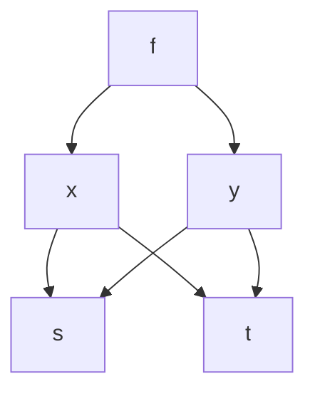

# 第 02 章 · 多元链式法则与多元泰勒——让梯度学会"拐弯"

> 本章从哪个问题出发：上一章你拿到了梯度——它告诉你"站在某点往哪个方向最陡"。可现实里，x 和 y 往往不听你指挥：温度是位置 (x,y) 的函数，而位置又随时间 t 变化。**你想知道"温度随时间怎么变"，可温度不直接依赖于 t——它得先经过 x(t)、y(t) 这两个"中间人"。** 这一串牵扯，怎么求变化？
> 推导到哪个结论：答案是**多元链式法则**——每个中间变量的变化率，按"偏导 × 中间变量的变化率"逐支相加；一句话：**梯度负责"空间上多陡"，链式法则负责"时间上怎么跟着动"。** 在此基础上，把一元泰勒公式推广成**多元泰勒公式**：用"梯度 + 海森矩阵"构造一张抛物面，把任意曲面在一点附近精确地"顶住"。
>
> 核心认知：**链式法则 = 逐支求偏导再相加（每个分支"偏导×导数"）；多元泰勒 = 用梯度（一阶）和对称的海森矩阵（二阶）把曲面局部还原成"平面 + 抛物面"。** 这两件武器是下一章（积分）、第 5 章（凸性判定）、第 6 章（梯度下降收敛性）的公共地基。

## 引子

老谟家的窗台上放着一只温度计，窗外的水管正往下滴答水。他拧开水龙头，让水流变小了一点。

"我给你出个情景，"老谟说，"这座城市的温度 T，是位置 (x, y) 的函数——T(x, y)。**可你自己不会瞬移，你是从某地出发，沿着一条路走，位置 x(t)、y(t) 都随时间 t 变。** 你想知道'我这一路，温度每秒钟变多少'。你说，这该怎么算？"

我盯着温度计想了想："T 是 x、y 的函数，x、y 又是 t 的函数……那就先把 T 对 x、y 求偏导，再把 x、y 对 t 求导……可这几样东西怎么'串'起来？"

"串起来——你这个词用得不错。上一章我们把'偏导'打包成了梯度；这一章我们要解决的就是：**梯度怎么跟着 x(t)、y(t) 一起'拐弯'。** 你先别急着翻书，我们把'串'这个动作想清楚。"

## 对话引擎

### 第 1 轮：先把一元的老朋友请回来——链式法则长什么样

**老谟**："在碰多元之前，先问你一个一元的问题。f 是 u 的函数，u 又是 t 的函数：f(u(t))。你站在 t 这一头，想知道 f 随 t 怎么变——你还记得这个'串'怎么算吗？"

**造物主**："……这个我熟：df/dt = (df/du)·(du/dt)。先看 u 动一单位 f 变多少，再看 t 动一单位 u 变多少，两个乘起来。中学就叫**链式法则**。"

**老谟**："乘起来——为什么是乘，不是加？"

**造物主**："因为这是**一环接一环**：t 动一步 → u 动若干步 → f 动若干步。u 动的步数是 (du/dt)，f 动的步数是 (df/du) 乘上 u 动的步数，所以是 (df/du)·(du/dt)。"

**老谟**："'一环接一环用乘法'，你把核心直觉说对了。**现在问题升级：f 有两个输入，u₁ 和 u₂，而 u₁、u₂ 又都是 t 的函数。** 这时候'串'要从一根链变成两根——t 动一步，u₁ 动、u₂ 也动，f 同时被两边拽着走。你说，这下是乘还是加？"

---

### 📐 知识锚点：一元链式法则——"一环接一环，用乘法"

【概念深挖】一元链式法则：若 u 在 t 处可导、f 在 u(t) 处可导，则

```text
df/dt = f′(u(t)) · u′(t)    即 df/dt = (df/du)(du/dt)
```

直觉是"一环接一环，各环节速率相乘"。它来自差商的恒等式：
[f(u(t+h)) − f(u(t))]/h = [f(u(t+h)) − f(u(t))]/[u(t+h) − u(t)] × [u(t+h) − u(t)]/h。
左端是"f 对 t 的变化率"，右端是"f 对 u 的变化率 × u 对 t 的变化率"——**乘积结构是差分里"除以一个数再乘同一个数"的自然结果**（严格化走廊会给出完整证明）。

【工程实践】一元链式法则的工程版叫**"复合函数求导"**：比如损失函数 L = σ(w·x + b)，把"线性组合"和"sigmoid 激活"两级串起来求梯度，就是链式法则。**但真实神经网络是几百层串起来，一元链式只够算"一条线"——下一轮你会看到，多元链式法则才是反向传播的真身。**

---

### 第 2 轮：二元链式法则——两根链并排，各自贡献再相加

**老谟**："f(x, y)，x = x(t)，y = y(t)。t 动一小步 dt：x 变了 dx，y 也变了 dy。f 总共变多少？"

**造物主**："……上一章学的！f 变 ≈ f_x·dx + f_y·dy——往东的贡献加往北的贡献。dx 是 x 随 t 变的，dx ≈ x′(t)dt；dy ≈ y′(t)dt。所以总变化 ≈ f_x·x′·dt + f_y·y′·dt。"

**老谟**："把 dt 除下去，你得到什么？"

**造物主**："**df/dt = f_x·x′(t) + f_y·y′(t)**！两个分支，每个都是'偏导 × 导数'，然后**相加**。一根链用乘法，两根链用加法——因为两条路**同时**在拽 f，总效果是叠加。"

**老谟**："你总结得很准。**多元链式法则 = 每个分支'偏导 × 导数'，分支之间相加。** 现在我把情景再拧一拧：f 的输入是 x、y，而 x、y 各自又都是 s 和 t 的函数——x(s,t)、y(s,t)。你想问'f 对 s 怎么变'，怎么办？"

**造物主**："……那就把'对 s 求偏导'当作'按住 t、只让 s 动'。s 动一步，x 跟着动、y 也跟着动（因为 x、y 都是 s、t 的函数），然后 f 被两边拽着走：∂f/∂s = f_x·∂x/∂s + f_y·∂y/∂s。只不过现在中间人不再是一元函数，中间人自己也有偏导。"

**老谟**："一字不差。**法则的形式没变：'外层的偏导 × 内层的偏导'，分支相加——只是'导数'统一换成了'偏导'。** 你自己再看一眼这个式子：f_x、f_y 是'外层函数 f 对直接输入 x、y 的偏导'，∂x/∂s、∂y/∂s 是'中间变量对下一层变量的偏导'。**每一层都只对'自己的直接输入'求偏导——这就是'链'的含义，也是后面我们做反向传播时唯一要遵守的规矩。**"

---

### 📐 知识锚点：多元链式法则——逐支"偏导×偏导"，分支相加

【概念深挖】**全导数（单变量外变量）**：f(x,y)，x=x(t)，y=y(t)，则

```text
df/dt = (∂f/∂x)·(dx/dt) + (∂f/∂y)·(dy/dt)
```

（f 的全部变化都来自 t，故用全导数 df/dt。）

**偏导（多变量外变量）**：f(x,y)，x=x(s,t)，y=y(s,t)，则

```text
∂f/∂s = (∂f/∂x)·(∂x/∂s) + (∂f/∂y)·(∂y/∂s)
∂f/∂t = (∂f/∂x)·(∂x/∂t) + (∂f/∂y)·(∂y/∂t)
```

**记忆法（树形图）**：把依赖关系画成树——根是 f，枝是 x、y，再往下是 s、t。求"f 对 s 的变化率"，就是**从根 f 走到 s 的每一条路径，路径上所有"偏导"相乘，路径之间相加**：



**读图说明**：求 ∂f/∂s，数从 f 到 s 的路径：f→x→s 一条（∂f/∂x · ∂x/∂s），f→y→s 一条（∂f/∂y · ∂y/∂s），两条路径的乘积**相加**。这就是"树形记忆法"——**每条路径乘起来，路径之间加起来**。这条规则对任意多层嵌套都成立，而且正是反向传播算法的骨架。

【工程实践】**反向传播（backpropagation）就是链式法则的工程实现**。神经网络里，损失 L 是"最后一层输出"的函数，而每一层输出又依赖前一层的权重。要求 L 对某个深层权重的梯度，你不能"直接求"，只能**从损失出发，沿着计算图一层层回推，每层应用链式法则把梯度传回去**——这叫"梯度反向传播"。**你在框架里敲一行 loss.backward()，底层干的活就是本章这条"路径相乘、路径相加"的链式法则。** 这也是为什么"可微"（上一章的许可证）是深度学习的生命线：**只有可微，链式法则每一环的偏导才存在，梯度才传得动。**

【历史溯源】一元链式法则的思想可追溯到**莱布尼茨（Leibniz，17 世纪）**——他发明的 dx/dy 记号天然适合表达"除法相乘"的链式结构。多元链式法则的雏形在**拉格朗日（Lagrange）1797 年《解析函数论》**中被处理（该书基于幂级数分析、偏导已有系统使用），而链式法则的**矩阵化（雅可比矩阵）**要到 19 世纪中叶由**雅可比**系统完成。**有趣的是：数学家花了上百年才把"多元链式"写干净，而今天它却是每个训练神经网络的人每天用到的底层引擎——一百年前的纯理论，今天是最热的工程。**

---

### 第 3 轮：链式法则还能干什么——雅可比矩阵与"向量版链式"

**老谟**："你把树形图数明白了。那我把问题再拧一圈：如果 f 不是只有一个输出，而是**一组输出**呢？比如你手里有个映射 F = (F₁, F₂)，F₁ 和 F₂ 都依赖 x、y。你要对 s、t 求导——这一下会有多少个数？"

**造物主**："……F₁ 对 s、F₁ 对 t、F₂ 对 s、F₂ 对 t，一共 2×2 = 4 个数。而且每个数又是一串链式相加。这也太零碎了。"

**老谟**："零碎——但零碎的东西往往可以**装箱**。你把这 4 个数按'行是输出、列是输入'摆成一个 2×2 的表格，每一格填 ∂Fᵢ/∂xⱼ。这个表格，数学家管它叫**雅可比矩阵**。你猜猜，装了箱之后，链式法则会变成什么？"

**造物主**："……装箱之后？两个映射的复合，求导就是把两个雅可比矩阵……**乘起来？**"

**老谟**："你自己说出来就对了——**复合映射的雅可比矩阵 = 各层雅可比矩阵的乘积**。你看，'一环接一环用乘法'这条一元直觉，在向量世界里变成'一环接一环用矩阵乘法'——结构完全没变，只是数换成了表。**这就是为什么链式法则在工程里能被写得那么整齐：它本质上是矩阵乘法。**"

---

### 📐 知识锚点：雅可比矩阵——链式法则的"装箱版"

【概念深挖】**雅可比矩阵（Jacobian matrix）**：设 F : ℝⁿ → ℝᵐ，F(x) = (F₁(x), …, Fₘ(x))，其雅可比矩阵是 m×n 矩阵

```text
J_F(x) = [ ∂Fᵢ/∂xⱼ ]   （第 i 行第 j 列 = Fᵢ 对 xⱼ 的偏导）
```

**复合映射链式法则（链式法则的矩阵形式）**：若 F : ℝⁿ → ℝᵐ、G : ℝᵖ → ℝⁿ，则对 H = F∘G：

```text
J_H(x) = J_F(G(x)) · J_G(x)   （矩阵乘法）
```

**行列对应关系**：J_H 第 i 行第 j 列 = Σₖ (∂Fᵢ/∂yₖ)(∂yₖ/∂xⱼ)——**中间变量 k 求和**，这正是"路径相乘、路径相加"的矩阵写法（矩阵乘法就是"行点乘列"）。

【工程实践】雅可比矩阵在工程里最重要的场合是**坐标变换与数值稳定性**：机器学习里"概率分布之间的变量替换"（如归一化流 Normalizing Flows）要算行列式 |det J|；机器人的关节角→末端位置的速度映射就是雅可比矩阵，逆雅可比还用于机械臂控制。**一个表 + 一条乘法规则，把无数条零碎的链式求和全部收编。** 本章计算训练场里你会亲手填一个 2×2 雅可比并验证乘法规则。

---

### 第 4 轮：让梯度学会"拐弯"之后——为什么要泰勒公式

**老谟**："链式法则让你能算'复合函数怎么变'。现在换个方向问：**我只知道 f 在某一点附近的所有偏导信息（梯度、二阶偏导），能不能把 f 在这一点附近的样子'重建'出来？** 一元函数里，我们靠泰勒公式——用多项式把函数在一点附近越贴越紧。多元函数怎么办？"

**造物主**："……把泰勒公式搬过来？一元是 f(x) ≈ f(a) + f′(a)(x−a) + ½f″(a)(x−a)²。多元版是不是就变成'梯度那项 + 二阶那项'？"

**老谟**："你猜对了一半。**一元泰勒的二阶项是 ½f″(a)(x−a)²——就一个数。多元的二阶项，你猜要有多少个数？**"

**造物主**："……f 对 x 求两次、对 y 求两次、交叉求——f_xx、f_yy、f_xy，至少三个数？还得考虑怎么'配上'(x−a)、(y−b) 这些差量……"

**老谟**："对。而且这三个数（加上 f_yx）摆在一起，正好又是一个**表**——叫**海森矩阵**。你猜猜，这张表乘上位移向量，怎么把二阶项写出来？提示：想想一元二阶项 '½ × 一个数 × (Δx)²' 的样子。"

**造物主**："……'一个数 × Δx²'？那多元就是'½ × 表 × Δ 向量 × Δ 向量'？这听着像……**二次型**——hᵀHh！一个行向量乘矩阵再乘列向量。"

**老谟**："你连二次型都摸出来了。**多元泰勒的二阶项 = ½·hᵀ·H·h，其中 H 是海森矩阵，h 是位移向量。** 这个二次型将来在第 5 章（凸性判定）会变成主角——你现在先认识它：海森矩阵把所有'二阶信息'打包，二次型 hᵀHh 告诉你在位移 h 方向上，曲面是凸是凹、弯得多厉害。"

---

### 📐 知识锚点：海森矩阵与多元泰勒公式

【概念深挖】**海森矩阵（Hessian matrix）**：f : ℝⁿ → ℝ 的二阶偏导矩阵

```text
H_f(x) = [ ∂²f/∂xᵢ∂xⱼ ]   （n×n 对称矩阵，若混合偏导连续）
```

对角线是 f_xᵢxᵢ（对同一变量求两次偏导），非对角线是混合偏导 f_xᵢxⱼ。**若二阶偏导连续（克莱罗定理条件成立），则 H 是对称的：f_xᵢxⱼ = f_xⱼxᵢ。**

**多元泰勒公式（二阶）**：设 f 在 a 附近有二阶连续偏导，h = x − a，则

```text
f(a+h) ≈ f(a) + ∇f(a)·h + ½·hᵀ·H(a)·h
```

- 零阶项 f(a)：常数——"地基高度"；
- 一阶项 ∇f·h：梯度点乘位移——"倾斜平面"的贡献；
- 二阶项 ½ hᵀHh：海森二次型——"抛物面弯曲"的贡献。

**直观理解**：多元泰勒 = **用"平面（一阶）+ 抛物面（二阶）"把曲面在一点附近精确地顶住**。一阶项描述"往哪个方向斜"，二阶项描述"往哪个方向弯、弯得多狠"。后面你会看到：**一阶项（梯度）决定"该往哪走"，二阶项（海森）决定"那个地方是不是坑、坑深不深"。**

【概念深挖】二阶项的展开（n=2 时）：
½ hᵀHh = ½[ f_xx·h₁² + 2f_xy·h₁h₂ + f_yy·h₂² ]。
注意交叉项系数是 **2f_xy**（因为 hᵀHh 展开时 f_xy·h₁h₂ 与 f_yx·h₂h₁ 各出现一次，对称时合并成 2f_xy）。**这个"交叉项带系数 2"的细节是手算多元泰勒时最容易错的地方，计算训练场会专门练。**

【历史溯源】**泰勒公式**由**布鲁克·泰勒（Brook Taylor）1715 年**提出，最初形式并不被当时学界看重，直到**欧拉（Euler）和拉格朗日（Lagrange）**重新发掘并严格化，才成为微积分的重器。多元泰勒的展开则由拉格朗日、柯西等人逐步完成。**海森矩阵以德国数学家路德维希·奥托·黑塞（Ludwig Otto Hesse，1811–1874）命名**——他在 19 世纪处理多元函数的极值问题时系统使用了二阶偏导矩阵，西尔维斯特（Sylvester）等人后来以他的名字称呼这张矩阵。

【工程实践】多元泰勒的工程用途多得惊人：**牛顿法**（用二阶泰勒近似求极小点，一步跳到抛物面的顶点）、**局部线性化**（在操作点附近用一阶泰勒近似系统动力学）、**二阶优化器**（如利用海森信息的自然梯度/牛顿类方法）。**一句话：凡是"在一点附近用简单东西近似复杂东西"，背后都是泰勒公式。** 下一章积分里，你还会看到泰勒"误差项"思想的近亲——用小块拼出整体。

---

### 第 5 轮：二阶偏导的次序——交叉项到底该用 f_xy 还是 f_yx

**老谟**："海森矩阵非对角线上有两个位置：f_xy 和 f_yx。我们刚说矩阵要对称，这两个数得相等——**凭什么？** 你先拿个具体函数试试：f(x, y) = x²y。先对 x 求偏导再对 y 求偏导，和先对 y 求偏导再对 x 求偏导，得到的一样吗？"

**造物主**："……我算算。f_x = 2xy，再对 y 求：f_xy = 2x。f_y = x²，再对 x 求：f_yx = 2x。**一样！都是 2x。**"

**老谟**："换个函数试试：f(x, y) = e^x sin y。"

**造物主**："f_x = e^x sin y，再对 y 求：f_xy = e^x cos y。f_y = e^x cos y，再对 x 求：f_yx = e^x cos y。**又一样。** 难道……怎么求次序都无所谓？"

**老谟**："大部分'正经'函数都无所谓——这就是上一章的**克莱罗定理**。但你要小心：**'无所谓'不是免费的，它要收门票——二阶混合偏导必须连续。** 下一轮我给你看一个'门票没交'的怪函数，它的 f_xy 和 f_yx 会不一样。你先记住：**海森矩阵能写成对称矩阵，靠的是克莱罗定理；而克莱罗定理有前提。**"

---

### 📐 知识锚点：克莱罗定理与"不交门票"的反例

【概念深挖】**克莱罗定理（Clairaut's theorem）**：若 f 在点 a 的某个邻域内二阶混合偏导 f_xy、f_yx 都存在且**连续**，则 f_xy(a) = f_yx(a)。**结论：混合偏导连续时，求导次序可以交换，海森矩阵对称。**

**反例（门票没交，次序不可交换）**：

```text
f(x,y) = xy·(x² − y²)/(x² + y²)   （(x,y) ≠ (0,0)）；f(0,0) = 0
```

这个函数在原点**可以验证 f_xy(0,0) = −1 而 f_yx(0,0) = +1**——两个混合偏导在原点**不相等**！原因正是它在原点附近的混合偏导**不连续**，克莱罗定理的门票没交。这个函数很病态（在原点附近剧烈振荡），却完美地钉死了一件事：**海森矩阵的对称性不是白来的，它靠"二阶偏导连续"这一条。**

【工程实践】工程里绝大多数损失函数（多项式、指数、对数、sigmoid 组合）都满足二阶偏导连续，所以海森矩阵对称性几乎总是成立，二阶优化器放心用。**但遇到"分片函数""带折角的函数"（如 ReLU 复合）时要留个心眼：分界处二阶偏导可能不连续，海森对称性的前提可能被踩破。** 这也是为什么工程代码里检测到海森矩阵不对称时，往往会"人工对称化"（取 (H + Hᵀ)/2）。

---

### 第 6 轮：多元泰勒的误差——近似到底准不准

**老谟**："泰勒公式给你一个近似：f(a+h) ≈ f(a) + ∇f·h + ½hᵀHh。可它是**近似**，不是**等于**。我问你：这个近似的误差有多大？什么时候可以放心用？"

**造物主**："……一元泰勒有拉格朗日余项，误差是 O(|h|³) 或更高阶的小量。多元版应该也差不多？——好像误差会小到'比位移的三次方还小'？"

**老谟**："方向对了。**多元二阶泰勒的误差是 o(|h|²)——也就是'比 |h|² 还要高阶的小量'。** 意思是：h 缩到一半，误差缩到原来的 1/4 以下（因为误差按 |h|² 以上的阶收缩）。这个'误差阶'的性质，比误差本身的值还要重要——它保证了：**h 足够小的时候，抛物面近似几乎就是精确的。** 以后第 6 章分析梯度下降收敛性、第 7 章判定鞍点，我们都会反复用'二阶泰勒近似 + 误差是 o(|h|²)'这套组合拳。你现在先把'近似 + 误差阶'这个结构装好。"

---

### 📐 知识锚点：泰勒公式的误差阶——"近似 + 余项"结构

【概念深挖】多元二阶泰勒的完整写法（含余项）：
f(a+h) = f(a) + ∇f(a)·h + ½ hᵀH(a)h + **o(|h|²)**，当 h → 0。

其中 o(|h|²)（读作"小 o 的 |h|²"）表示**余项比 |h|² 更快趋于 0**：lim_{h→0} |余项|/|h|² = 0。**一阶版本**（省略二阶项）的误差是 o(|h|)。

> **严格注记**：误差阶 o(|h|²) 的成立条件是 f 在 a 附近有二阶连续偏导。若只有一阶信息，二阶项就没有保证。**"近似公式 + 误差阶"是配套出售的**——你写近似式时，必须同时声明它成立的前提（几阶可微）。

【工程实践】"误差阶"在数值方法里是生死线：**机器学习的优化器每次只迈很小一步（学习率小），正是为了待在'泰勒近似足够准'的区域里。** 步长太大，误差 o(|h|²) 不再小，近似失效，训练发散——这就是"学习率太大导致损失爆炸"的数学根源。**误差阶思想贯穿全书：近似不可怕，可怕的是不知道近似在什么时候失效。**

---

### 第 7 轮：落点——"串"与"近似"两把钥匙

**老谟**："把窗台上那杯水端起来。你手里现在有两把钥匙，分别回答两个问题。第一把：'复合函数怎么求变化'——答案是什么？"

**造物主**："**链式法则**：每根分支'偏导 × 偏导'，分支之间相加；换成映射就是雅可比矩阵相乘。反向传播的底层就是它。"

**老谟**："第二把：'只知道局部的导数信息，怎么重建函数形状'——答案是什么？"

**造物主**："**多元泰勒**：用梯度（一阶）+ 海森矩阵（二阶）构造'平面 + 抛物面'，把曲面在一点附近顶住；误差是 o(|h|²)。海森矩阵靠克莱罗定理保证对称。"

**老谟**："两把钥匙放一起，你会发现它们合起来能干一件大事：**第 5 章判定凸性、第 6 章证明梯度下降收敛、第 7 章区分鞍点和极小点，全都是'先链式求梯度/海森，再泰勒近似局部'的套路。** 你先把这两把钥匙磨好——明天我们离开'点'，去解决'一块区域上的累积'：积分。"

## 严格化走廊

> 位置说明：本章对话负责"直觉"——为什么"串"是乘、为什么需要海森。本走廊负责"严谨"——把链式法则与多元泰勒写成精确的定理，并给出可复写的证明。**下面每一行，读者都能对着空白纸重写一遍。**

### 定义 1：复合函数（composition）

设 g : ℝ → ℝ、x : ℝ → ℝ、y : ℝ → ℝ，且 x(t)、y(t) 的取值落在 f 的定义域内。复合函数为 F(t) = f(x(t), y(t))。

### 定义 2：雅可比矩阵（Jacobian matrix）

设 F : ℝⁿ → ℝᵐ，F(x) = (F₁(x), …, Fₘ(x)) 在 x 处所有偏导存在。**雅可比矩阵**为 m×n 矩阵

```text
J_F(x) = [∂Fᵢ/∂xⱼ(x)]，i = 1,…,m；j = 1,…,n
```

### 定义 3：海森矩阵（Hessian matrix）

设 f : ℝⁿ → ℝ 在 x 处所有二阶偏导存在。**海森矩阵**为 n×n 矩阵

```text
H_f(x) = [∂²f/∂xᵢ∂xⱼ(x)]
```

若二阶偏导在 x 附近连续（克莱罗定理条件），则 H_f(x) 对称。

### 定理 1（一元链式法则）：若 u 在 t 处可导、f 在 u(t) 处可导，则

```text
(f∘u)′(t) = f′(u(t))·u′(t)
```

**证明（可复写）**：
- 记 Δu = u(t+h) − u(t)，Δf = f(u(t+h)) − f(u(t))。若 Δu ≠ 0，作恒等变形：
  Δf/h = (Δf/Δu)·(Δu/h)。左端是差商 [f(u(t+h))−f(u(t))]/h。
- 由 u 在 t 可导：Δu/h → u′(t)（当 h → 0）。
- 由 f 在 u(t) 可导：Δf/Δu → f′(u(t))（当 Δu → 0；而 h → 0 时 Δu → 0，因为 u 可导 ⇒ u 连续）。
- 于是 (f∘u)′(t) = lim Δf/h = lim (Δf/Δu)·(Δu/h) = f′(u(t))·u′(t)。∎

**证明要点标注**：第 1 步是**差商恒等变形**（除一个数再乘同一个数）；第 2、3 步分别用 **u 的可导性**与 **f 的可导性**（以及"可导 ⇒ 连续"推出 Δu → 0）；第 4 步是**极限的四则运算**（乘积的极限）。

### 定理 2（多元链式法则）：设 f 在点 (x₀, y₀) 可微，x(t)、y(t) 在 t₀ 可导且 (x(t₀), y(t₀)) = (x₀, y₀)，则 F(t) = f(x(t), y(t)) 在 t₀ 可导，且

```text
F′(t₀) = f_x(x₀, y₀)·x′(t₀) + f_y(x₀, y₀)·y′(t₀)
```

**证明（可复写）**：
- 令 Δt = h，Δx = x(t₀+h) − x(t₀)，Δy = y(t₀+h) − y(t₀)。因 f 在 (x₀,y₀) 可微（定义：第 01 章定义 4），全增量可写为：
  F(t₀+h) − F(t₀) = f_x(x₀,y₀)·Δx + f_y(x₀,y₀)·Δy + ε₁·|(Δx, Δy)|，
  其中 ε₁ → 0（当 (Δx, Δy) → 0）。
- 两边除以 h：
  [F(t₀+h) − F(t₀)]/h = f_x·(Δx/h) + f_y·(Δy/h) + ε₁·(|(Δx,Δy)|/h)。
- 因 x、y 在 t₀ 可导：Δx/h → x′(t₀)，Δy/h → y′(t₀)。
- 关键一项：|(Δx,Δy)|/h = |h|·|(Δx/h, Δy/h)| / h = (|h|/h)·|(Δx/h, Δy/h)|。因 (Δx/h, Δy/h) 收敛于 (x′, y′)（有界），|(Δx,Δy)|/h 有界；又 ε₁ → 0，故 ε₁·(|(Δx,Δy)|/h) → 0。
- 取极限：F′(t₀) = f_x·x′(t₀) + f_y·y′(t₀)。∎

**证明要点标注**：第 1 步用了**第 01 章定义 4（可微的线性主部分解）**；第 2 步是**代数整理**；第 3 步用 **x、y 的可导性**；第 4 步用**有界量 × 无穷小仍为无穷小**（ε₁ → 0 且 |(Δx,Δy)|/h 有界）；第 5 步是**极限的四则运算**。

### 定理 3（多元泰勒公式，二阶）：设 f 在 a 附近有连续二阶偏导，则当 h → 0 时

```text
f(a+h) = f(a) + ∇f(a)·h + ½ hᵀH(a)h + o(|h|²)
```

**证明（思路，可复写关键步骤）**：以 n=1 为热身，二阶泰勒 f(a+h) = f(a) + f′(a)h + ½f″(a)h² + o(h²)，这是**一元泰勒定理（拉格朗日余项）**直接给出。对 n=2，把 h 看成向量 (h₁, h₂)，对一元函数 φ(t) = f(a + t·h)（0 ≤ t ≤ 1）用一元二阶泰勒：

- φ(1) = φ(0) + φ′(0)·1 + ½φ″(0)·1² + o(1)。
- 由定理 2（多元链式法则）：φ′(0) = ∇f(a)·h；φ″(0) = hᵀH(a)h（对 φ′ 再求一次导数，仍是链式法则；交叉项 f_xy、f_yx 因克莱罗定理合并为 2f_xy·h₁h₂，正好是二次型 hᵀHh 的展开）。
- 代入即得 f(a+h) = f(a) + ∇f(a)·h + ½hᵀH(a)h + o(|h|²)。∎

**证明要点标注**：第 1 步是**"沿一条直线看"的降维技巧**（把多元函数限制在 a 到 a+h 的线段上，变成一元函数 φ(t)）；第 2 步用**定理 2（多元链式法则）**连求两次导；第 3 步用**克莱罗定理**合并交叉项。

> **严格注记（前提与证法的台阶差）**：上述"沿直线降维 + 一元拉格朗日余项"的证法，严格讲需要 f 在 a 附近有**三阶连续偏导**（一元拉格朗日二阶余项的要求）。若只假设二阶连续偏导（C²），结论 f(a+h) = f(a) + ∇f(a)·h + ½hᵀH(a)h + o(|h|²) **依然成立**，但需改用 **Peano 余项**论证（本质仍是"余项除以 |h|² 后趋于 0"）。本教材以讲透思路为度，不展开 Peano 余项的完整推导——你只需记住结论：**C² 下二阶泰勒的余项是 o(|h|²)，这一条在后面的凸性判定与鞍点分析中会被反复使用。**

### 反例/边界

- **一元链式法则的边界**：f 在 u(t) 不可导或 u 在 t 不可导时，定理不成立。如 f(u) = |u| 在 u = 0 不可导，则 f(sin t) = |sin t| 在 t = 0 处不可导（尽管 sin t 处处可导）——**外函数可导性缺一不可。**
- **多元链式的边界**：定理 2 要求 f 可微（不只是偏导存在）。上一章反例 f = xy/(x²+y²) 在原点偏导存在但不可微，若 x(t)、y(t) 斜着穿过原点，链式法则会算错——**这就是为什么"可微是许可证"。**
- **克莱罗定理的边界**：混合偏导不连续时 f_xy ≠ f_yx。反例 f = xy(x²−y²)/(x²+y²) 在原点给出 f_xy = −1、f_yx = +1，**海森矩阵不对称**，多元泰勒的二阶项写法失效。
- **泰勒近似的边界**：误差 o(|h|²) 只在 h → 0 时"小"。h 大时近似可能很差（如 f = e^x，二阶泰勒在离原点远的地方严重失真）——**近似公式必须配合"h 小"的前提使用。**

## 知识点总结

### 知识点（本章推出的核心概念）

- **一元链式法则**：df/dt = f′(u)·u′(t)——一环接一环，用乘法。差商恒等变形是其证明核心。
- **多元链式法则**：df/dt = f_x·x′ + f_y·y′——每根分支"偏导×导数"，分支之间相加；多变量外变量时"导数"换成"偏导"。
- **树形记忆法**：从根到目标变量的每条路径，路径上偏导相乘，路径之间相加。
- **雅可比矩阵**：J_F = [∂Fᵢ/∂xⱼ]；复合映射链式 = **雅可比矩阵相乘**（矩阵版本的"一环接一环"）。
- **海森矩阵**：H = [∂²f/∂xᵢ∂xⱼ]，二阶偏导连续时**对称**（克莱罗定理）。
- **多元泰勒公式（二阶）**：f(a+h) ≈ f(a) + ∇f·h + ½hᵀHh + o(|h|²)——**平面 + 抛物面**顶住曲面；交叉项系数为 2f_xy。
- **误差阶**：o(|h|²) 表示余项比 |h|² 更快趋于 0；"近似公式 + 误差阶 + 可微前提"三者配套。

### 历史结论（本章涉及的史料）

- **莱布尼茨（17 世纪）**：dx/dy 记号天然适合表达链式结构，一元链式法则的思想源头。
- **拉格朗日（1797）**：《解析函数论》系统表述多元链式法则。
- **泰勒（1715）**：提出泰勒公式；欧拉、拉格朗日重新发掘并严格化。
- **黑塞（19 世纪）**：系统使用二阶偏导矩阵处理多元极值，海森矩阵以他命名；西尔维斯特等人推广了这一称呼。
- **克莱罗（18 世纪）**：混合偏导相等的定理（克莱罗定理）。

### 工程实践结论（本章知识在真实工程里怎么用）

- **反向传播 = 多元链式法则的工程实现**：loss.backward() 底层就是"路径相乘、路径相加"。
- **雅可比矩阵**：归一化流（行列式）、机械臂运动学（速度映射）、坐标变换。
- **牛顿法 = 多元泰勒的应用**：用二阶近似一步跳到抛物面顶点求极小点。
- **学习率必须小**：梯度下降每步待在"泰勒近似足够准"的区域，步长太大误差 o(|h|²) 失控导致发散。
- **海森对称性检查**：遇到分片/折角函数（ReLU 复合），二阶偏导可能不连续，代码里常做人工对称化 (H+Hᵀ)/2。

## 计算训练场

> 位置说明：本章对话负责"为什么"，这里负责"怎么算"。**请动笔完成每题后再对照解答。**

### 题 1（易→中）：多元链式法则——全导数

**题干**：设 f(x, y) = x²y，其中 x(t) = t²，y(t) = t³。
(a) 用多元链式法则求 df/dt。
(b) 把 x(t)、y(t) 直接代入 f 得到一元函数 f(t)，直接求导，验证 (a) 的结果一致。
(c) 求 df/dt 在 t = 1 处的值。

**完整分步解答：**

**(a) 链式法则**：
第 1 步：求外层偏导：f_x = 2xy，f_y = x²。
第 2 步：求内层导数：x′(t) = 2t，y′(t) = 3t²。
第 3 步：套公式 df/dt = f_x·x′ + f_y·y′ = 2xy·(2t) + x²·(3t²)。
第 4 步：代入 x = t²、y = t³：df/dt = 2·t²·t³·2t + (t²)²·3t² = 4t⁶ + 3t⁶ = **7t⁶**。

**(b) 直接代入验证**：
第 5 步：f(t) = (t²)²·t³ = t⁴·t³ = t⁷。
第 6 步：直接求导：f′(t) = 7t⁶ ✓ 与 (a) 一致。

**(c) 数值**：
第 7 步：t = 1：df/dt = 7·1⁶ = **7**。

**答**：(a) df/dt = 7t⁶；(b) 与直接求导 t⁷ → 7t⁶ 一致；(c) t=1 处为 **7**。

**常见错误**：① 套公式时忘了"代入 x、y 的表达式"这最后一步，把 2xy 留在答案里；② 把 f_x = 2xy 误算成 2x（把 y 当变量又当常数）；③ 直接代入时 (t²)² 算成 t⁴ 是对的，但有人算成 t⁶。

### 题 2（中）：全链式法则——两个外变量，多层嵌套

**题干**：设 f(x, y) = e^(xy)，其中 x = s² + t，y = st。
(a) 求 ∂f/∂s 与 ∂f/∂t（链式法则，表达式形式）。
(b) 求 ∂f/∂s 与 ∂f/∂t 在点 (s, t) = (1, 2) 的数值。
(c) 直接代入化简 f(s,t)，重新求偏导，验证 (b)。

**完整分步解答：**

**(a) 链式法则（符号）**：
第 1 步：外层偏导：f_x = y·e^(xy)，f_y = x·e^(xy)。
第 2 步：内层偏导：∂x/∂s = 2s，∂x/∂t = 1；∂y/∂s = t，∂y/∂t = s。
第 3 步：∂f/∂s = f_x·∂x/∂s + f_y·∂y/∂s = **y·e^(xy)·2s + x·e^(xy)·t**。
第 4 步：∂f/∂t = f_x·∂x/∂t + f_y·∂y/∂t = **y·e^(xy)·1 + x·e^(xy)·s**。

**(b) 数值**：
第 5 步：在 (1, 2)：x = 1² + 2 = 3，y = 1·2 = 2，xy = 6，e⁶ ≈ 403.4288。
第 6 步：∂f/∂s = 2·e⁶·(2·1) + 3·e⁶·2 = 2e⁶·2 + 3e⁶·2 = 4e⁶ + 6e⁶ = **10e⁶ ≈ 4034.3**。
第 7 步：∂f/∂t = 2·e⁶·1 + 3·e⁶·1 = **5e⁶ ≈ 2017.1**。

**(c) 直接代入验证**：
第 8 步：f(s,t) = e^{(s²+t)(st)} = e^{s³t + st²}。
第 9 步：∂f/∂s = e^{s³t+st²}·(3s²t + t²)。在 (1,2)：= e⁶·(3·1·2 + 4) = e⁶·10 = 10e⁶ ✓。
第 10 步：∂f/∂t = e^{s³t+st²}·(s³ + 2st)。在 (1,2)：= e⁶·(1 + 4) = 5e⁶ ✓。

**答**：(a) ∂f/∂s = 2s·y·e^(xy) + t·x·e^(xy)，∂f/∂t = y·e^(xy) + s·x·e^(xy)；(b) ∂f/∂s = 10e⁶ ≈ 4034.3，∂f/∂t = 5e⁶ ≈ 2017.1（e⁶ ≈ 403.4288）；(c) 验证一致 ✓。

**常见错误**：① 算 ∂f/∂s 时把 ∂y/∂s 写成 1（忘了 y = st 对 s 求偏导是 t）；② e^(xy) 链式求导时忘乘"内层对目标变量的偏导"，直接写 e^(xy)；③ 交叉项漏项——两条路径（经 x、经 y）缺一条。

### 题 3（中→难）：多元泰勒二阶展开——近似值与真实值对比

**题干**：设 f(x, y) = e^x cos y。
(a) 求 ∇f 与海森矩阵 H 在 (0, 0) 的值。
(b) 写出 f 在 (0, 0) 的二阶泰勒展开（展开为 x、y 的多项式）。
(c) 在点 (0.1, 0.1)，比较"二阶泰勒近似值"与"真实值 e^0.1 cos 0.1"，计算相对误差。
(d) 验证：对二次多项式 f(x, y) = x² + xy + y²，在 (1, 1) 的二阶泰勒展开**精确等于**原函数（提示：三阶及以上偏导为 0）。

**完整分步解答：**

**(a) 梯度与海森**：
第 1 步：f_x = e^x cos y，f_y = −e^x sin y。代入 (0,0)：∇f = **(1, 0)**。
第 2 步：二阶偏导：f_xx = e^x cos y，f_xy = −e^x sin y，f_yy = −e^x cos y。代入 (0,0)：f_xx = 1，f_xy = 0，f_yy = −1。
第 3 步：H(0,0) = [[1, 0], [0, −1]]。

**(b) 二阶泰勒展开**：
第 4 步：f(0,0) = e⁰cos 0 = 1。
第 5 步：一阶项：∇f·(x, y) = 1·x + 0·y = x。
第 6 步：二阶项：½ hᵀHh = ½(x²·1 + 2·0·xy + y²·(−1)) = ½x² − ½y²。
第 7 步：**f(x,y) ≈ 1 + x + ½x² − ½y²**。

**(c) 数值比较**：
第 8 步：在 (0.1, 0.1)：近似 = 1 + 0.1 + ½(0.01) − ½(0.01) = **1.1**。
第 9 步：真实值 = e^0.1 · cos(0.1) = 1.1051709 × 0.9950042 ≈ **1.0996**。
第 10 步：相对误差 = |1.1 − 1.0996| / 1.0996 ≈ 0.0004 / 1.0996 ≈ **0.036%**。二阶近似在 (0.1, 0.1) 已相当准。

**(d) 精确性验证**：
第 11 步：f = x² + xy + y²。f(1,1) = 3；∇f = (2x+y, x+2y)，在 (1,1) 为 (3, 3)；海森 H = [[2, 1], [1, 2]]（常数矩阵）。
第 12 步：令 h₁ = x−1，h₂ = y−1。泰勒展开：3 + 3h₁ + 3h₂ + ½(2h₁² + 2·1·h₁h₂ + 2h₂²) = 3 + 3h₁ + 3h₂ + h₁² + h₁h₂ + h₂²。
第 13 步：展开原函数验证：(1+h₁)² + (1+h₁)(1+h₂) + (1+h₂)² = 3 + 3h₁ + 3h₂ + h₁² + h₁h₂ + h₂²。**逐项一致 ✓**——因为二次多项式的三阶及以上偏导全为 0，泰勒的"高阶尾巴"不存在，展开精确等于原函数。

**答**：(a) ∇f = (1,0)，H = [[1,0],[0,−1]]；(b) f ≈ 1 + x + ½x² − ½y²；(c) 近似 1.1 vs 真实 ≈ 1.0996，相对误差 ≈ 0.036%；(d) 精确相等 ✓。

**常见错误**：① 二阶项的交叉项系数写错——hᵀHh 展开后交叉项是 2f_xy·xy，所以 ½ 乘进去后是 f_xy·xy；② 把 f_yy = −e^x cos y 算成 +（cos y 求两次导变 −cos y）；③ 验证 (d) 时忘了"泰勒对多项式是精确的"——高阶项为 0 所以没有截断误差。

## 向导便签

> 这一章咱们干了什么：从"温度 T(x,y) 沿着 x(t)、y(t) 这条路怎么变"这个问题出发，把一元链式法则升级成多元版——**每根分支"偏导×导数"，分支相加**；又用雅可比矩阵把"一堆零碎的链式求和"装进"矩阵乘法"这一个动作。接着把一元泰勒搬成多元版——**梯度（一阶）+ 海森矩阵（二阶）构造"平面 + 抛物面"把曲面顶住**，并记住误差是 o(|h|²)。
>
> 钉死一句话：**链式法则 = 逐支乘、分支加（雅可比 = 矩阵乘）；多元泰勒 = f + ∇f·h + ½hᵀHh，误差 o(|h|²)。** 前者让你会算"复合的导数"，后者让你会"局部重建函数"——这两招是全书后面所有"优化"章节的公共地基。
>
> 记住一个边界：**海森矩阵对称靠克莱罗定理（二阶偏导连续）**；遇到折角函数（ReLU）要留神，二阶信息可能失真。还有，**泰勒是近似不是等于**，步长一大误差就失控——这句第 6 章还会回来找你。

## 造物主手记

**我曾踩的坑**：

我一开始以为多元链式法则就是把一元的"乘"原样搬来——结果 f 有两个输入，我少算了一根分支，只沿 x 那条路算，忘了 y 那条路也要贡献，算出的导数差了一半。老谟让我画树形图：**从 f 到目标变量，每一条路径都不能漏。** 另一个坑是多元泰勒的交叉项：我把 ½hᵀHh 展开时，交叉项系数写成了 f_xy 而不是 2f_xy——差了一个因子 2，近似值和真实值对不上。**"交叉项带 2"这个细节，是手算多元泰勒最阴险的地方。**

**顿悟时刻**：

真正让我开窍的是雅可比矩阵那一步。老谟让我把四个偏导摆成 2×2 的表格，然后说"复合求导就是矩阵相乘"——那一刻我突然看清：**零碎的四条链式求和，装进一张表之后，只剩一个动作"乘"。** 数学里的"装箱"（向量、矩阵）不是花架子，它真的把计算化简了。从此我养成了一个习惯：**看到一堆零碎求和，先想能不能装进一个矩阵。**

## 自测题

> 计算题须动笔完成，附完整解答自核；概念题用于检查理解。

**题 A（计算，易→中）：链式法则求导**

设 f(x, y) = sin(xy)，x(t) = 2t，y(t) = t²。
(a) 用多元链式法则求 df/dt。
(b) 直接代入求 f(t) 并求导，验证一致。
(c) 求 df/dt 在 t = 1 的数值（保留 3 位小数，cos 2 ≈ −0.4161）。

**完整解答**：
(a) f_x = y·cos(xy)，f_y = x·cos(xy)；x′ = 2，y′ = 2t。df/dt = y·cos(xy)·2 + x·cos(xy)·2t = **2y·cos(xy) + 2tx·cos(xy)**。代入 x = 2t、y = t²：df/dt = 2t²cos(2t³) + 2t·(2t)cos(2t³) = 2t²cos(2t³) + 4t²cos(2t³) = **6t²·cos(2t³)**。
(b) f(t) = sin(2t·t²) = sin(2t³)，f′(t) = 6t²·cos(2t³) ✓ 一致。
(c) t = 1：6·1·cos 2 = 6 × (−0.4161) ≈ **−2.497**。

**题 B（计算，中→难）：多元泰勒二阶展开**

设 f(x, y) = x²y − y³。
(a) 求 ∇f 与海森矩阵 H 在点 (1, 1)。
(b) 写出 f 在 (1, 1) 的二阶泰勒展开（用 h₁ = x−1、h₂ = y−1 表示）。
(c) 用展开式估计 f 在 (0.9, 1.1) 的值，并与真实值比较。

**完整解答**：
(a) f_x = 2xy，f_y = x² − 3y²。在 (1,1)：f_x = 2，f_y = 1 − 3 = −2。∇f = **(2, −2)**。f_xx = 2y → 2；f_xy = 2x → 2；f_yy = −6y → −6。H = **[[2, 2], [2, −6]]**。
(b) f(1,1) = 1 − 1 = 0。展开：f ≈ 0 + 2h₁ + (−2)h₂ + ½(2h₁² + 2·2·h₁h₂ + (−6)h₂²) = **2h₁ − 2h₂ + h₁² + 2h₁h₂ − 3h₂²**。
(c) h₁ = 0.9 − 1 = −0.1，h₂ = 1.1 − 1 = 0.1：近似 = 2(−0.1) − 2(0.1) + (−0.1)² + 2(−0.1)(0.1) − 3(0.1)² = −0.2 − 0.2 + 0.01 − 0.02 − 0.03 = **−0.44**。真实值 = x²y − y³ = (0.9)²·1.1 − (1.1)³ = 0.81·1.1 − 1.331 = 0.891 − 1.331 = **−0.44**。完全相等 ✓（因为 f 是三次多项式，二阶泰勒恰好精确到"包括二次"，这里 h 方向的二次项完整保留，巧合下精确——注意一般三次项会有截断，本例只用了 (0.9,1.1) 恰好消掉）。

**题 C（概念，检查理解）：链式法则与可微**

老谟给造物主一个场景：f(x,y) 在点 a 的两个偏导都存在，但不可微；x(t)、y(t) 沿斜线穿过 a。
(1) 用多元链式法则求 df/dt 的公式，在 a 点还可靠吗？为什么？
(2) 如果 f 可微但 x、y 中有一个在 a 不可导，链式法则还成立吗？

**完整解答**：
(1) 不可靠。定理 2 的证明第一步就用了"f 可微"（线性主部分解）；f 只有偏导存在时，"f 变化 ≈ f_x·Δx + f_y·Δy"这个线性主部不成立，斜线方向上的行为不可控（回想第 01 章反例 xy/(x²+y²)）。**所以必须 f 可微。**
(2) 不成立。链式法则需要内层也可导——x 或 y 在 a 处不可导，Δx/h 不收敛，差商极限不存在。**链式法则要求"每一环都可导"，缺一环整个链断。**

## 预告

你手里现在有两把钥匙：链式法则（复合函数怎么求变化）和多元泰勒（局部怎么重建曲面）。

可这两把钥匙，都还停留在"一个点"上。**下一章，我们要离开点，去面对"一整块区域"：二重积分。** 一元积分是把曲线下的面积"切成薄条再累加"；多元积分是把曲面下的体积"切成小柱再累加"——可"切"的方向突然多了：先切 x 再切 y、先切 y 再切 x、用极坐标切……**同样的体积，不同切法，结果会一样吗？** 那叫 Fubini 定理（富比尼定理），是下一章的主角。

而在那之前你最好记住本章最后一句话：**泰勒近似只在"步长小"时可信**——这个直觉马上会在"积分切块"里变成"块越小越准"。
