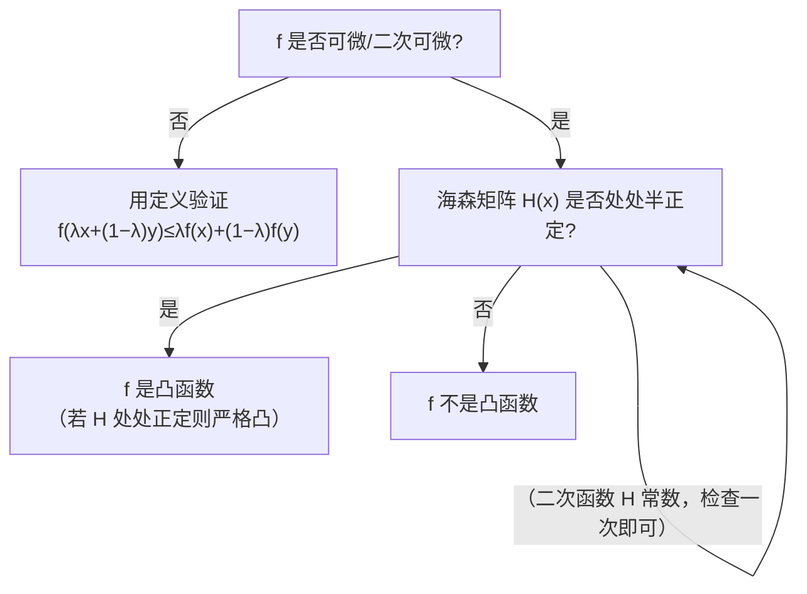

# 第 05 章 · 凸性判定与二次型——怎么用二阶导判定"这碗有没有歪坑"

> 本章从哪个问题出发：上一章我们立了"凸函数 = 海森矩阵半正定"这把尺子。可这把尺子有个绕不过去的坎——**"海森矩阵半正定"到底怎么判断？** 你不能真拿"任意方向 h 都满足 hᵀHh ≥ 0"去穷举，那有无限多个方向。有没有**有限个数的检查**，就能一次判定一个对称矩阵是正定、半正定、还是不定？
> 推导到哪个结论：答案是**二次型与主子式/特征值判据**——对称矩阵 xᵀAx 的"符号"（对任意 x 恒正/恒非负/可正可负）决定它正定/半正定/不定；而这件事有两条捷径：**Sylvester 判据**（顺序主子式全正 ⇔ 正定；所有主子式非负 ⇔ 半正定）和**特征值判据**（对称矩阵正定 ⇔ 特征值全正）。再把海森矩阵套进去，就得到一张"判定凸性的决策树"。
>
> 核心认知：**凸性判定 = 判断海森矩阵的正定性；判断正定性 = 检查有限个主子式或特征值，不必穷举无限个方向。** 这一章把上一章的"海森半正定 ⇔ 凸"从"定义"落成"可操作的计算流程"，是第 6 章"为什么梯度下降收敛到全局最优"与第 7 章"如何区分鞍点与极值点"的实操工具。

## 引子

老谟的书桌上摊着一张给小朋友玩的"走迷宫"纸，纸上用铅笔画了几条歪歪扭扭的沟槽。他把一颗玻璃珠放在一条沟槽里，松手。

"你看这条沟，"老谟说，"玻璃珠滚下去，卡在中间那个小坑里了——你觉得它到底了吗？"

"没有，"我凑近看，"旁边还有更低的沟，它只是被小坑卡住，没滚到真正最低的地方。"

"对。那这条'会骗人'的沟，和一条'老实'的沟——玻璃珠一滚到底的沟——**从数学上怎么区分？** 上一章我们说了，老实沟对应'凸函数'，海森矩阵要'半正定'。可问题来了：**你总不能拿根尺子去量'每个方向都往上翘'吧？方向有无限多个。** 你打算怎么检查一个矩阵"正不正定"？"

我低头看着那颗卡在坑里的玻璃珠，突然觉得它像一个卡在局部最优里出不来的神经网络参数。"……检查无限多个方向？那我得累死。老谟，肯定有更省事的办法吧？"

"有。"老谟把一张空白的表格推过来，"这一章，就是教你**用有限几个数，一次判定一个矩阵的正定性**——顺便把'这碗有没有歪坑'这个几何问题，彻底翻译成'矩阵算几个数'的代数问题。"

## 对话引擎

### 第 1 轮：海森矩阵正不正定，到底是个什么问题

**老谟**："上一章我们说了：二次可微的 f 是凸函数，当且仅当海森矩阵处处半正定。可'半正定'的定义是'对任意方向 h，hᵀHh ≥ 0'——方向有无限多个。你打算怎么验证'无限多个'？"

**造物主**："……穷举是不可能的。但我想想，hᵀHh 这个式子，h 是个向量，H 是矩阵，乘出来是个数——这玩意儿好像有个专门的名字？它是 h 的**二次型**，对吧？在多元泰勒里见过。"

**老谟**："你认出来了。**hᵀHh 叫二次型（quadratic form）**，它是把'一个方向 h'输入进去、吐出一个数的函数。我们要问的是：这个二次型，对**所有**非零 h，是恒正、恒非负、还是可正可负？这三种情况分别对应矩阵'正定''半正定''不定'。**这一章的核心，就是给这三个词配上'有限个数的判据'。** 我们先从二次型本身说起。"

---

### 📐 知识锚点：二次型——"把方向输入矩阵，吐出一个数"

【概念深挖】**二次型（quadratic form）**：设 A 为 n×n 对称矩阵，对任意 x ∈ ℝⁿ，**二次型**为：

```text
Q(x) = xᵀAx = Σᵢ Σⱼ Aᵢⱼ xᵢ xⱼ
```

展开（n=2）：Q(x₁,x₂) = A₁₁x₁² + 2A₁₂x₁x₂ + A₂₂x₂²（对称矩阵交叉项系数为 2A₁₂）。**二次型 = 一个"二次多项式"，它的系数信息全装在那个对称矩阵 A 里。**

**为什么对称**：交叉项 A₁₂x₁x₂ 与 A₂₁x₂x₁ 在求和里各出现一次，若 A 对称（A₁₂=A₂₁），则合并成 2A₁₂x₁x₂。**本书约定 A 对称（海森矩阵天然对称，克莱罗定理保证）。**

【概念深挖】**正定/半正定/负定/不定的定义**（对 n×n 对称矩阵 A）：
- **正定（positive definite）**：对任意 x ≠ 0，xᵀAx > 0（恒正）；
- **半正定（positive semidefinite）**：对任意 x，xᵀAx ≥ 0（恒非负）；
- **负定**：对任意 x ≠ 0，xᵀAx < 0（恒负）；
- **不定（indefinite）**：存在 x 使 xᵀAx > 0，也存在 y 使 yᵀAy < 0（可正可负）。

【工程实践】为什么二次型无处不在？**因为它是最简单的"非平凡"函数——二次多项式，它的海森矩阵恰好是那个常数矩阵 A。** 任何可微函数在某点附近的"弯曲"，都由海森矩阵（一个对称矩阵）给出的二次型描述。**所以"理解二次型 = 理解一切光滑函数局部的凹凸"——这是判断凸性、判断极值、判断鞍点的共同地基。**

---

### 第 2 轮：能不能只看"几个数"——特征值的提示

**老谟**："现在正式面对'怎么判断一个对称矩阵正定'。你手里有定义：xᵀAx > 0 对一切 x≠0。这要穷举无限个 x。**但线性代数里，对称矩阵有个特别的'钥匙'——特征值和特征向量。** 你还记得吗：对称矩阵可以正交对角化，A = QΛQᵀ，Λ 是对角线上排着特征值的对角矩阵。"

**造物主**："……对！对称矩阵总能正交对角化。那 xᵀAx 用 Q 变一下形……设 y = Qᵀx，那 xᵀAx = xᵀQΛQᵀx = (Qᵀx)ᵀΛ(Qᵀx) = yᵀΛy = Σ λᵢ yᵢ²。**如果所有特征值 λᵢ 都 > 0，那 Σλᵢyᵢ² 对一切非零 y 恒 > 0——正定！**"

**老谟**："漂亮。你把特征值判据自己推出来了：**对称矩阵正定 ⇔ 特征值全正；半正定 ⇔ 特征值全非负；负定 ⇔ 特征值全负；不定 ⇔ 有正有负。** 特征值是有限个数（n 个），检查它们就检查完了，不用穷举无限个方向。**可特征值也不总是好算——遇到 3×3、4×4，解特征多项式要算高次方程的根，麻烦。** 有没有更'只做乘除'的判据？下一轮看。"

---

### 📐 知识锚点：特征值判据——"对称矩阵的符号，藏在特征值里"

【概念深挖】**特征值判据**：设 A 为 n×n 对称矩阵，特征值为 λ₁,…,λₙ（实数，因为 A 对称），则：
- **A 正定** ⇔ 所有 λᵢ > 0；
- **A 半正定** ⇔ 所有 λᵢ ≥ 0；
- **A 负定** ⇔ 所有 λᵢ < 0；
- **A 不定** ⇔ 特征值中既有正又有负（或有 0 且同时有正负）。

**推导核心**：对称矩阵 A = QΛQᵀ（正交对角化），则 xᵀAx = yᵀΛy = Σλᵢyᵢ²（y = Qᵀx）。**二次型的符号完全由特征值的符号决定**——这就是特征值判据的来源（严格证明见走廊定理 2）。

**注意**：特征值判据适用于**对称**矩阵；非对称矩阵的正定性定义与特征值的关系更微妙，本书只处理对称情形（海森矩阵天然对称）。

【工程实践】**特征值判据在数值上是"金标准"**：当你需要精确判断一个矩阵正不定，最可靠的办法就是数值库算它的特征值（numpy 的 eigvalsh 专门算对称矩阵特征值）。**工程师常用"最小特征值是否为正"来快速判断正定性**——最小特征值 > 0 ⇔ 正定。但特征值对数值误差敏感，接近 0 的特征值要小心（可能因舍入从正变负）。

---

### 第 3 轮：不想解特征多项式——有没有"只做乘除"的判据

**老谟**："特征值判据好归好，可解特征多项式算根，对 3×3 以上就头大。我给你一个只做**乘法和加减**的判据试试。你看这个 2×2 对称矩阵 [[a, b],[b, c]]。正定需要什么？"

**造物主**："……特征值全正，那判别式 (a−λ)(c−λ)−b² = 0 的根都 > 0……等价于 a>0 且 ac−b² > 0？我猜的。"

**老谟**："你猜对了，而且这个'猜'里藏着一般规律：**正定 ⇔ 左上角那个 1×1 主子式 a > 0，且 2×2 整个行列式 ac−b² > 0。** 这套'只看左上角一块块的行列式'的办法，叫**主子式判据**。它最妙的地方是——**只做乘除，不用开根解高次方程。** 你想不想看看它在 3×3 上怎么推广？"

**造物主**："……推广？那是不是看左上角 1×1、2×2、3×3 三个主子式，都 > 0 就正定？"

**老谟**："你先把这个猜测记住，这一章后半段我们来验证它到底对不对、以及它的坑在哪。**现在我们先敲定：判断正定，有两条路——特征值（精确但费算）、主子式（省算但要小心边界）。** 下一轮，我们用具体的函数，把'海森矩阵'和'凸性结论'真正连起来。"

---

### 📐 知识锚点：主子式与 Sylvester 判据——"只做乘除，一招定正定"

【概念深挖】**主子式与顺序主子式**：
- 对 n×n 矩阵 A，取第 i₁,…,i_k 行和**同样编号**的列形成的子矩阵，其行列式叫**主子式（principal minor）**。
- 取前 k 行、前 k 列（即左上角 k×k 块）的行列式，叫**顺序主子式（leading principal minor）**，记为 Δₖ。

**Sylvester 判据**：
- **正定** ⇔ 所有顺序主子式全 > 0（Δ₁>0, Δ₂>0, …, Δₙ>0）；
- **半正定** ⇔ **所有**主子式 ≥ 0（注意是"所有"主子式，不只是顺序的——这是半正定和正定判据的差别，也是最容易踩的坑）。

**例**（2×2）：A = [[2,1],[1,2]]：Δ₁ = 2 > 0，Δ₂ = det = 4−1 = 3 > 0，正定 ✓。

【历史溯源】**Sylvester 判据**以英国数学家**詹姆斯·约瑟夫·西尔维斯特（James Joseph Sylvester，1814–1897）**命名。他在 19 世纪研究二次型的化简与惯性时，给出了"正定二次型的系数矩阵顺序主子式全正"这个判据。**西尔维斯特一生多产，和凯莱（Cayley）共同发展了矩阵论——而矩阵论正是本章所有判据的语言载体。**

【工程实践】**主子式判据是"手算正定"的主力**：因为只做加减乘除（行列式），不需要开方、不需要解高次方程，特别适合快速手判 2×2、3×3 的海森矩阵。**机器学习的凸性检查常先用主子式快速筛查**，出问题再上特征值精算。**但要注意：半正定要看"所有"主子式，漏掉一个交叉主子式就可能误判。**

---

### 第 4 轮：三个函数，三种命运——正定、不定、半正定

**老谟**："判据有了。现在我们用三个具体的海森矩阵，把'正定/不定/半正定'和'凸不凸'真正对上号。第一个：f(x,y) = x² + xy + y²，它的海森矩阵 H = [[2,1],[1,2]]。你先用主子式判据说说它正定吗？"

**造物主**："……Δ₁ = 2 > 0，Δ₂ = det([[2,1],[1,2]]) = 2·2 − 1·1 = 3 > 0。两个顺序主子式都正，**正定！** 所以 f 是严格凸的。"

**老谟**："对。第二个：f(x,y) = x² − y²，海森 H = [[2,0],[0,−2]]。Δ₁ = 2 > 0，但 Δ₂ = det = 2·(−2) − 0 = −4 < 0。你说，这是什么？"

**造物主**："……Δ₂ < 0，不是正定。特征值 2 和 −2，一正一负——**不定！** 所以这个函数不是凸的，它是个马鞍形状。"

**老谟**："你自己把'鞍'说出来了——这个形状正是第 7 章的主角。第三个：f(x,y) = x²，海森 H = [[2,0],[0,0]]。Δ₁ = 2 > 0，但 Δ₂ = det = 2·0 − 0 = **0**。这算什么？"

**造物主**："……Δ₂ = 0，不是正定（正定要求全 > 0）。但特征值 2 和 0，都 ≥ 0——**半正定！** 所以 f 是凸的，但不是严格凸。"

**老谟**："完美。你现在亲手把三种命运摸出来了：**正定（严格凸）、不定（非凸，鞍）、半正定（凸但不严格）。** 这三个例子是本章的计算训练场主角，也是你判断一切海森矩阵的模板。下一轮，我们把这套东西收成一张'判定树'。"

---

### 📐 知识锚点：三个模板——正定 / 不定 / 半正定

【概念深挖】三个被用作模板的 2×2 海森矩阵（蓝图指定，务必记牢）：

| 函数 | 海森 H | 主子式 | 特征值 | 判定 | 凸性 |
|------|--------|--------|--------|------|------|
| f = x²+xy+y² | [[2,1],[1,2]] | Δ₁=2>0，Δ₂=3>0 | 1, 3（全正）| 正定 | 严格凸 |
| f = x²−y² | [[2,0],[0,−2]] | Δ₁=2>0，Δ₂=−4<0 | 2, −2（有正有负）| 不定 | 非凸（鞍）|
| f = x² | [[2,0],[0,0]] | Δ₁=2>0，Δ₂=0 | 2, 0（非负）| 半正定 | 凸但不严格 |

**关键区分**：
- **正定**：Δ₁>0 且 Δ₂>0（特征值全正）→ 严格凸，唯一全局极小；
- **半正定**：Δ₂=0 但特征值全非负 → 凸但不严格，有"平底"（沿某方向函数不变）；
- **不定**：Δ₂<0（特征值有正有负）→ 非凸，驻点是**鞍点**。

【工程实践】这三个模板对应真实损失面：**MSE 的海森正定**（凸，训练稳）；**某些带交叉项的损失海森不定**（有鞍点，梯度下降会"迷路"）；**沿某方向平坦的损失海森半正定**（凸但有退化方向，收敛慢）。**"算海森看正定/半正定/不定"是工程里判断"这面好不好优化"的快筛。**

---

### 第 5 轮：正定判据 vs 凸性——海森"处处"半正定才是凸

**老谟**："判据你都摸出来了。可我得提醒你一个上一章就埋下的坑：**二阶刻画说'海森矩阵处处半正定 ⇔ f 凸'——是'处处'，不是'某一点'。** 你怎么理解'处处'这个词？"

**造物主**："……'处处'就是……定义域里每个点都要检查？不能只看一个点的海森就说整个函数凸？"

**老谟**："对。**一个函数可能在某个点局部凸（那点的海森正定），但整体不凸。** 所以判断'整个函数凸不凸'，理论上要在定义域的**所有点**检查海森半正定。不过对**二次函数**（f = xᵀAx + bᵀx + c 这种），海森矩阵是**常数**，处处一样——所以只看一个点的海森就够了。**这是二次函数最可爱的地方。** 那你说，一般函数呢？"

**造物主**："……一般函数海森随点变，得检查每个点……听起来累，但至少比穷举无限个方向强多了。而且工程里很多目标函数要么是二次的（海森常数），要么海森符号在各处相对稳定。"

**老谟**："正是。**判断凸性有个递进：先看它是不是二次函数（海森常数，一次搞定）；不是就检查关键区域的海森符号。** 我们把这一整套，收成一张判定树。"

---

### 📐 知识锚点：凸性判定流程——判定树

【概念深挖】**凸性判定决策树**（本章核心可操作流程）：



**读图说明**：这张判定树从"可微性"分叉——**不可微函数（ReLU、绝对值）只能退回定义验证**（第 04 章的方法）；可微函数算海森，检查"是否处处半正定"；半正定 → 凸，不正定 → 非凸。**其中最关键的一步是"判断海森是否半正定"——这正是本章的主子式/特征值判据要解决的事。**

【工程实践】**判定树是工程师的"凸性快筛流程"**：拿到一个损失函数，先问能不能直接看出是二次的（海森常数），是就一次算完；不是就取几个代表性点算海森看符号是否稳定。**这套流程把"凸不凸"从抽象概念变成可执行的检查清单——这就是凸优化为什么能落地的原因：判定凸性是有确定算法的，不是玄学。**

---

### 第 6 轮：Sylvester 判据的坑——半正定要看"所有"主子式

**老谟**："主子式判据好用，但它有个阴险的坑，我得专门拿出来。正定判据是'**顺序**主子式全正'；可**半正定**判据，是'**所有**主子式非负'——注意，是'所有'，不只是顺序的。你猜猜，为什么这里差别这么大？"

**造物主**："……半正定要看所有主子式？难道顺序主子式全非负还不够？"

**老谟**："我举个反例。A = [[0,0],[0,−1]]：顺序主子式 Δ₁ = 0，Δ₂ = det = 0。**顺序主子式全非负！** 可 A 的第二个对角元是 −1，取 x = (0,1)，xᵀAx = −1 < 0——**它根本不是半正定！** 你看，漏掉'交叉主子式'（这里是右下角 1×1 主子式 det[[−1]] = −1 < 0）就误判了。"

**造物主**："……所以半正定必须检查所有主子式，包括那些不在左上角的。这个坑真阴险。"

**老谟**："对。**正定因为'所有顺序主子式全正'会顺带逼出所有主子式都正，所以只看顺序的够了；可半正定允许出现 0，0 让'顺序全非负'失去了对'其他位置'的控制。** 这就是为什么工程里判断半正定，最稳妥还是用特征值（全非负）——主子式对半正定要数全所有主子式，容易漏。你把这个坑记死。"

---

### 📐 知识锚点：主子式判据的边界——半正定的坑

【概念深挖】**为什么半正定不能只看顺序主子式**：正定时"顺序主子式全正"足够，因为一旦顺序主子式全正，其余主子式也自动全正。**但半正定允许主子式为 0，此时"顺序主子式全非负"无法保证"非顺序的主子式"也非负。** 反例 A = [[0,0],[0,−1]]：顺序主子式 0、0 全非负，但右下角主子式 −1 < 0，矩阵不半正定。

**正确做法**：
- 判断**正定**：顺序主子式全 > 0（省力）；
- 判断**半正定**：检查**所有**主子式 ≥ 0，或直接看特征值全 ≥ 0（最稳妥）。

【工程实践】**工程里判断半正定优先用特征值**（数值库 eigvalsh 直接给对称矩阵特征值，检查最小特征值 ≥ 0）。**主子式判据适合手算正定，但手算半正定容易漏——因为它要数"所有"主子式，2×2 有 3 个主子式、3×3 有 7 个，漏一个就误判。** 判断"是不是凸"这种影响训练成败的事，值得用最稳的特征值判据。

---

### 第 7 轮：落点——从"量歪坑的尺子"到"一张判定树"

**老谟**："把迷宫纸收起来。你现在回答我最初那个问题：'怎么判断这碗有没有歪坑'——把完整的工具链给我说一遍。"

**造物主**："先看能不能用二阶刻画——能的话就检查海森矩阵。海森正不正定，有两条路：**特征值判据**（对称矩阵特征值全正⇔正定，全非负⇔半正定）和**Sylvester 主子式判据**（顺序主子式全正⇔正定；半正定要看所有主子式非负）。然后套回凸性：海森处处半正定⇔凸，处处正定⇔严格凸，不定⇔非凸（驻点是鞍点）。整套就是一张判定树。"

**老谟**："你自己把'歪坑检测'做成了流水线。**而且你有没有发现：这一章说的'正定/半正定/不定'，正好预告了三种命运——正定的碗一滑到底（全局最优），不定的马鞍会卡人（鞍点，第 7 章主角），半正定的碗有平底但不会骗人（凸但有退化方向）。** 你先把这个'二阶导符号 ⇔ 碗的形状 ⇔ 优化难度'的对应关系焊死，下一章，我们带着这把尺子正式下山——梯度下降，然后证明它凭什么能到谷底。"

## 严格化走廊

> 位置说明：本章对话负责"直觉"——为什么特征值判符号、为什么主子式省算、半正定的坑在哪。本走廊负责"严谨"——把二次型、正定/半正定、Sylvester 判据、特征值判据写成精确的定义与定理，并给出**可复写的证明**。**下面每一行，读者都能对着空白纸重写一遍。**

### 关于对话的口径说明

对话里"特征值全正⇔正定""顺序主子式全正""半正定要看所有主子式"都是直觉引导。**本走廊把正定性判据落成严格形式**：定义 1（二次型）、定义 2（正定/半正定/负定/不定）、定理 1（一阶凸性刻画，用定义+中值定理，补全第 04 章）、定理 2（特征值判据）、定理 3（Sylvester 主子式判据，归纳证明）。**读者应把对话当"为什么要这样想"，把本走廊当"为什么这样想是对的"。**

### 定义 1：二次型（quadratic form）

设 A 为 n×n 对称矩阵。**二次型**是函数 Q : ℝⁿ → ℝ，定义为：

```text
Q(x) = xᵀAx = Σᵢ₌₁ⁿ Σⱼ₌₁ⁿ Aᵢⱼ xᵢ xⱼ
```

（因 A 对称，展开时交叉项 xᵢxⱼ 与 xⱼxᵢ 合并为 2Aᵢⱼxᵢxⱼ。）

### 定义 2：正定 / 半正定 / 负定 / 不定

设 A 为 n×n 对称矩阵。
- A **正定**：对任意 x ≠ 0，xᵀAx > 0；
- A **半正定**：对任意 x，xᵀAx ≥ 0；
- A **负定**：对任意 x ≠ 0，xᵀAx < 0；
- A **不定**：存在 x 使 xᵀAx > 0，且存在 y 使 yᵀAy < 0。

### 定理 1（一阶凸性刻画，补全）：设 f 在凸集 C ⊆ ℝⁿ 上可微。则 f 凸，当且仅当对任意 x, y ∈ C：

```text
f(y) ≥ f(x) + ∇f(x)·(y−x)
```

**证明（可复写，用定义 + 中值定理）**：
- **"凸 ⇒ 不等式"**：
  - 第 1 步：对 λ ∈ (0,1)，由凸性定义：f(λy + (1−λ)x) ≤ λf(y) + (1−λ)f(x)。（依据：第 04 章定义 2。）
  - 第 2 步：设 g(λ) = f(λy + (1−λ)x)，则 g 在 [0,1] 上可微（f 可微、复合函数可微，依据第 02 章链式法则）。由第 1 步，g(λ) ≤ λg(1) + (1−λ)g(0)，即 g(λ) − g(0) ≤ λ(g(1) − g(0))。（依据：代入 g 的记号。）
  - 第 3 步：两边除以 λ（λ>0）取 λ → 0⁺：(g(λ)−g(0))/λ → g′(0)（依据：导数定义）；右端 → g(1) − g(0)。故 g′(0) ≤ g(1) − g(0)。（依据：极限保号性。）
  - 第 4 步：g′(0) = ∇f(x)·(y−x)（依据：链式法则，g′(λ) = ∇f(λy+(1−λ)x)·(y−x)）。g(1)−g(0) = f(y)−f(x)。代入得 ∇f(x)·(y−x) ≤ f(y)−f(x)，即 f(y) ≥ f(x)+∇f(x)·(y−x)。∎
- **"不等式 ⇒ 凸"**：
  - 第 5 步：设 z = λx+(1−λ)y。由假设：f(x) ≥ f(z) + ∇f(z)·(x−z)，f(y) ≥ f(z) + ∇f(z)·(y−z)。（依据：假设的不等式。）
  - 第 6 步：λf(x)+(1−λ)f(y) ≥ f(z) + ∇f(z)·[λ(x−z)+(1−λ)(y−z)]。（依据：线性组合。）
  - 第 7 步：λ(x−z)+(1−λ)(y−z) = λx+(1−λ)y − z = z − z = 0。（依据：z 的定义。）
  - 第 8 步：故 λf(x)+(1−λ)f(y) ≥ f(z) = f(λx+(1−λ)y)，凸性成立。∎

**证明要点标注**：前四步用**凸性定义**、**一维化技巧（沿线段限制成 g(λ)）**、**导数定义与极限保号性**、**链式法则**；后四步用**假设不等式**、**线性组合**与**z 的定义**。**本题是蓝图指定证明，也是梯度下降收敛性分析的基础工具。**

### 定理 2（特征值判据）：设 A 为 n×n 对称矩阵，特征值 λ₁,…,λₙ。则：
- A 正定 ⇔ 所有 λᵢ > 0；
- A 半正定 ⇔ 所有 λᵢ ≥ 0；
- A 负定 ⇔ 所有 λᵢ < 0；
- A 不定 ⇔ 特征值中既有正又有负（或含 0 且同时有正负）。

**证明（可复写，用正交对角化）**：
- 第 1 步：因 A 对称，A 可正交对角化：A = QΛQᵀ，其中 Q 正交（QᵀQ = I），Λ = diag(λ₁,…,λₙ)。（依据：实对称矩阵正交对角化定理。）
- 第 2 步：对任意 x，设 y = Qᵀx。则 xᵀAx = (Qy)ᵀA(Qy) = yᵀQᵀAQy = yᵀΛy = Σᵢ λᵢ yᵢ²。（依据：代入 x = Qy 与 A = QΛQᵀ。）
- 第 3 步：因 Q 正交，x ↦ y = Qᵀx 是双射（对任意 y 存在 x = Qy）。故"xᵀAx 对一切 x≠0 的符号"等价于"Σλᵢyᵢ² 对一切 y≠0 的符号"。（依据：Q 的可逆性。）
- 第 4 步：若所有 λᵢ > 0，则 Σλᵢyᵢ² > 0 对一切 y≠0，正定；反之若 A 正定，取 y 为第 k 个标准基向量（yᵏᵢ = δᵢₖ），则 Σλᵢ(yᵏᵢ)² = λₖ > 0，故每个 λₖ > 0。其余情形（半正定/负定/不定）同理。∎

**证明要点标注**：第 1 步用**实对称矩阵正交对角化定理**；第 2 步用**二次型定义与正交矩阵性质 QᵀQ=I**；第 3 步用**Q 可逆（双射）**；第 4 步用**标准基向量取特殊 y**与**Σλᵢyᵢ² 的符号结构**。

### 定理 3（Sylvester 主子式判据）：设 A 为 n×n 对称矩阵，Δₖ 为前 k 行前 k 列的顺序主子式。则：
- A 正定 ⇔ Δ₁ > 0, Δ₂ > 0, …, Δₙ > 0（所有顺序主子式全正）。

**证明（可复写，数学归纳法）**：
- **基础情形（n=1）**：A = [a₁₁]，xᵀAx = a₁₁x₁²。正定 ⇔ a₁₁ > 0，即 Δ₁ > 0。成立。（依据：定义 2 与二次型定义。）
- **归纳假设**：设对 (n−1)×(n−1) 对称矩阵，命题成立。
- **归纳步（n）**：把 A 分块为：

```text
A = [ A₁₁   v ]
    [ vᵀ    aₙₙ ]
```

  其中 A₁₁ 是前 (n−1)×(n−1) 块，v ∈ ℝⁿ⁻¹。
  - 第 1 步：若 A 正定，则对任意非零 z ∈ ℝⁿ⁻¹，取 x = (z, 0)，xᵀAx = zᵀA₁₁z > 0，故 A₁₁ 正定；由归纳假设，A₁₁ 的前 k 个顺序主子式（k=1,…,n−1）全正，即 Δ₁,…,Δₙ₋₁ > 0。（依据：正定定义限制到子空间 + 归纳假设。）
  - 第 2 步：还需证 Δₙ = det A > 0。因 A 正定，A 的特征值全正（定理 2），det A = ∏λᵢ > 0。故 Δₙ > 0。（依据：定理 2 + 行列式 = 特征值乘积。）
  - 第 3 步：故"正定 ⇒ 顺序主子式全正"。
  - 第 4 步（反方向）：设 Δ₁,…,Δₙ > 0。先证 A₁₁ 顺序主子式全正（它们就是 Δ₁,…,Δₙ₋₁），由归纳假设 A₁₁ 正定。（依据：归纳假设。）
  - 第 5 步：因 A₁₁ 正定可逆，作分块的高斯消元（Schur 补）：存在下三角矩阵 L、D 使 A = LDLᵀ，其中 D = diag(d₁,…,dₙ)，且 det A = d₁d₂…dₙ，而 Δₖ = d₁d₂…dₖ。（依据：对称矩阵的 LDLᵀ 分解。）
  - 第 6 步：由 Δₖ > 0（k=1,…,n），得 dₖ = Δₖ/Δₖ₋₁ > 0（记 Δ₀ = 1），故 D 对角元全正。（依据：顺序主子式与 LDLᵀ 的关系。）
  - 第 7 步：对任意 x ≠ 0，xᵀAx = (Lᵀx)ᵀD(Lᵀx) = Σₖ dₖ (Lᵀx)ₖ² > 0（因 dₖ>0 且 Lᵀx ≠ 0——L 可逆、x≠0）。（依据：LDLᵀ 分解 + 对角元全正 + L 可逆。）
  - 第 8 步：故 A 正定。归纳完成。∎

**证明要点标注**：基础情形用**定义 2**；归纳步前向用**正定限制到子空间 + 归纳假设 + 特征值乘积**；反向用**归纳假设（A₁₁ 正定）+ LDLᵀ 分解（Schur 补）+ 顺序主子式与对角元关系 + 可逆性**。**本题是蓝图指定证明，用的是"分块 + 数学归纳法"的标准路线。**

### 反例/边界

- **半正定判据的坑**：A = [[0,0],[0,−1]]：顺序主子式 Δ₁=0、Δ₂=0 全非负，但矩阵不半正定（取 x=(0,1)，xᵀAx = −1）。**故半正定不能只看顺序主子式，要看所有主子式或特征值。**
- **非对称矩阵的特征值判据失效**：特征值判据要求 A 对称。非对称矩阵 A = [[1,100],[0,1]] 特征值全 1（正），但 xᵀAx 可正可负（取 x=(1,−1)：xᵀAx = 1 −100 +1 = −98 < 0），**并非正定**。**所以"特征值全正"只对对称矩阵等价于正定。**
- **二阶刻画的"处处"边界**：海森矩阵在某一点半正定只能说明"局部凸"，不能推出整个函数凸。二次函数（海森常数）是例外——一处正定则处处正定。**判断一般函数凸性要在定义域所有点检查海森。**
- **正定 vs 严格凸的边界**：正定（H 处处正定）→ 严格凸；但半正定（允许某方向 hᵀHh = 0）→ 只是凸不严格，函数沿该退化方向"平"（如 f = x² 沿 y 方向函数值不变）。

## 知识点总结

### 知识点（本章推出的核心概念）

- **二次型 xᵀAx**：把方向 x 输入对称矩阵 A，吐出一个二次多项式；它是"光滑函数局部的凹凸"的统一语言。
- **正定/半正定/负定/不定**：xᵀAx 对一切 x 恒正/恒非负/恒负/可正可负。
- **特征值判据**：对称矩阵正定 ⇔ 特征值全正；半正定 ⇔ 全非负；负定 ⇔ 全负；不定 ⇔ 有正有负（推导靠正交对角化 A = QΛQᵀ）。
- **主子式 / Sylvester 判据**：正定 ⇔ 所有顺序主子式全正；半正定 ⇔ 所有主子式非负（不能只看顺序的！）。
- **凸性判定流程（判定树）**：不可微→退回定义验证；可微→检查海森是否处处半正定；二次函数海森常数，检查一次即可。
- **三个模板**：x²+xy+y² 正定（严格凸）、x²−y² 不定（鞍）、x² 半正定（凸但不严格）。
- **海森"处处"半正定 ⇔ 凸**：判断凸性是整体性质，不能只看一个点（二次函数除外）。

### 历史结论（本章涉及的史料）

- **西尔维斯特（James Joseph Sylvester，1814–1897）**：19 世纪研究二次型化简与惯性时给出"正定 ⇔ 顺序主子式全正"（Sylvester 判据）；他与凯莱（Cayley）共同发展矩阵论。
- **特征值视角**：对称矩阵正交对角化（谱定理）保证特征值为实，是特征值判据的根基；谱定理的严格化由柯西、韦尔等完成。
- **凸性判定工具化**：把"海森半正定 ⇔ 凸"（第 04 章，Jensen 一脉）与"正定判据"（西尔维斯特一脉）接起来，构成现代凸优化（Rockafellar《Convex Analysis》体系）的实操工具箱。

### 工程实践结论（本章知识在真实工程里怎么用）

- **凸性快筛**：算海森看正定/半正定/不定，是判断"这损失好不好优化"的标准动作（MSE 正定、深度网络不定）。
- **特征值判据最稳**：数值库 eigvalsh 直接给对称矩阵特征值，检查最小特征值符号；主子式适合手算正定，但算半正定易漏。
- **鞍点预警**：海森不定 → 驻点是鞍点，梯度下降会"迷路"——这正是第 7 章"深度学习怕鞍点不怕浅坑"的数学根源。
- **凸 = 可证明收敛**：只有凸目标（海森半正定）才保证"找到稳定点即全局最优"，这是传统 ML 与深度学习的可证明性分水岭。

## 计算训练场

> 位置说明：本章对话负责"为什么"，这里负责"怎么算"。**每题请动笔 10 分钟以上，先自己写，再对照完整解答。禁止边算边翻答案。**

### 题 1（易→中）：求海森并用主子式判定——三个模板

**题干**：对以下三个函数，求海森矩阵，用主子式判据判断正定/半正定/不定，并给出凸性结论：
(a) f(x,y) = x² + xy + y²。
(b) f(x,y) = x² − y²。
(c) f(x,y) = x²。

**完整分步解答：**

**（a）f = x²+xy+y²**：
第 1 步：一阶偏导 f_x = 2x+y，f_y = x+2y。（规则：偏导。）
第 2 步：二阶偏导 f_xx = 2，f_xy = 1，f_yy = 2，故 H = [[2,1],[1,2]]。（规则：二阶偏导，H 对称。）
第 3 步：主子式 Δ₁ = 2 > 0。（规则：1×1 顺序主子式。）
第 4 步：Δ₂ = det([[2,1],[1,2]]) = 2·2 − 1·1 = 3 > 0。（规则：2×2 行列式 = ad−bc。）
第 5 步：顺序主子式全正 ⇒ **正定**，f **严格凸**。（规则：Sylvester 判据。）

**（b）f = x²−y²**：
第 6 步：f_x = 2x，f_y = −2y；f_xx = 2，f_xy = 0，f_yy = −2，H = [[2,0],[0,−2]]。（规则：偏导。）
第 7 步：Δ₁ = 2 > 0。（规则：1×1 主子式。）
第 8 步：Δ₂ = det([[2,0],[0,−2]]) = 2·(−2) − 0 = −4 < 0。（规则：2×2 行列式。）
第 9 步：因 Δ₂ < 0（顺序主子式不满足全正），且特征值 2、−2 一正一负 ⇒ **不定**，f **非凸**（驻点是鞍点）。（规则：特征值判据/不定定义。）

**（c）f = x²**：
第 10 步：f_x = 2x，f_y = 0；f_xx = 2，f_xy = 0，f_yy = 0，H = [[2,0],[0,0]]。（规则：偏导。）
第 11 步：Δ₁ = 2 > 0，Δ₂ = det([[2,0],[0,0]]) = 0。（规则：2×2 行列式 = 0。）
第 12 步：Δ₂ = 0 不满足"全正"（正定要求全 > 0），但特征值 2、0 全非负 ⇒ **半正定**，f **凸但不严格**。（规则：特征值判据——全非负即半正定。）

**答**：(a) 正定，严格凸；(b) 不定，非凸（鞍）；(c) 半正定，凸但不严格。

**常见错误**：① 求二阶偏导时把 f_xy 算错（如 f=xy 的 f_xy=1，有人误算成 0）；② 行列式符号错——det([[2,1],[1,2]])=4−1=3，有人算成 4+1=5；③ 把 (b) 的 Δ₂<0 误判成"负定"，忘了"不定"才是（特征值一正一负，非全负）。

### 题 2（中）：特征值判据 vs 主子式判据——双通道互证

**题干**：设 f(x,y,z) = x² + y² + 2z² + 2xy（含交叉项的三元函数）。
(a) 求海森矩阵 H（3×3）。
(b) 用特征值判据判断 H 的正定性。
(c) 用主子式判据（顺序主子式）重判，验证与 (b) 一致。

**完整分步解答：**

**（a）海森矩阵**：
第 1 步：一阶偏导 f_x = 2x+2y，f_y = 2y+2x，f_z = 4z。（规则：偏导。）
第 2 步：二阶偏导 f_xx = 2，f_yy = 2，f_zz = 4，f_xy = 2，f_xz = 0，f_yz = 0。（规则：二阶偏导。）
第 3 步：H = [[2,2,0],[2,2,0],[0,0,4]]。（规则：对称矩阵组装。）

**（b）特征值判据**：
第 4 步：特征多项式 det(H − λI) = 0。先看左上 2×2 块 [[2,2],[2,2]] 的特征值：det([[2−λ,2],[2,2−λ]]) = (2−λ)²−4 = λ²−4λ = λ(λ−4) = 0，得 λ = 0、4。（规则：2×2 特征多项式。）
第 5 步：3×3 的 H 是块对角（右下角对角元 4，与 2×2 块不耦合），故特征值为 **0、4、4**。（规则：块对角矩阵特征值 = 各块特征值。）
第 6 步：特征值含 0 但都 ≥ 0（0、4、4）⇒ **半正定**，f 凸但不严格。（规则：特征值判据——全非负即半正定。）

**（c）主子式判据**：
第 7 步：Δ₁ = det[2] = 2 > 0。（规则：1×1 主子式。）
第 8 步：Δ₂ = det([[2,2],[2,2]]) = 4−4 = 0。（规则：2×2 行列式。）
第 9 步：Δ₃ = det(H) = det([[2,2,0],[2,2,0],[0,0,4]]) = 4·det([[2,2],[2,2]]) = 4·0 = 0。（规则：按第三行展开，det=4×0=0。）
第 10 步：顺序主子式 Δ₁=2>0、Δ₂=0、Δ₃=0，不全正 ⇒ 不是正定；因顺序主子式都 ≥ 0 且 Δ₁>0，需进一步判断半正定——看所有主子式：对角线主子式 det[2]=2、det[2]=2、det[4]=4 都非负，交叉主子式 det[[2,0],[0,4]]=8、det[[2,0],[0,4]]=8、det[[2,2],[2,2]]=0 都非负 ⇒ **半正定**。（规则：半正定看所有主子式非负。）

**答**：(a) H = [[2,2,0],[2,2,0],[0,0,4]]；(b) 特征值 0、4、4，半正定；(c) 顺序主子式 2、0、0（非全正），但所有主子式非负，半正定 ✓ 与 (b) 一致。

**常见错误**：① 求特征值时忘了 H 是块对角，硬解 3×3 特征多项式算错；② 把 Δ₂=0 误判成"不定"——**Δ₂=0 既可能是半正定也可能是负定，要看特征值或所有主子式**；③ 判断半正定时只列顺序主子式（2、0、0 全非负）就下结论——**好在这次顺序的全非负碰巧对，但严格讲要看所有主子式（本例额外核对了交叉主子式才坐实半正定）**。

### 题 3（中→难）：含参海森——参数如何影响凸性

**题干**：设 f(x,y) = x² + axy + y²，其中 a 是参数。
(a) 求海森矩阵 H(a)。
(b) 用主子式/特征值分析：a 取何值时 f 正定（严格凸）、半正定、不定？
(c) 特别地，验证 a=1 时正定（对应模板 x²+xy+y²），a=2 时半正定，a=3 时不定。

**完整分步解答：**

**（a）海森矩阵**：
第 1 步：f_x = 2x+ay，f_y = ax+2y；f_xx = 2，f_xy = a，f_yy = 2。（规则：偏导，交叉项 f_xy=a。）
第 2 步：H(a) = [[2, a],[a, 2]]。（规则：对称矩阵。）

**（b）正定性随 a 变化**：
第 3 步：Δ₁ = 2 > 0 恒成立。（规则：1×1 主子式。）
第 4 步：Δ₂ = det([[2,a],[a,2]]) = 4 − a²。（规则：2×2 行列式。）
第 5 步：正定需 Δ₂ > 0，即 4 − a² > 0，即 **|a| < 2**（严格凸）。（规则：Sylvester 判据——顺序主子式全正。）
第 6 步：半正定需特征值全 ≥ 0。特征值：det([[2−λ,a],[a,2−λ]]) = (2−λ)²−a² = 0 → λ = 2±a。全 ≥ 0 ⇔ 2−a ≥ 0 ⇔ **a ≤ 2**（且 2+a ≥ 0 恒成立，因 a≥−2 时 2+a≥0；综合 |a|≤2 时特征值 2±a ≥ 0）。（规则：特征值判据。）
第 7 步：不定 ⇔ 特征值一正一负 ⇔ 2−a < 0 ⇔ **a > 2**（此时 2−a<0，2+a>0）。（规则：特征值判据。）

**（c）特例验证**：
第 8 步：a=1：Δ₂ = 4−1 = 3 > 0，正定 ✓（对应模板 x²+xy+y² 正定）。（规则：Sylvester。）
第 9 步：a=2：Δ₂ = 4−4 = 0，特征值 2−2=0、2+2=4 全非负，半正定 ✓（H=[[2,2],[2,2]]，同题 2）。（规则：特征值。）
第 10 步：a=3：Δ₂ = 4−9 = −5 < 0，特征值 2−3=−1、2+3=5 一正一负，不定 ✓。（规则：特征值。）

**答**：(a) H(a) = [[2,a],[a,2]]；(b) |a|<2 正定（严格凸），|a|≤2 半正定（凸但不严格），a>2 或 a<−2 不定（非凸）；(c) a=1 正定、a=2 半正定、a=3 不定 ✓。

**常见错误**：① 求 f_xy 时漏了"交叉项 axy 对 x 求偏导得 ay、再对 y 求偏导得 a"，误写成 2a 或 0；② 判定半正定边界时只看了 a≤2 忘了 a≥−2 的限制（特征值 2+a 也要 ≥0）；③ 把"a=2 时半正定"和"a=2 时正定"混淆——**半正定是闭的（≤2），正定是开的（<2）**。

## 向导便签

> 这一章咱们干了什么：从"怎么判断海森矩阵正不正定"这个问题出发，定义了二次型 xᵀAx 和正定/半正定/不定；给出了两条判据——**特征值判据**（对称矩阵特征值全正⇔正定）和**Sylvester 主子式判据**（顺序主子式全正⇔正定，半正定看所有主子式）；并把它们套进海森矩阵，形成一张"凸性判定决策树"。
>
> 钉死一句话：**海森矩阵处处半正定 ⇔ 凸函数；判断半正定最稳走特征值，手算正定走顺序主子式。** 正定→严格凸（一滑到底），半正定→凸（有平底但不会骗人），不定→非凸（鞍点，会卡人）。
>
> 记住两个边界：**半正定要看"所有"主子式（顺序的会漏判，反例 [[0,0],[0,−1]]）；特征值判据只对对称矩阵成立（海森天然对称，放心用）。** 还有，判断凸性是"处处"的事，二次函数（海森常数）是唯一能"只看一个点"的例外。

## 造物主手记

**我曾踩的坑**：

我最先想当然地以为"判断半正定就看看顺序主子式全非负就行"，被老谟拿 [[0,0],[0,−1]] 狠狠打脸——顺序主子式 0、0 全非负，可它根本不半正定（右下角是 −1）。**"半正定要看所有主子式，正定才能只看顺序的"——这个差别我记死了。** 另一个坑是特征值判据：我差点把它用到非对称矩阵上，老谟用 [[1,100],[0,1]]（特征值全 1 却不定）点醒我——**特征值判据是"对称矩阵"的专属福利，好在海森矩阵天生对称。** 还有一次我判断 a=2 的含参海森时，把"半正定"（闭区间）和"正定"（开区间）混在一起，漏了边界条件。

**顿悟时刻**：

真正开窍是第 4 轮那三个模板。老谟让我用同一个套路判断 x²+xy+y²、x²−y²、x² 三个海森，我亲手把"正定/不定/半正定"三个词分别落到"严格凸/鞍/凸但平"上——**那一刻我突然明白，一个矩阵的"符号"，直接决定了一个函数的"命运"：是让人安心的一滑到底，还是设陷阱的马鞍，还是平坦却不会骗人的大道。** 而且这三个例子正好预告了第 6、7 章的三种优化场景。从此我看任何损失函数，第一反应就是"它的海森正不定"。

## 自测题

> 计算题须动笔完成，附完整解答自核；概念题用于检查理解。

**题 A（计算，易→中）：求海森判定凸性**

对 f(x,y) = x² + 4xy + y²，求海森矩阵，用主子式和特征值双重判断正定/半正定/不定，并给出凸性结论。

**完整解答**：
f_x = 2x+4y，f_y = 4x+2y；f_xx=2，f_xy=4，f_yy=2，H = [[2,4],[4,2]]。
主子式：Δ₁=2>0，Δ₂=det=4−16=−12<0。故非正定。（规则：Sylvester。）
特征值：det([[2−λ,4],[4,2−λ]])=(2−λ)²−16=0 → λ=2±4 = 6、−2，一正一负 ⇒ **不定**，f 非凸（驻点是鞍点）。（规则：特征值判据。）

**题 B（计算，中→难）：含参海森 + 判定树**

设 f(x,y) = x² + axy + y²。
(a) 求 a 为何值时 f 正定（严格凸）、半正定、不定。
(b) 用特征值判据验证你的主子式结论。
(c) 若把 a 固定在 2，f 是否严格凸？说明理由。

**完整解答**：
(a) H=[[2,a],[a,2]]，Δ₁=2>0，Δ₂=4−a²。正定⇔Δ₂>0⇔|a|<2；半正定⇔特征值 2±a 全≥0⇔|a|≤2；不定⇔特征值一正一负⇔|a|>2。（规则：Sylvester / 特征值。）
(b) 特征值 λ=2±a：|a|<2 时 2±a>0 全正（正定）；|a|=2 时一个为 0（半正定）；|a|>2 时 2−a<0（不定）。与 (a) 一致 ✓。（规则：特征值判据。）
(c) a=2 时 |a|=2，特征值 0、4，半正定而非正定，故 f **不是严格凸**（凸但沿 y=−x 方向 f 不变）。（规则：正定⇔严格凸，半正定⇔凸但不严格。）

**题 C（概念，检查理解）：判据与边界**

(1) 为什么"半正定"不能只看顺序主子式，而"正定"可以？
(2) 特征值判据为什么要求矩阵对称？海森矩阵天然对称吗？
(3) 为什么说"海森处处半正定才是凸"，但二次函数除外？

**完整解答**：
(1) 正定时顺序主子式全正会顺带逼出所有主子式正，所以只看顺序够；半正定允许主子式为 0，此时顺序主子式全非负无法控制非顺序位置的主子式（反例 [[0,0],[0,−1]]）。（规则：Sylvester 判据边界。）
(2) 特征值判据的推导用正交对角化 A=QΛQᵀ，这要求 A 对称（谱定理）。非对称矩阵特征值全正也可能不定（[[1,100],[0,1]]）。海森矩阵因混合偏导连续（克莱罗定理）而天然对称。（规则：谱定理 + 克莱罗定理。）
(3) 二阶刻画说"海森处处半正定 ⇔ 凸"是整体性质，某一点半正定只说明局部凸。但二次函数海森是常数矩阵，处处一样，所以看一个点即可。（规则：二阶刻画的"处处"。）

## 预告

你手里现在有一套完整的"歪坑检测"工具：海森矩阵 + 正定/半正定/不定判据 + 一张凸性判定树。你知道了：**正定的碗能一滑到底（全局最优），不定的马鞍会卡人（鞍点），半正定的碗有平底但不会骗人。**

**下一章，我们正式带着这把尺子下山——梯度下降**：沿着负梯度一步步走，走到哪算哪。可是凭什么"走到哪算哪"就一定是谷底？凭的是凸性：**只要海森处处半正定（凸），梯度零点就是全局最优。** 下一章我们要证明：沿着负梯度走、选择合适的步长，函数值会单调下降，最终收敛到全局最优——**你这一章种的"碗"，下一章要真正滑起来了。**

而在那之前，你先记住：**那个"不定的马鞍"——海森不定导致的鞍点——可不是小事。** 它在高维空间里是压倒性的多数，第 7 章你会亲眼看到，深度学习真正的敌人不是浅坑，而是这匹"马"。
